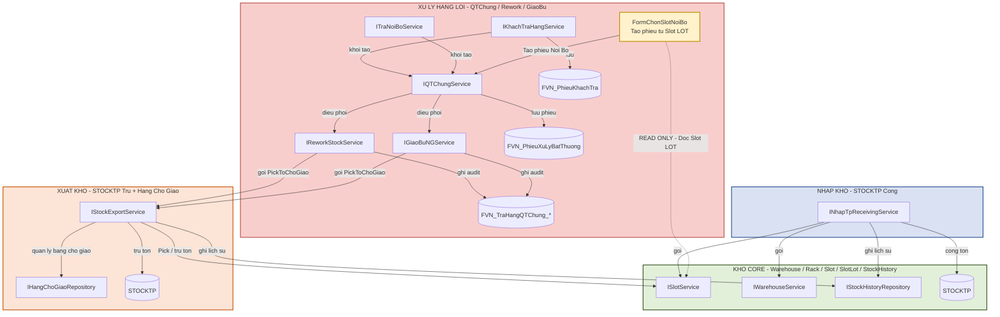

ARCHITECTURE_DEPENDENCIES — WMS
1. Mục đích
Tài liệu này mô tả dependency kiến trúc giữa 4 phân khu WMS.
`WORKFLOW_HANGLOI`: Luồng nghiệp vụ làm gì?
`ARCHITECTURE_DEPENDENCIES`: Module nào được phép gọi module nào?
---
2. Bốn phân khu
2.1. Kho Core — Xanh Lá
Quản lý không gian kho và dữ liệu tồn kho cốt lõi.
Thành phần:
`ISlotService`
`IWarehouseService`
`IStockHistoryRepository`
`STOCKTP`
2.2. Nhập Kho — Xanh Dương
Quản lý tiếp nhận hàng mới và hàng Rework đạt chuẩn nhập lại.
Thành phần: `INhapTpReceivingService`
Được phép cập nhật vị trí, cộng tồn và ghi lịch sử theo nghiệp vụ nhập.
2.3. Xuất Kho — Cam
Quản lý Pick, bảng chờ giao và trừ tồn.
Thành phần:
`IStockExportService`
`IHangChoGiaoRepository`
`STOCKTP`
2.4. Xử Lý Hàng Lỗi / QTChung — Đỏ
Điều phối phiếu bất thường, Rework và giao bù.
Thành phần:
`IKhachTraHangService`
`ITraNoiBoService`
`FormChonSlotNoiBo`
`IQTChungService`
`IReworkStockService`
`IGiaoBuNGService`
`FVN_PhieuKhachTra`
`FVN_PhieuXuLyBatThuong`
`FVN_TraHangQTChung_*`
Nguyên tắc: Xử Lý Hàng Lỗi không tự ý ghi/trừ tồn kho.
---
3. Quy tắc Dependency
3.1. Nhập Kho → Kho Core
```text
INhapTpReceivingService
    ├──> ISlotService
    ├──> IWarehouseService
    ├──> IStockHistoryRepository
    └──> STOCKTP
```
3.2. Xuất Kho → Kho Core
```text
IStockExportService
    ├──> ISlotService
    ├──> IStockHistoryRepository
    ├──> STOCKTP
    └──> IHangChoGiaoRepository
```
3.3. QTChung → Rework / Giao bù → Xuất Kho
```text
IQTChungService
    ├──> IReworkStockService
    └──> IGiaoBuNGService

IReworkStockService
    └──> IStockExportService

IGiaoBuNGService
    └──> IStockExportService
```
`IReworkStockService` và `IGiaoBuNGService` không tự Pick/Trừ tồn tại Slot/STOCKTP.
3.4. FormChonSlotNoiBo → Kho Core
Đây là dependency READ ONLY:
```text
FormChonSlotNoiBo
    -. READ ONLY: đọc Slot/LOT đang tồn .->
ISlotService
```
Mục đích:
Đọc danh sách Slot/LOT đang tồn.
Cho người dùng chọn Slot/LOT.
Tạo phiếu xử lý bất thường nguồn Nội Bộ.
Không được hiểu là quyền:
```text
FormChonSlotNoiBo
    X-> AddQuantity
    X-> Trừ tồn
    X-> Cập nhật STOCKTP
```
---
4. Sơ đồ kiến trúc

---
5. Ma trận Dependency
Nguồn	Đích	Quyền / Mục đích
`INhapTpReceivingService`	`ISlotService`	Cập nhật vị trí / tồn theo nghiệp vụ nhập
`INhapTpReceivingService`	`IWarehouseService`	Xử lý thông tin kho
`INhapTpReceivingService`	`IStockHistoryRepository`	Ghi lịch sử
`INhapTpReceivingService`	`STOCKTP`	Cộng tồn
`IStockExportService`	`ISlotService`	Pick / trừ tồn
`IStockExportService`	`IStockHistoryRepository`	Ghi lịch sử
`IStockExportService`	`STOCKTP`	Trừ tồn
`IStockExportService`	`IHangChoGiaoRepository`	Quản lý bảng chờ giao
`FormChonSlotNoiBo`	`ISlotService`	READ ONLY — đọc Slot/LOT
`FormChonSlotNoiBo`	`IQTChungService`	Tạo phiếu Nội Bộ
`IQTChungService`	`IReworkStockService`	Điều phối Rework
`IQTChungService`	`IGiaoBuNGService`	Điều phối giao bù
`IReworkStockService`	`IStockExportService`	Pick / xuất Rework
`IGiaoBuNGService`	`IStockExportService`	Pick / xuất giao bù
---
6. Dependency bị cấm
Không được có:
```text
FormChonSlotNoiBo
    X-> IStockExportService
```
Form chỉ đọc Slot/LOT để tạo phiếu, không phải module xuất kho.
Không được có:
```text
IReworkStockService
    X-> ISlotService.AddQuantity
```
và:
```text
IGiaoBuNGService
    X-> ISlotService.AddQuantity
```
Các thao tác xuất/trừ tồn phải đi qua `IStockExportService`.
Không được có:
```text
IQTChungService
    X-> STOCKTP
```
QTChung là module điều phối, không trực tiếp quản lý tồn kho.
---
7. Nguyên tắc chốt
Rule 1 — Đọc Slot ≠ thay đổi tồn
```text
FormChonSlotNoiBo
    -. READ ONLY .->
ISlotService
```
Dependency này được phép.
Rule 2 — Thay đổi tồn phải qua module kho được phân quyền
```text
Rework / GiaoBu
       |
       v
IStockExportService
       |
       v
Slot / STOCKTP
```
Rule 3 — QTChung chỉ điều phối
```text
IQTChungService
       |
       +--> IReworkStockService
       |
       +--> IGiaoBuNGService
```
Rule 4 — Workflow và Architecture không trộn vai trò
`WORKFLOW_HANGLOI` mô tả trình tự nghiệp vụ.
`ARCHITECTURE_DEPENDENCIES` mô tả dependency và quyền gọi.
Dependency quan trọng cần giữ:
```text
FormChonSlotNoiBo -. READ ONLY .-> ISlotService

IQTChungService --> IReworkStockService
IQTChungService --> IGiaoBuNGService

IReworkStockService --> IStockExportService
IGiaoBuNGService --> IStockExportService

IStockExportService --> ISlotService
IStockExportService --> STOCKTP
```
