ARCHITECTURE_DEPENDENCIES
WMS — Kiến trúc Dependency giữa các Phân khu
> **Mục đích:** Tài liệu này trả lời câu hỏi **“Module nào được phép gọi module nào?”**
>
> **Không thay thế `WORKFLOW_HANGLOI`**, tài liệu đó trả lời câu hỏi **“Luồng nghiệp vụ làm gì?”**
---
1. Tổng quan kiến trúc
Hệ thống WMS được chia thành 4 phân khu:
#	Phân khu	Vai trò	Màu
1	Kho Core	Quản lý Slot, Warehouse, tồn kho và lịch sử tồn	🟩 Xanh lá
2	Nhập Kho	Tiếp nhận hàng và cộng tồn	🟦 Xanh dương
3	Xuất Kho	Pick, bảng chờ giao và trừ tồn	🟧 Cam
4	Xử Lý Hàng Lỗi / QTChung	Điều phối phiếu lỗi, Rework và giao bù	🟥 Đỏ
---
2. Thành phần của từng phân khu
2.1. 🟩 Kho Core
Thành phần
Thành phần	Vai trò
`ISlotService`	Quản lý Slot / SlotLot / số lượng tại vị trí
`IWarehouseService`	Quản lý thông tin kho
`IStockHistoryRepository`	Ghi lịch sử biến động tồn
`STOCKTP`	Dữ liệu tồn kho tổng
Nguyên tắc
> Kho Core là nơi cung cấp năng lực quản lý tồn kho nền tảng.  
> Các module nghiệp vụ không được tự ý cập nhật tồn ngoài service được phân quyền.
---
2.2. 🟦 Nhập Kho
Thành phần
Thành phần	Vai trò
`INhapTpReceivingService`	Điều phối nghiệp vụ nhập kho
Dependency được phép
```text
INhapTpReceivingService
    ├──> ISlotService
    ├──> IWarehouseService
    ├──> IStockHistoryRepository
    └──> STOCKTP
```
Mục đích:
Cập nhật vị trí hàng.
Cộng tồn.
Ghi lịch sử nhập kho.
---
2.3. 🟧 Xuất Kho
Thành phần
Thành phần	Vai trò
`IStockExportService`	Pick và xử lý xuất kho
`IHangChoGiaoRepository`	Quản lý bảng chờ giao
`STOCKTP`	Tồn kho được trừ khi xuất
Dependency được phép
```text
IStockExportService
    ├──> ISlotService
    ├──> IStockHistoryRepository
    ├──> STOCKTP
    └──> IHangChoGiaoRepository
```
Mục đích:
Pick hàng.
Trừ tồn.
Ghi lịch sử.
Đưa hàng vào / xử lý từ bảng chờ giao.
---
3. 🟥 Xử Lý Hàng Lỗi / QTChung
3.1. Thành phần
Thành phần	Vai trò
`IKhachTraHangService`	Tiếp nhận nguồn khách trả
`ITraNoiBoService`	Tiếp nhận nguồn nội bộ
`FormChonSlotNoiBo`	Chọn Slot/LOT để tạo phiếu nội bộ
`IQTChungService`	Điều phối QTChung
`IReworkStockService`	Xử lý nghiệp vụ xuất / nhập lại liên quan Rework
`IGiaoBuNGService`	Xử lý giao bù
`FVN_PhieuKhachTra`	Chứng từ khách trả
`FVN_PhieuXuLyBatThuong`	Phiếu xử lý bất thường
`FVN_TraHangQTChung_*`	Audit / log QTChung
---
4. Dependency của QTChung
4.1. Luồng điều phối chính
```text
IQTChungService
    ├──> IReworkStockService
    └──> IGiaoBuNGService
```
QTChung điều phối, không trực tiếp Pick hoặc trừ tồn.
---
4.2. Rework và Giao bù đi qua Xuất Kho
```text
IReworkStockService
    └──> IStockExportService

IGiaoBuNGService
    └──> IStockExportService
```
Ý nghĩa
Module	Gọi	Mục đích
`IReworkStockService`	`IStockExportService`	Pick / xuất Rework
`IGiaoBuNGService`	`IStockExportService`	Pick / xuất giao bù
> `IReworkStockService` và `IGiaoBuNGService` **không tự ý thao tác trực tiếp Slot/STOCKTP để trừ tồn**.
---
5. ⭐ Dependency đặc biệt: FormChonSlotNoiBo
Đây là điểm cần ghi rõ nhất trong kiến trúc.
5.1. Dependency
```text
FormChonSlotNoiBo
        │
        │  READ ONLY
        │  Đọc Slot / LOT đang tồn
        ▼
   ISlotService
```
Đây là dependency được phép.
`FormChonSlotNoiBo` sử dụng `ISlotService` để:
Đọc danh sách Slot/LOT đang tồn.
Cho người dùng chọn Slot/LOT.
Tạo phiếu xử lý bất thường nguồn Nội Bộ.
---
5.2. ⚠️ READ ONLY không đồng nghĩa với quyền cập nhật tồn
Được phép
```text
FormChonSlotNoiBo
    -. READ ONLY .->
ISlotService
```
Không được phép
```text
FormChonSlotNoiBo
    X-> ISlotService.AddQuantity
    X-> Trừ tồn
    X-> Cập nhật STOCKTP
```
Nguyên tắc
> **Đọc Slot/LOT để lựa chọn ≠ được quyền thay đổi tồn kho.**
---
6. Sơ đồ kiến trúc tổng thể

```mermaid
graph TD

    %% ==================================================
    %% KHO CORE
    %% ==================================================
    subgraph KhoCore["🟩 KHO CORE"]
        ISlotService["ISlotService"]
        IWarehouseService["IWarehouseService"]
        IStockHistoryRepo["IStockHistoryRepository"]
        StockTP_Core[("STOCKTP")]
    end

    %% ==================================================
    %% NHAP KHO
    %% ==================================================
    subgraph NhapKho["🟦 NHẬP KHO"]
        INhapTpService["INhapTpReceivingService"]
    end

    %% ==================================================
    %% XUAT KHO
    %% ==================================================
    subgraph XuatKho["🟧 XUẤT KHO"]
        IStockExportService["IStockExportService"]
        IHangChoGiaoRepo["IHangChoGiaoRepository"]
        StockTP_Xuat[("STOCKTP")]
    end

    %% ==================================================
    %% XU LY HANG LOI
    %% ==================================================
    subgraph XuLyLoi["🟥 XỬ LÝ HÀNG LỖI / QTCHUNG"]
        IKhachTraHangService["IKhachTraHangService"]
        ITraNoiBoService["ITraNoiBoService"]
        FormChonSlotNoiBo["FormChonSlotNoiBo"]
        IQTChungService["IQTChungService"]
        IReworkStockService["IReworkStockService"]
        IGiaoBuNGService["IGiaoBuNGService"]

        TablePhieuKhachTra[("FVN_PhieuKhachTra")]
        TablePhieuXuLy[("FVN_PhieuXuLyBatThuong")]
        TableTraHangQTChung[("FVN_TraHangQTChung_*")]
    end

    %% ==================================================
    %% NHAP KHO -> CORE
    %% ==================================================
    INhapTpService -->|Cập nhật vị trí| ISlotService
    INhapTpService -->|Kho| IWarehouseService
    INhapTpService -->|Ghi lịch sử| IStockHistoryRepo
    INhapTpService -->|Cộng tồn| StockTP_Core

    %% ==================================================
    %% XUAT KHO -> CORE
    %% ==================================================
    IStockExportService -->|Pick / Trừ tồn| ISlotService
    IStockExportService -->|Ghi lịch sử| IStockHistoryRepo
    IStockExportService -->|Trừ tồn| StockTP_Xuat
    IStockExportService -->|Bảng chờ giao| IHangChoGiaoRepo

    %% ==================================================
    %% KHOI TAO QTCHUNG
    %% ==================================================
    IKhachTraHangService -->|Khởi tạo| IQTChungService
    ITraNoiBoService -->|Khởi tạo| IQTChungService

    IKhachTraHangService -->|Lưu| TablePhieuKhachTra
    IQTChungService -->|Lưu phiếu| TablePhieuXuLy

    %% ==================================================
    %% FORM NOI BO -> CORE: READ ONLY
    %% ==================================================
    FormChonSlotNoiBo -.->|READ ONLY - Đọc Slot / LOT| ISlotService
    FormChonSlotNoiBo -->|Tạo phiếu Nội Bộ| IQTChungService

    %% ==================================================
    %% QTCHUNG -> SERVICE
    %% ==================================================
    IQTChungService -->|Điều phối| IReworkStockService
    IQTChungService -->|Điều phối| IGiaoBuNGService

    %% ==================================================
    %% REWORK / GIAO BU -> XUAT KHO
    %% ==================================================
    IReworkStockService -->|PickToChoGiao| IStockExportService
    IGiaoBuNGService -->|PickToChoGiao| IStockExportService

    %% ==================================================
    %% AUDIT
    %% ==================================================
    IReworkStockService -->|Audit| TableTraHangQTChung
    IGiaoBuNGService -->|Audit| TableTraHangQTChung

    %% ==================================================
    %% STYLE
    %% ==================================================
    style KhoCore fill:#e2f0d9,stroke:#385723,stroke-width:2px
    style NhapKho fill:#d9e1f2,stroke:#2f5597,stroke-width:2px
    style XuatKho fill:#fce4d6,stroke:#c65911,stroke-width:2px
    style XuLyLoi fill:#f8cecc,stroke:#b85450,stroke-width:2px
    style FormChonSlotNoiBo fill:#fff2cc,stroke:#bf9000,stroke-width:2px
```

---
7. 📊 Ma Trận Dependency
> Đây là **ma trận kiến trúc**, không phải mô tả workflow.
#	Module nguồn	Module / Thành phần đích	Loại dependency	Quyền / Mục đích
1	`INhapTpReceivingService`	`ISlotService`	Service Call	Cập nhật vị trí / tồn theo nghiệp vụ nhập
2	`INhapTpReceivingService`	`IWarehouseService`	Service Call	Xử lý thông tin kho
3	`INhapTpReceivingService`	`IStockHistoryRepository`	Repository	Ghi lịch sử tồn
4	`INhapTpReceivingService`	`STOCKTP`	Stock Update	Cộng tồn
5	`IStockExportService`	`ISlotService`	Service Call	Pick / trừ tồn
6	`IStockExportService`	`IStockHistoryRepository`	Repository	Ghi lịch sử tồn
7	`IStockExportService`	`STOCKTP`	Stock Update	Trừ tồn
8	`IStockExportService`	`IHangChoGiaoRepository`	Repository	Quản lý bảng chờ giao
9	`IKhachTraHangService`	`IQTChungService`	Service Call	Khởi tạo / điều phối QTChung
10	`ITraNoiBoService`	`IQTChungService`	Service Call	Khởi tạo / điều phối QTChung
11	`FormChonSlotNoiBo`	`ISlotService`	READ ONLY	Đọc Slot/LOT đang tồn
12	`FormChonSlotNoiBo`	`IQTChungService`	Service Call	Tạo phiếu Nội Bộ
13	`IQTChungService`	`IReworkStockService`	Service Call	Điều phối Rework
14	`IQTChungService`	`IGiaoBuNGService`	Service Call	Điều phối giao bù
15	`IReworkStockService`	`IStockExportService`	Service Call	Pick / xuất Rework
16	`IGiaoBuNGService`	`IStockExportService`	Service Call	Pick / xuất giao bù
17	`IReworkStockService`	`FVN_TraHangQTChung_*`	Audit	Ghi audit QTChung
18	`IGiaoBuNGService`	`FVN_TraHangQTChung_*`	Audit	Ghi audit QTChung
---
8. 🚫 Dependency bị cấm
Dependency	Trạng thái	Lý do
`FormChonSlotNoiBo → IStockExportService`	❌ Cấm	Form chỉ đọc Slot/LOT để chọn, không phải module xuất kho
`FormChonSlotNoiBo → STOCKTP` để cập nhật	❌ Cấm	Không được trực tiếp thay đổi tồn
`IReworkStockService → ISlotService.AddQuantity`	❌ Cấm	Rework không tự ý cập nhật tồn
`IGiaoBuNGService → ISlotService.AddQuantity`	❌ Cấm	Giao bù không tự ý cập nhật tồn
`IQTChungService → STOCKTP`	❌ Cấm	QTChung chỉ điều phối nghiệp vụ
`IQTChungService → ISlotService` để trừ tồn	❌ Cấm	Thao tác xuất phải qua `IStockExportService`
---
9. Quyền truy cập theo phân khu
Phân khu	Đọc Slot/LOT	Cộng tồn	Trừ tồn	Pick	Điều phối Rework	Điều phối Giao bù
Kho Core	✅	✅	✅	✅	❌	❌
Nhập Kho	✅	✅	❌	❌	❌	❌
Xuất Kho	✅	❌	✅	✅	❌	❌
Xử Lý Hàng Lỗi	⚠️ Read Only	❌	❌	❌	✅	✅
> ⚠️ `Xử Lý Hàng Lỗi` chỉ được **đọc Slot/LOT** thông qua `FormChonSlotNoiBo → ISlotService`.  
> Các thao tác thay đổi tồn phải đi qua module kho tương ứng.
---
10. Quy tắc kiến trúc chốt
Rule 01 — Read Slot ≠ Modify Stock
```text
FormChonSlotNoiBo
        |
        | READ ONLY
        v
   ISlotService
```
Được phép.
---
Rule 02 — Rework / Giao bù không tự trừ tồn
```text
Rework / GiaoBù
       |
       v
IReworkStockService / IGiaoBuNGService
       |
       v
IStockExportService
       |
       v
Slot / STOCKTP
```
---
Rule 03 — QTChung là Orchestrator
```text
IQTChungService
       |
       +----> IReworkStockService
       |
       +----> IGiaoBuNGService
```
QTChung không trực tiếp quản lý tồn kho.
---
Rule 04 — Workflow và Architecture phải tách riêng
`WORKFLOW_HANGLOI`
Trả lời:
> **Nghiệp vụ chạy theo trình tự nào?**
```text
Tạo phiếu
   ↓
QC định hướng
   ↓
Giao bù / Rework
   ↓
QC cuối
   ↓
OK / NG
   ↓
Hoàn tất
```
`ARCHITECTURE_DEPENDENCIES`
Trả lời:
> **Module nào được phép gọi module nào?**
```text
FormChonSlotNoiBo -. READ ONLY .-> ISlotService

IQTChungService --> IReworkStockService
IQTChungService --> IGiaoBuNGService

IReworkStockService --> IStockExportService
IGiaoBuNGService --> IStockExportService

IStockExportService --> ISlotService
IStockExportService --> STOCKTP
```
---
11. Kết luận
Kiến trúc cần giữ nguyên nguyên tắc:
> **Xử Lý Hàng Lỗi có thể đọc dữ liệu Slot/LOT từ Kho Core để lựa chọn nguồn hàng, nhưng không được tự ý thay đổi tồn.**
Cụ thể:
```text
READ
FormChonSlotNoiBo
        -.-> ISlotService
               │
               │ chỉ đọc
               ▼
          Slot / SlotLot


WRITE / STOCK MOVEMENT
IReworkStockService
        └──> IStockExportService
                    │
                    ├──> ISlotService
                    └──> STOCKTP
```
Điều này giúp `WORKFLOW_HANGLOI` và `ARCHITECTURE_DEPENDENCIES` không bị trộn vai trò, đồng thời làm rõ ranh giới trách nhiệm giữa Kho Core → Nhập Kho → Xuất Kho → Xử Lý Hàng Lỗi.
