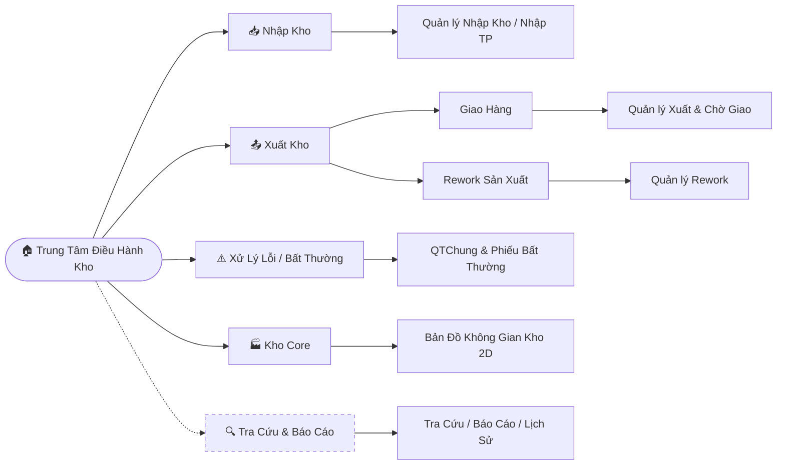
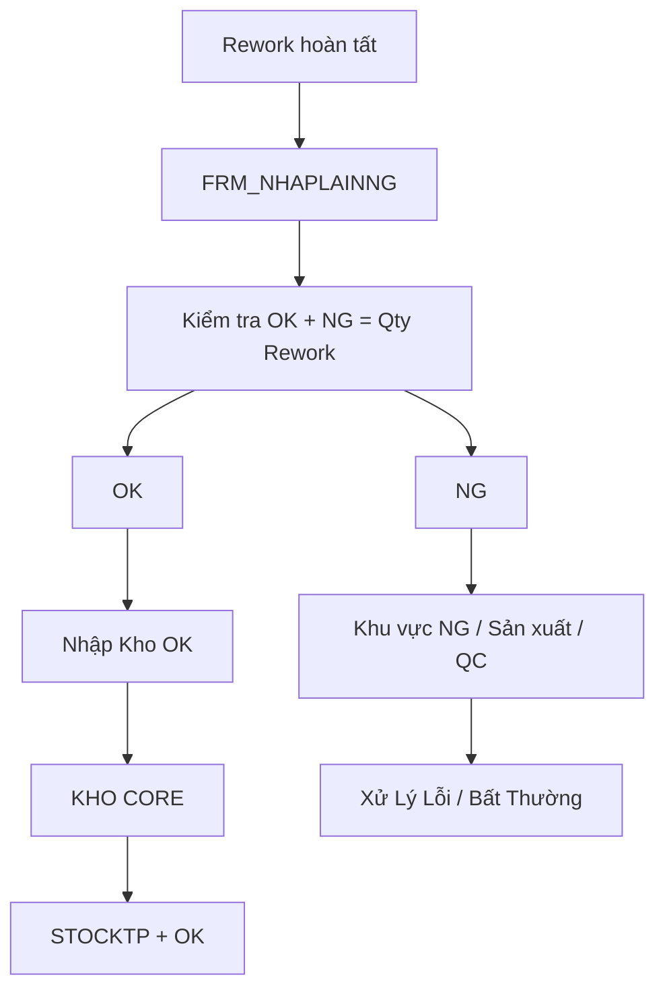

Tài Liệu Thiết Kế: Màn Hình Chính & Trung Tâm Điều Hành Kho (Dashboard)
> **Vị trí trong bộ tài liệu:** Đây là bản trực quan hóa giao diện (UI) dựa trên luồng nghiệp vụ tổng thể tại `WORKFLOW_WMS.md` và ranh giới 4 phân khu tại `ARCHITECTURE_DEPENDENCIES.md`.
>
> Tài liệu này mô tả cách hiển thị trạng thái vận hành lên màn hình chính và cách điều hướng người dùng đến các module nghiệp vụ tương ứng.
---
1. Cấu Trúc Màn Hình Chính (Shell Dashboard Layout)
Màn hình `TrungTamDieuHanhKho` được chia thành các khu vực chính ánh xạ 1-1 với 4 Subsystems, giúp người dùng nắm bắt công việc thông qua các badge số liệu thực tế.
1.1. Khu vực Module Nghiệp Vụ — 4 Phân Khu Chính
📥 Nhập Kho
Hiển thị các trạng thái liên quan đến nghiệp vụ nhập hàng:
Chờ nhập
Nhập thành phẩm
Nhập hàng OK sau Rework
Các nghiệp vụ nhập khác theo cấu hình khách hàng
Bấm vào để vào module Quản lý Nhập Kho / Nhập TP.
> **Quy tắc:** KHO CORE chỉ tiếp nhận và quản lý hàng **OK**. Hàng NG không được nhập vào KHO CORE và không được cộng vào `STOCKTP`.
---
📤 Xuất Kho
Hiển thị các trạng thái liên quan đến nghiệp vụ xuất:
Chờ giao
Chờ xác nhận
Hàng đang trong quá trình giao
Các nghiệp vụ Rework trả về sản xuất
Bấm vào để vào module Quản lý Xuất Kho.
Xuất Kho được chia thành hai nghiệp vụ chính:
```text
XUẤT KHO
│
├── GIAO HÀNG
│
└── REWORK SẢN XUẤT
```
---
⚠️ Xử Lý Lỗi / Bất Thường
Hiển thị các trạng thái xử lý hàng lỗi:
Chờ QC định hướng
Đang Rework
Chờ QC xác nhận cuối
Các phiếu bất thường đang xử lý
Bấm vào để mở QTChung / Quản lý Phiếu Bất Thường.
> Hàng NG có thể được lưu giữ tại khu vực sản xuất, QC hoặc khu vực NG riêng tùy nghiệp vụ thực tế. Không mặc định coi khu vực NG là một khu vực tồn kho của KHO CORE.
---
🏭 Kho Core
Hiển thị bản đồ kho vật lý:
Rack
Slot
Lot
A0
Vị trí hàng OK
Trạng thái vị trí
Hàng đang chờ xử lý theo nghiệp vụ kho
Bấm vào để mở Bản đồ Không gian Kho 2D.
> **Quy tắc tồn kho:** KHO CORE chỉ quản lý hàng OK. `STOCKTP` phản ánh tồn kho OK, không phản ánh hàng NG đang nằm tại sản xuất/QC.
---
1.2. Khu Vực Tra Cứu & Báo Cáo Xuyên Suốt
Các chức năng sau không được coi là một phân khu nghiệp vụ thứ 5:
Ô tra cứu nhanh đa năng
Quét QR / Barcode
Tra cứu mã Lot
Tra cứu mã lệnh
Tra cứu phiếu
Báo cáo tồn kho
Lịch sử giao dịch
Đây là các Cross-cutting Features, có thể đọc dữ liệu từ nhiều Subsystems.
> ⚠️ **Lưu ý kiến trúc:** Khu vực "Tra cứu & Báo cáo" không phải là phân khu thứ 5. Đây là tập hợp tính năng dùng xuyên suốt hệ thống.
---
2. Quy Định Điều Hướng Module
Thao tác	Điều hướng
Click Nhập Kho	Mở màn hình Quản lý Nhập Kho / Nhập TP
Click Xuất Kho	Mở màn hình Quản lý Xuất & Chờ Giao
Click Xử Lý Lỗi	Mở QTChung & Quản lý Phiếu Bất Thường
Click Kho Core	Mở bản đồ không gian kho 2D
Quét QR / Barcode	Nhận diện pattern và điều hướng đến nghiệp vụ phù hợp
Tra cứu Lot	Hiển thị thông tin Lot và trạng thái hiện tại
Tra cứu lệnh	Hiển thị thông tin lệnh và các nghiệp vụ liên quan
2.1. Quy Tắc Không Đưa Logic Nghiệp Vụ Vào Dashboard
`TrungTamDieuHanhKho` chỉ chịu trách nhiệm:
Hiển thị trạng thái tổng hợp.
Điều hướng.
Nhận sự kiện cập nhật.
Hiển thị cảnh báo / badge.
Hiển thị các thông tin tổng quan.
Dashboard không trực tiếp:
cập nhật `STOCKTP`;
thay đổi Slot;
thay đổi trạng thái Lot;
tạo phiếu nhập;
tạo phiếu xuất;
xác nhận Rework;
xác nhận QC;
xử lý bất thường.
Các thao tác trên phải được thực hiện tại các module nghiệp vụ tương ứng.
---
3. Sơ Đồ Điều Hướng (Mermaid Diagram)

---
4. Quan Hệ Nghiệp Vụ Giữa 4 Phân Khu
4 phân khu không phải là 4 hệ thống độc lập. Hàng hóa có thể đi qua nhiều phân khu trong suốt vòng đời.
4.1. Luồng Tổng Quát
```text
NHẬP KHO
    │
    ▼
KHO CORE
    │
    ▼
STOCKTP
    │
    ▼
XUẤT KHO
    │
    ├──────────────► GIAO HÀNG
    │
    └──────────────► REWORK
                          │
                          ▼
                     SẢN XUẤT
                          │
                          ▼
                    REWORK HOÀN TẤT
                          │
                          ▼
                   XÁC NHẬN OK / NG
                       │       │
                       │       └────────► XỬ LÝ LỖI /
                       │                    BẤT THƯỜNG
                       │
                       └──────────────► NHẬP KHO OK
                                             │
                                             ▼
                                          KHO CORE
                                             │
                                             ▼
                                          STOCKTP
```
4.2. Nguyên Tắc Tồn Kho
```text
KHO CORE
    │
    └── Chỉ quản lý hàng OK

STOCKTP
    │
    └── Chỉ phản ánh tồn kho OK

HÀNG NG
    │
    ├── Không nhập KHO CORE
    ├── Không cộng STOCKTP
    └── Có thể nằm tại:
        ├── Khu vực NG sản xuất
        ├── Khu vực QC
        ├── Khu vực cách ly
        └── Khu vực xử lý bất thường
```
---
5. Xuất Kho — Giao Hàng
Nghiệp vụ Giao Hàng hiện đang được sử dụng chung cho các khách hàng thông qua luồng hiện có của HVN-PGH.
Về mặt kiến trúc, nếu nghiệp vụ thực tế giống nhau giữa các khách hàng thì logic này nên được xem là Shared/Core Workflow, không nên khóa cứng vào riêng một khách hàng.
5.1. Trường Hợp LOT Đang Tồn Tại Trong KHO CORE
Nếu `LotNo` của hàng xuất đang tồn tại trong một Slot cụ thể:
```text
KHO CORE
    │
    ▼
Rack / Slot / Lot
    │
    ▼
Nhổ hàng khỏi Slot
    │
    ▼
FVN_HANGCHOGIAO
    │
    ▼
Status = WAIT
```
Ở bước chuyển sang `FVN_HANGCHOGIAO`:
Hàng được nhổ khỏi Slot.
Ghi nhận vào danh sách hàng chờ giao.
Đánh dấu trạng thái `WAIT` / `ChoGiao`.
Không trừ `STOCKTP`.
> Hàng mới chỉ được pick ra khỏi Slot để chuẩn bị giao, chưa được xác nhận xuất thực tế.
5.2. Khi Thực Hiện Giao Hàng
```text
FVN_HANGCHOGIAO
    │
    ▼
Chọn hàng chờ giao
    │
    ▼
Xác nhận giao
    │
    ├── Hoàn tất trạng thái WAIT
    ├── Đánh dấu Export
    ├── Trừ STOCKTP
    └── Ghi lịch sử giao dịch
```
Trạng thái cuối:
```text
Lot = EXPORT
STOCKTP = STOCKTP - Quantity
```
---
6. Xuất Kho — Trường Hợp Rack A0
Nếu hàng xuất đang nằm trực tiếp tại Rack A0:
```text
Rack A0
    │
    ▼
KHO CORE
    │
    ▼
Xuất trực tiếp
    │
    ├── Đánh dấu Export
    ├── Trừ STOCKTP
    └── Ghi StockHistory
```
Không cần chuyển qua `FVN_HANGCHOGIAO → WAIT`.
---
7. Xuất Kho — Rework Sản Xuất
Rework là một nhánh nghiệp vụ độc lập với Giao Hàng.
```text
XUẤT KHO
    │
    └── REWORK SẢN XUẤT
```
7.1. Đưa Hàng Đi Rework
Nếu Lot cần trả về sản xuất để Rework:
```text
KHO CORE
    │
    ▼
Rack / Slot / Lot
    │
    ▼
Nhổ hàng khỏi Slot
    │
    ▼
FVN_HANGCHOGIAO
    │
    ▼
Status = WAITREWORK
    │
    ▼
Trừ STOCKTP
```
> Ngay khi đưa hàng ra khỏi Kho Core để trả sản xuất Rework, số lượng được trừ khỏi `STOCKTP`.
---
8. QC Định Hướng Rework
```text
WAITREWORK
    │
    ▼
QC định hướng
    │
    ▼
Phiếu bàn giao sản xuất
    │
    ▼
Status = REWORK
    │
    ▼
Sản xuất thực hiện Rework
```
Phiếu bàn giao cần lưu tối thiểu:
Lot.
Số lượng.
Bộ phận nhận.
Người giao.
Người nhận.
Thời gian.
Nội dung / hướng Rework.
---
9. Rework Hoàn Tất — FRM_NHAPLAINNG
Sau khi sản xuất Rework xong, người dùng mở `FRM_NHAPLAINNG`.
Form lấy danh sách:
```text
FVN_HANGCHOGIAO
WHERE Status = REWORK
```
Ví dụ:
```text
LotNo       Qty Rework
-----------------------
LOT001          100
LOT002           50
```
Người dùng nhập:
```text
LOT001
Qty Rework = 100

OK = 80
NG = 20
```
Hệ thống bắt buộc kiểm tra:
```text
OK + NG = Qty Rework
```
Nếu không bằng thì không được xác nhận.
---
10. Kết Quả Rework — OK / NG

10.1. Kết Quả OK
```text
FRM_NHAPLAINNG
    │
    ▼
OK
    │
    ▼
NHẬP KHO OK
    │
    ▼
KHO CORE
    │
    ▼
STOCKTP + Quantity OK
```
Đây là một nghiệp vụ Nhập Kho thực sự.
10.2. Kết Quả NG
```text
FRM_NHAPLAINNG
    │
    ▼
NG
    │
    ▼
Không nhập KHO CORE
    │
    ▼
Không cộng STOCKTP
    │
    ▼
Khu vực NG / Sản xuất / QC
    │
    ▼
Xử Lý Lỗi / Bất Thường
```
Vị trí vật lý của hàng NG không mặc định thuộc KHO CORE.
---
11. Quan Hệ Giữa Nhập Kho Và Rework
Nhập Kho không chỉ là điểm bắt đầu của vòng đời hàng. Nhập Kho còn là điểm tiếp nhận hàng OK quay trở lại sau Rework.
```text
                    ┌──────────────┐
                    │   NHẬP KHO   │
                    └──────┬───────┘
                           │
                           ▼
                      KHO CORE OK
                           │
                           ▼
                        STOCKTP
                           │
                           ▼
                       XUẤT KHO
                           │
                           ▼
                         REWORK
                           │
                           ▼
                     Sản xuất Rework
                           │
                           ▼
                    FRM_NHAPLAINNG
                           │
                      ┌────┴────┐
                      ▼         ▼
                     OK         NG
                      │         │
                      ▼         ▼
                 NHẬP KHO    SX / QC / NG
                      │         │
                      ▼         ▼
                  KHO CORE   BẤT THƯỜNG
                      │
                      ▼
                   STOCKTP
```
---
12. Nguồn Dữ Liệu Cho Badge
Theo nguyên tắc kiến trúc, `TrungTamDieuHanhKho` không chứa logic nghiệp vụ.
Dashboard thông qua tầng tổng hợp riêng:
```csharp
public interface IDashboardQueryService
{
    DashboardCounters GetCounters();
}

public sealed class DashboardCounters
{
    public int NhapKho_ChoNhap { get; set; }

    public int XuatKho_ChoGiao { get; set; }

    public int XuatKho_ChoXacNhan { get; set; }

    public int XuLyLoi_ChoQCDinhHuong { get; set; }

    public int XuLyLoi_DangRework { get; set; }

    public int XuLyLoi_ChoQCXacNhanCuoi { get; set; }
}
```
Dashboard chỉ gọi:
```csharp
var counters = dashboardQueryService.GetCounters();
```
và hiển thị kết quả.
---
13. Bảng Ánh Xạ Nguồn Dữ Liệu Badge
Phân Khu	Tên Badge / Chỉ Số	Nguồn Số Liệu	Điều Kiện Lọc / Trạng Thái
Nhập Kho	Chờ nhập	`INhapTpReceivingService` / `NHAP_TP_HIS`	Các bản ghi chưa xử lý / chưa hoàn tất
Xuất Kho	Chờ giao	`IHangChoGiaoRepository`	`FVN_HANGCHOGIAO` có trạng thái `WAIT` / `ChoGiao`
Xuất Kho	Chờ xác nhận	`IHangChoGiaoRepository` / `IStockExportService`	Các lệnh đã Pick vào chờ giao nhưng chưa Confirm chốt xuất
Xử Lý Lỗi	Chờ QC định hướng	`IPhieuXuLyBatThuongRepository`	`QTChungStatus.ChoQCDinhHuong`
Xử Lý Lỗi	Đang Rework	Bảng phiếu xử lý / QTChung	`QTChungStatus.DangRework`
Xử Lý Lỗi	Chờ QC xác nhận cuối	Bảng phiếu xử lý / QTChung	`QTChungStatus.ChoQCXacNhanCuoi`
Kho Core	Tổng tồn OK	`IStockRepository` / `STOCKTP`	Chỉ tính tồn kho OK
Kho Core	Hàng theo Rack / Slot	`IStockRepository`	Chỉ tính Lot đang tồn tại trong KHO CORE
> **Lưu ý:** `DashboardCounters` phải map trực tiếp theo đúng tên state trong enum `QTChungStatus` đã được định nghĩa tại luồng Xử lý hàng lỗi. Không tự đặt tên trạng thái mới ở tầng UI.
---
14. Cập Nhật Badge Theo Thời Gian Thực (Realtime Event Bus)
Hệ thống không sử dụng polling liên tục gây quá tải cơ sở dữ liệu.
Dashboard tái sử dụng cơ chế sự kiện sẵn có trong kiến trúc, ví dụ:
`StockChangedNotifier`
`AppEventBus`
`LotStatusResetEvent`
Event thay đổi trạng thái phiếu
Event thay đổi trạng thái hàng chờ giao
Luồng tổng quát:
```text
Module nghiệp vụ
      │
      ▼
Cập nhật Database
      │
      ▼
Phát Domain/App Event
      │
      ▼
AppEventBus
      │
      ▼
Dashboard
      │
      ▼
Refresh badge liên quan
```
---
15. Khu Vực Tra Cứu & Báo Cáo Xuyên Suốt
15.1. Ô Tra Cứu Nhanh Đa Năng
Cho phép người dùng nhập hoặc quét:
QR Code
Barcode
Mã lệnh sản xuất
Mã Pallet
Mã Lot
Mã phiếu
Mã phiếu bất thường
Cơ chế điều hướng:
```text
QR / Barcode / Text
        │
        ▼
Pattern Matching
        │
        ├── LotNo
        ├── Pallet
        ├── Lệnh sản xuất
        ├── Phiếu
        └── Phiếu bất thường
        │
        ▼
Mở màn hình chi tiết phù hợp
```
Dashboard chỉ thực hiện nhận diện và điều hướng, không xử lý nghiệp vụ.
15.2. Báo Cáo Tồn Kho & Lịch Sử Giao Dịch
Báo cáo tồn kho
Hiển thị:
Tổng tồn kho OK.
Tồn theo Rack.
Tồn theo Slot.
Tồn theo Lot.
Tồn tại A0 nếu A0 thuộc phạm vi KHO CORE.
Các biến động tồn kho.
> Hàng NG tại sản xuất/QC không được đưa vào `STOCKTP` và không được coi là tồn kho KHO CORE.
Báo cáo lịch sử giao dịch
Tích hợp lối tắt xem nhanh:
Nhập kho.
Xuất kho.
Chuyển Slot.
Pick hàng.
Chuyển sang `FVN_HANGCHOGIAO`.
Xác nhận giao.
Rework.
Nhập OK sau Rework.
Các biến động Stock.
Nguồn dữ liệu:
```text
IStockHistoryRepository
```
---
16. Vòng Đời Hàng OK
```text
              NHẬP KHO
                  │
                  ▼
             KHO CORE
                  │
                  ▼
               STOCKTP
                  │
         ┌────────┴────────┐
         ▼                 ▼
      GIAO HÀNG          REWORK
         │                 │
         ▼                 ▼
       EXPORT          WAITREWORK
                           │
                           ▼
                         REWORK
                           │
                           ▼
                    Sản xuất Rework
                           │
                           ▼
                     FRM_NHAPLAINNG
                           │
                          OK
                           │
                           ▼
                      NHẬP KHO OK
                           │
                           ▼
                        KHO CORE
                           │
                           ▼
                        STOCKTP
```
---
17. Vòng Đời Hàng NG
Hàng NG không được coi là tồn kho KHO CORE.
```text
                REWORK
                   │
                   ▼
             FRM_NHAPLAINNG
                   │
                   ▼
                  NG
                   │
                   ▼
          Khu vực NG / SX / QC
                   │
                   ▼
         XỬ LÝ LỖI / BẤT THƯỜNG
                   │
          ┌────────┴────────┐
          ▼                 ▼
       QC định hướng     Nghiệp vụ khác
          │
          ▼
       Rework tiếp
          │
          └───────────────► ...
```
---
18. Nguyên Tắc Kiến Trúc Dashboard
Dashboard được phép
Hiển thị badge.
Hiển thị trạng thái.
Điều hướng.
Tra cứu.
Hiển thị cảnh báo.
Hiển thị báo cáo tổng hợp.
Subscribe event.
Dashboard không được phép
Trừ `STOCKTP`.
Cộng `STOCKTP`.
Đổi Slot.
Đánh dấu Lot = `EXPORT`.
Chuyển `WAIT` → `EXPORT`.
Chuyển `WAITREWORK` → `REWORK`.
Xác nhận QC.
Xác nhận Rework.
Tạo phiếu bất thường.
Các thao tác trên thuộc các module nghiệp vụ tương ứng.
---
19. Nguyên Tắc Phân Tách Customer
Nghiệp vụ chung không nên bị khóa vào một Customer cụ thể nếu nhiều khách hàng cùng sử dụng.
Cấu trúc định hướng:
```text
WMS
│
├── Core
│   ├── Kho Core
│   ├── StockTP
│   ├── StockHistory
│   └── Workflow
│
├── NhapKho
│   ├── Nhập thường
│   ├── Nhập OK
│   └── Nhập OK sau Rework
│
├── XuatKho
│   ├── Giao hàng
│   └── Rework
│
├── XuLyLoi
│   ├── QTChung
│   ├── Phiếu bất thường
│   ├── QC
│   └── Rework
│
└── Customers
    ├── HVN-PGH
    ├── YMVN
    └── Customer khác
```
Customer chỉ cấu hình những điểm thực sự khác nhau.
---
20. Nguyên Tắc Quan Trọng Nhất
Hệ thống phải phân biệt rõ:
```text
VỊ TRÍ VẬT LÝ
        ≠
TRẠNG THÁI NGHIỆP VỤ
        ≠
TỒN KHO STOCKTP
```
Hàng đang ở Slot
```text
Physical Location = Rack/Slot
Business State = Stored
STOCKTP = Có tồn
```
Hàng đã nhổ khỏi Slot và chờ giao
```text
Physical Location = Khu vực chờ giao
Business State = WAIT
STOCKTP = Vẫn tồn
```
Hàng đã giao
```text
Business State = EXPORT
STOCKTP = Đã trừ
```
Hàng đang Rework
```text
Physical Location = Sản xuất
Business State = REWORK
STOCKTP = Đã trừ
```
Hàng OK sau Rework
```text
Business State = OK
Physical Location = Chờ nhập / KHO CORE
STOCKTP = Cộng lại khi nhập kho
```
Hàng NG sau Rework
```text
Business State = NG
Physical Location = Sản xuất / QC / Khu vực NG
STOCKTP = Không cộng
```
Đây là nguyên tắc nền tảng để tránh việc Dashboard, Kho Core, `FVN_HANGCHOGIAO` và `STOCKTP` hiểu cùng một hàng theo các trạng thái khác nhau nhưng lại ghi đè sai dữ liệu.
