# WMS — HƯỚNG DẪN SỬ DỤNG CHUẨN

> Tài liệu này dành cho người dùng vận hành PCTP/WMS. Mục tiêu là giúp người dùng **nhìn sơ đồ trước, hiểu mục đích sau, rồi mới thao tác**.
>
> Nội dung hướng dẫn trong ứng dụng được đồng bộ theo các topic trong `PCTP/Shell/Help/WmsHelpCatalog.cs`.

## 1. Bản đồ tổng thể WMS

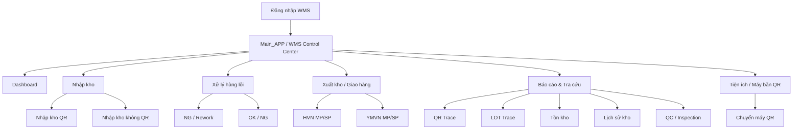

### Nguyên tắc đọc sơ đồ

- **Dashboard**: nhìn tình trạng và chọn việc cần làm.
- **Nhập kho / Xử lý lỗi / Giao hàng**: nơi thực hiện nghiệp vụ và thay đổi trạng thái.
- **Báo cáo & Tra cứu**: nơi đọc dữ liệu, đối chiếu và traceability; không dùng để sửa nghiệp vụ.
- **Tiện ích**: thao tác hỗ trợ vận hành, ví dụ chuyển máy bắn QR.

---

## 2. Quy trình nghiệp vụ tổng quát

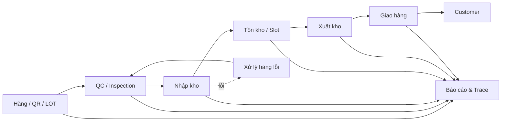

**Khi có vấn đề:** không nhảy thẳng sang bước sau để bỏ qua kiểm soát. Hãy quay về bước đang có lỗi, tra cứu dữ liệu và xử lý đúng workflow.

---

## 3. Dashboard / WMS Control Center

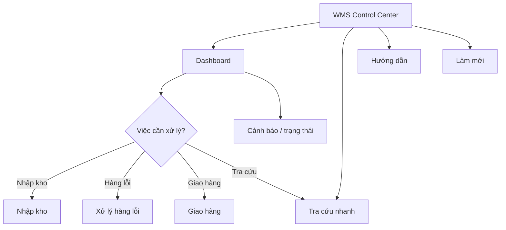

### Tra cứu nhanh từ Main_APP

Thanh **WMS CONTROL CENTER** là điểm vào nhanh cho người vận hành. Có thể nhập:

- `QR:xxxx` — tìm theo QR/carton.
- `LOT:xxxx` — tìm theo LOT.
- `PART:xxxx` — tìm theo PartNo.
- Không có tiền tố — mặc định xem là QR/carton.

Sau khi nhấn **Tra cứu**, Main_APP chỉ điều hướng sang module `BaoCao`; SQL/query không đặt trong Shell. Màn hình tra cứu là **read-only**.

### Người dùng nên làm gì trên Dashboard

1. Xem số lượng việc cần xử lý.
2. Ưu tiên cảnh báo ảnh hưởng trực tiếp đến giao hàng/tồn kho.
3. Dùng **Tra cứu nhanh** khi cần kiểm tra QR/LOT/Part.
4. Mở đúng module bằng vùng chức năng tương ứng.
5. Sau khi xử lý, nhấn **Làm mới** để kiểm tra lại.
6. Nhấn **Hướng dẫn** khi cần xem sơ đồ và checklist của nghiệp vụ.

---

## 4. Nhập kho QR

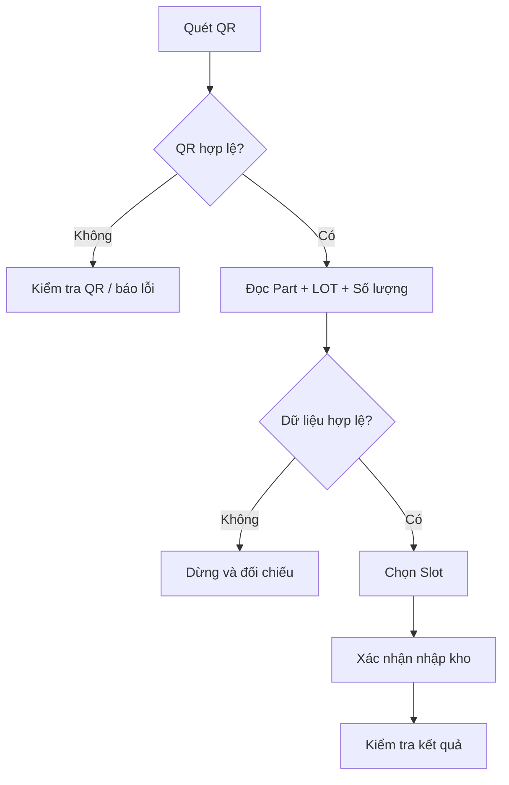

### Checklist

- QR đúng hàng.
- Part đúng.
- LOT đúng.
- Số lượng đúng.
- Slot đúng.
- Không có trạng thái đã nhập/trùng.

---

## 5. Nhập kho không QR

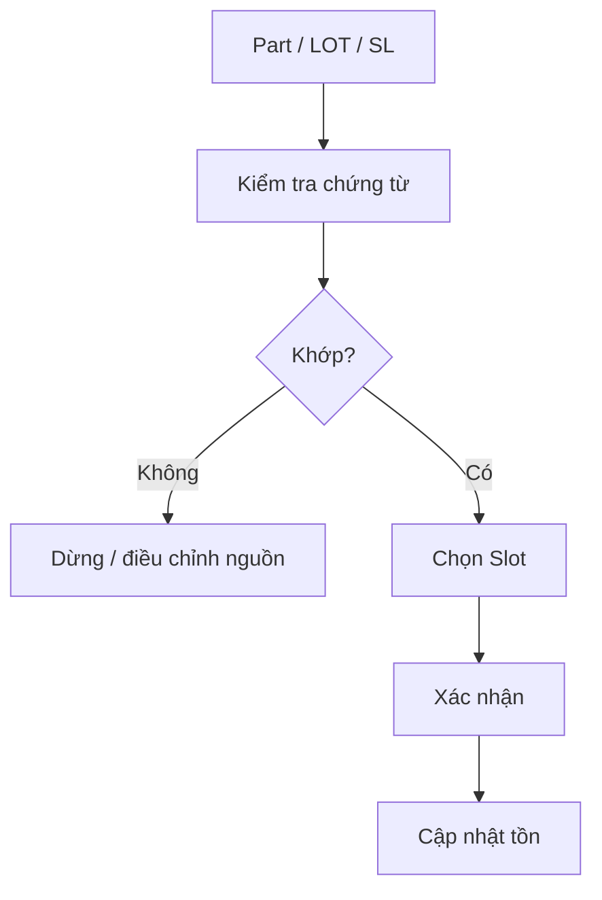

Chỉ sử dụng luồng này khi nghiệp vụ cho phép. Không dùng nhập không QR để bỏ qua kiểm soát QR.

---

## 6. Xử lý hàng lỗi

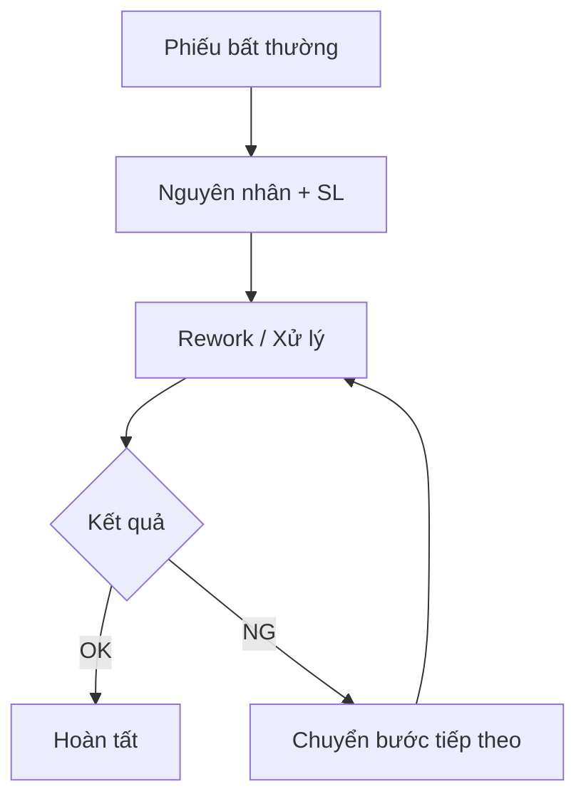

### Quy tắc

- Không tự sửa trạng thái trong DB.
- Mỗi bước phải đúng trạng thái trước đó.
- Khi phiếu đã kết thúc, không tiếp tục thao tác như phiếu đang mở.

---

## 7. Giao hàng HVN / YMVN

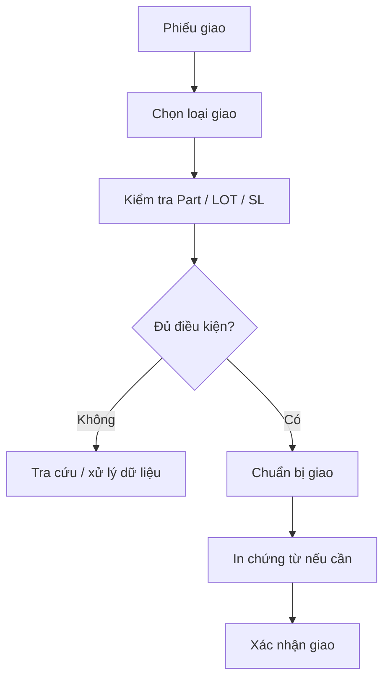

### Trước khi xác nhận giao

- Phiếu đúng khách hàng.
- Đúng loại giao MP/SP nếu có.
- Part đúng.
- LOT đủ và đúng.
- Số lượng khớp.
- Không còn trạng thái chặn giao.

---

## 8. Báo cáo & Traceability

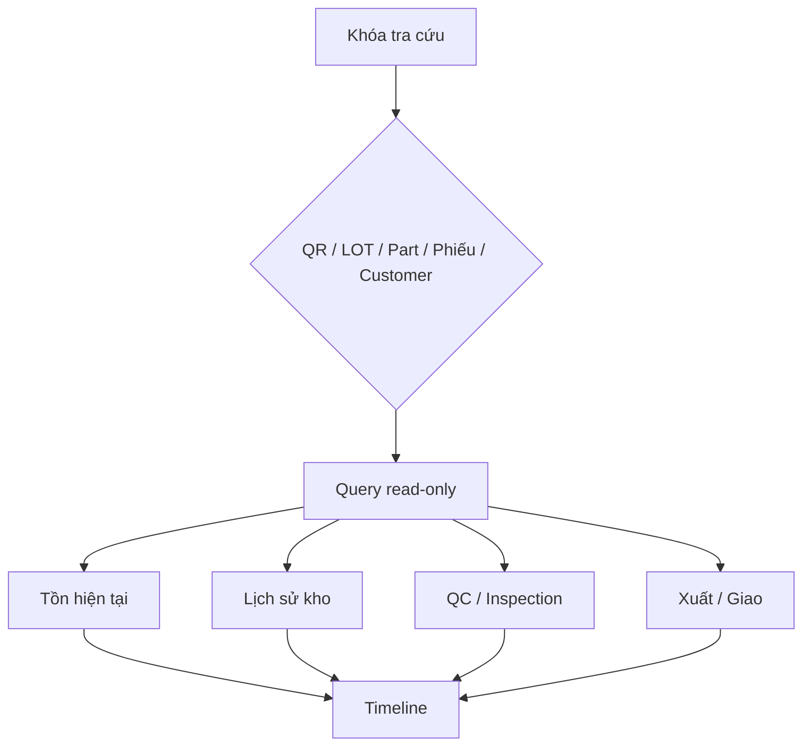

### Quy tắc quan trọng

`BaoCao` là **read-only**. Người dùng không dùng màn hình báo cáo để thay đổi dữ liệu nghiệp vụ.

Nếu không có liên kết dữ liệu chắc chắn giữa hai nguồn, kết quả phải được xem là **chưa xác nhận**, không suy diễn thành lịch sử thực tế.

---

## 9. Tra cứu LOT

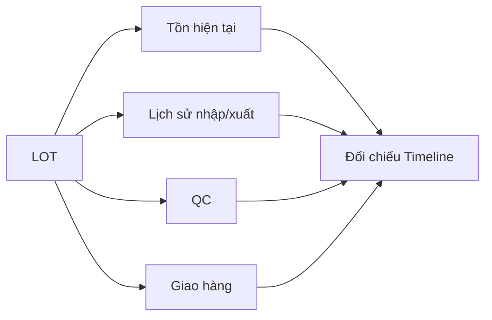

Dùng LOT khi cần trả lời các câu hỏi:

- LOT đang ở đâu?
- Còn bao nhiêu?
- Đã nhập khi nào?
- Đã xuất/giao chưa?
- Có lịch sử QC/Inspection không?

---

## 10. Tra cứu QR

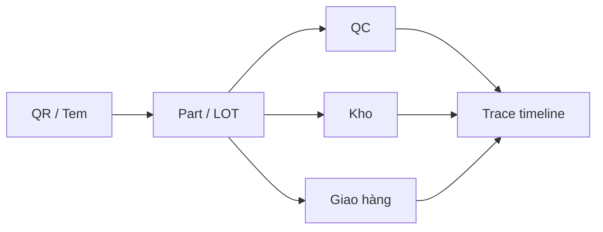

Khi không tìm được QR, thử đối chiếu bằng LOT hoặc Part. Không tự kết luận QR đã giao chỉ vì LOT tương ứng tồn tại.

---

## 11. Thiết lập và kiểm soát FIFO

FIFO (**First In – First Out**) là nguyên tắc quan trọng trong quản lý tồn kho: hàng vào trước phải được ưu tiên xuất trước, trừ trường hợp nghiệp vụ/khách hàng có quy định khác.

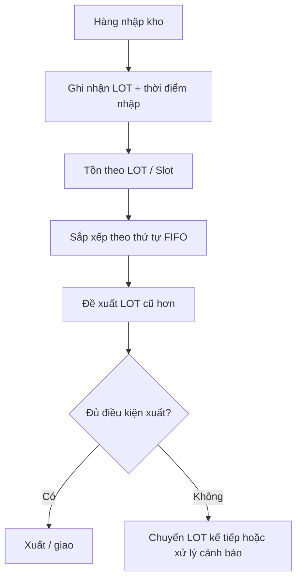

### Khi thiết lập FIFO

- Xác định **tiêu chí tuổi tồn** được hệ thống sử dụng, ưu tiên theo thời điểm nhập kho thực tế hoặc tiêu chí đã được nghiệp vụ thống nhất.
- Đảm bảo mỗi LOT có thông tin đủ để xác định thứ tự trước/sau.
- Không dùng ngày tạo phiếu thay cho ngày nhập kho nếu hai mốc có thể khác nhau.
- Kiểm tra FIFO theo **Part + LOT + vị trí tồn**; không trộn các Part khác nhau.
- Nếu khách hàng hoặc nghiệp vụ có quy tắc xuất đặc biệt, phải xác định rõ ngoại lệ trước khi xuất.

### Checklist vận hành FIFO

1. Kiểm tra LOT đang được đề xuất xuất.
2. So sánh thời điểm nhập với các LOT cùng Part còn tồn.
3. Nếu LOT cũ hơn vẫn còn tồn nhưng hệ thống đề xuất LOT mới hơn, **không tự bỏ qua**; phải kiểm tra cấu hình hoặc nguyên nhân nghiệp vụ.
4. Sau khi xuất, làm mới tồn và kiểm tra lại thứ tự LOT.
5. Khi phát hiện sai FIFO, lưu Part, LOT, Slot, thời điểm và phiếu liên quan để IT kiểm tra.

> **Lưu ý:** tài liệu này quy định nguyên tắc vận hành FIFO. Không tự thay đổi SQL/DB để ép thứ tự FIFO nếu chưa xác định chính xác cơ chế FIFO đang được triển khai trong module nghiệp vụ.

---

## 12. Cấu hình mã yêu cầu kiểm tra trùng khớp giữa thùng và hộp

Đây là cấu hình kiểm soát quan trọng khi hệ thống phải xác nhận **mã yêu cầu kiểm tra** giữa **thùng (carton)** và **hộp (box)** trước khi cho phép tiếp tục nghiệp vụ.

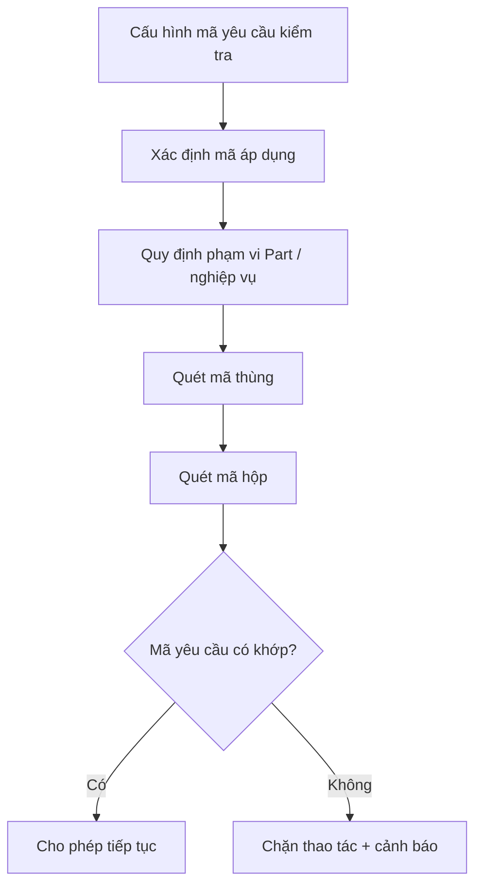

### Nguyên tắc cấu hình

- Mã yêu cầu kiểm tra phải được quản lý tập trung, có **mã rõ ràng và trạng thái hiệu lực**.
- Xác định chính xác mã áp dụng cho từng **Part / loại hàng / nghiệp vụ** nếu hệ thống có phân loại.
- Không dùng một mã chung cho tất cả trường hợp nếu yêu cầu kiểm tra thực tế khác nhau.
- Khi thay đổi mã, phải xác định thời điểm hiệu lực và người chịu trách nhiệm thay đổi.
- Không xóa hoặc sửa lịch sử cấu hình đang được sử dụng để truy vết.

### Quy trình kiểm tra thùng ↔ hộp

1. Quét mã **thùng**.
2. Đọc mã yêu cầu kiểm tra tương ứng từ dữ liệu cấu hình/nguồn nghiệp vụ.
3. Quét mã **hộp**.
4. Hệ thống đối chiếu mã yêu cầu của thùng và hộp.
5. **Khớp** → cho phép tiếp tục.
6. **Không khớp** → chặn thao tác, hiển thị cảnh báo và yêu cầu kiểm tra lại.

### Khi cấu hình hoặc kiểm tra không đúng

- Không tự sửa mã trên tem để làm cho hai mã giống nhau.
- Kiểm tra lại Part, mã thùng, mã hộp và mã yêu cầu đang có hiệu lực.
- Kiểm tra xem mã đã được cấu hình đúng phạm vi và thời điểm hiệu lực chưa.
- Nếu dữ liệu cấu hình đúng nhưng hệ thống vẫn báo không khớp, ghi lại mã thùng + mã hộp + Part + thời gian để IT kiểm tra.

> **Lưu ý:** đây là quy tắc vận hành và kiểm soát. Tên bảng, tên cột và màn hình cấu hình cụ thể phải được đối chiếu với implementation thực tế trước khi hướng dẫn người dùng nhập một giá trị cấu hình cụ thể.

---

## 13. Chuyển máy bắn QR

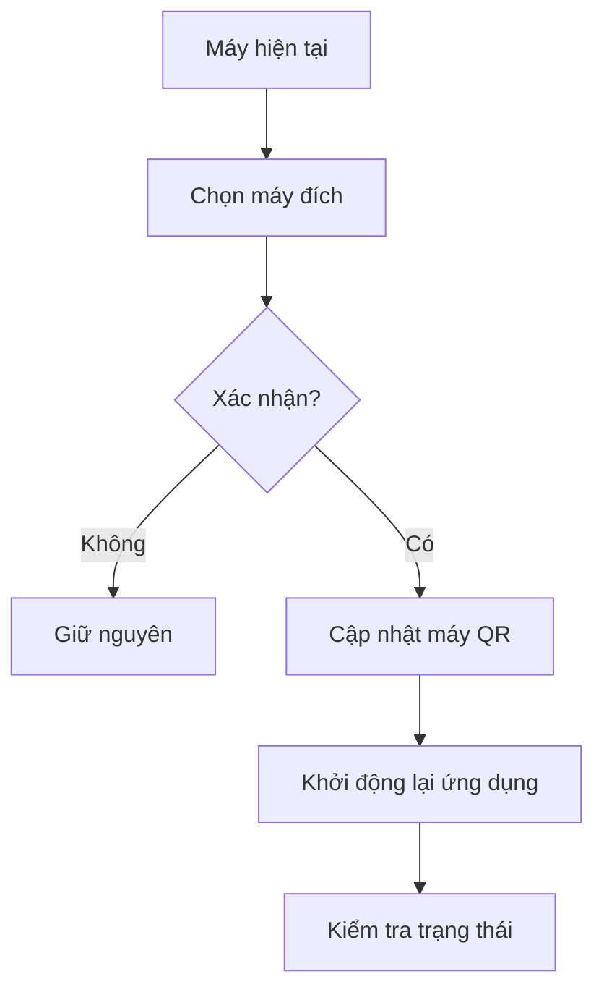

Chỉ thực hiện khi xác định chính xác hostname máy đích.

---

## 14. Xử lý lỗi chuẩn

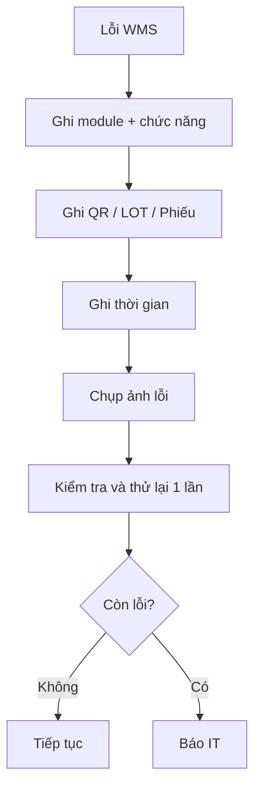

### Thông tin tối thiểu khi báo IT

1. Tên máy.
2. User.
3. Module/chức năng.
4. Thời gian lỗi.
5. QR/LOT/phiếu liên quan.
6. Nội dung lỗi.
7. Ảnh màn hình.

Không tự sửa DB hoặc dùng chức năng khác để bypass kiểm soát.

---

## 15. Hướng dẫn trong ứng dụng

Main_APP có nút **Hướng dẫn sử dụng**. Từ đây người dùng có thể chọn topic theo nghiệp vụ.

Mục tiêu kiến trúc:

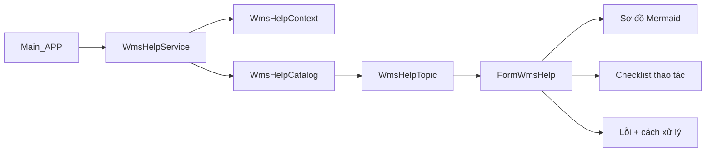

Nội dung hướng dẫn **không nằm trực tiếp trong Main_APP**. Khi thêm một nghiệp vụ mới, chỉ cần thêm topic vào Help Catalog và sau đó gắn context vào form/module tương ứng.

---

## 16. Chuẩn thiết kế một hướng dẫn mới

Mọi chức năng WMS mới phải có tối thiểu 7 phần:

1. Mục đích.
2. Sơ đồ Mermaid.
3. Điều kiện trước khi thực hiện.
4. Các bước thao tác.
5. Điều kiện xác nhận.
6. Lỗi thường gặp.
7. Cách xử lý / thông tin cần báo IT.

Không viết hướng dẫn kiểu chỉ liệt kê nút bấm. Người dùng phải hiểu **vì sao thực hiện bước đó và bước tiếp theo là gì**.
