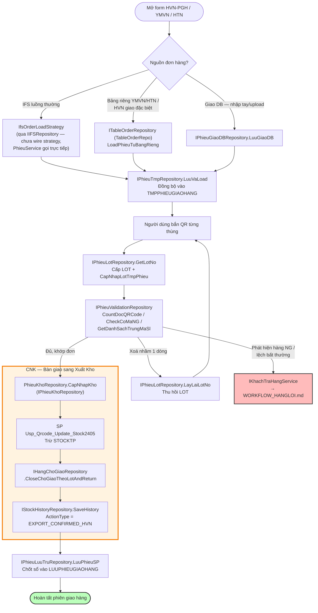

# Tài Liệu Quy Trình Nghiệp Vụ: Giao Hàng Khách (Customer Delivery — Bắn QR / CNK)

> **Vị trí trong bộ tài liệu:** Đây là tài liệu CON của [`WORKFLOW_WMS.md`](./WORKFLOW_WMS.md).
> Theo nguyên tắc kiến trúc cốt lõi (mục 1 của tài liệu mẹ), module Giao Hàng Khách **không
> tự trừ kho** — mọi thay đổi `STOCKTP`/`Slot` cuối cùng phải hội tụ về
> [`WORKFLOW_XUATKHO.md`](./WORKFLOW_XUATKHO.md) qua `IStockExportService`. Tài liệu này mô tả
> phần việc RIÊNG của Giao Hàng Khách — đối chiếu QR, ghép LOT, đối chiếu IFS, lưu trữ phiếu —
> tức là mọi thứ xảy ra TRƯỚC khi gọi tới Xuất Kho, cộng với cách nó bàn giao (handoff) sang
> Xuất Kho ở bước CNK cuối cùng. Nhánh phiếu bất thường/khiếu nại đi từ đây sang
> [`WORKFLOW_HANGLOI.md`](./WORKFLOW_HANGLOI.md) — xem mục 5.

---

## 1. Bối Cảnh — Vì Sao Có Nhiều Repository Nhỏ Như Vậy?

Thư mục [`Modules/GiaoHangKhach/Repositories/`](https://github.com/Nang0559/WINDOWS_PCTP-NO_Check-/tree/master/PCTP/Modules/GiaoHangKhach/Repositories)
chứa 8 repository nhỏ thay vì 1 repository lớn, vì nghiệp vụ "bắn QR giao hàng" (form HVN-PGH,
YMVN, HTN) thực chất gồm nhiều mối quan tâm (concern) độc lập chạy trên cùng 1 phiên làm việc:
nạp đơn hàng gốc, quản lý vòng đời bảng tạm khi bắn QR, cấp LOT, validate trùng lặp, lưu lịch
sử, và cuối cùng là cập nhật tồn kho. Gộp tất cả vào 1 class (`PhieuRepository` bản cũ) khiến
class đó phình to và khó test độc lập từng phần. Kiến trúc hiện tại tách theo
**Interface Segregation** — mỗi interface nhỏ (`IPhieuXxxRepository`) chỉ khai báo đúng nhóm
method mà 1 concern cần, và `PhieuRepository` là **implementation tổng hợp** (kế thừa nhiều
interface cùng lúc) cho những nơi vẫn cần "1 repo làm hết" (composition root hiện tại,
`HVN_PGH.cs`), trong khi các nơi khác (Service mới, Strategy) chỉ cần khai báo phụ thuộc đúng
1 interface nhỏ họ dùng.

```
IPhieuRepository  (umbrella — PhieuRepository implement TOÀN BỘ các interface dưới đây)
├── IPhieuTmpRepository        — vòng đời bảng TMP khi đang bắn QR
├── IPhieuValidationRepository — đếm/kiểm tra trùng lặp trong phiên bắn QR
├── IPhieuLotRepository        — cấp phát / thu hồi số LOT
├── IPhieuKhoRepository        — CNK: cập nhật tồn kho (nặng nhất, đang refactor — xem mục 4)
├── IPhieuLuuTruRepository     — phiếu đã lưu / lịch sử (LUUPHIEUGIAOHANG)
└── IPhieuGiaoDBRepository     — "Giao DB": đơn hàng đặc biệt nhập tay/upload

ITableOrderRepository  (KHÔNG nằm trong IPhieuRepository — xem mục 3)
└── TableOrderRepo — SQL trên Purchase_Order_* (nguồn đơn hàng cho YMVN/HTN/giao đặc biệt)
```

---

## 2. Vai Trò Từng Repository (Interface → Implementation)

| Interface | Implementation | Trách nhiệm | Bảng SQL chính |
|---|---|---|---|
| [`IPhieuTmpRepository`](https://github.com/Nang0559/WINDOWS_PCTP-NO_Check-/blob/master/PCTP/Modules/GiaoHangKhach/Intefaces/PhieuGiao/IPhieuTmpRepository.cs) | [`PhieuTmpRepository`](https://github.com/Nang0559/WINDOWS_PCTP-NO_Check-/blob/master/PCTP/Modules/GiaoHangKhach/Repositories/PhieuTmpRepository.cs) | Nạp/lưu (merge upsert)/xoá bảng TMP đang bắn QR; xác định `TrangThaiBan` (trống / đang bán / đã CNK) để quyết định UI cho phép bắn tiếp hay bắt buộc load lại. | `TMPPHIEUGIAOHANG`, `DOCQRCODE` |
| [`IPhieuValidationRepository`](https://github.com/Nang0559/WINDOWS_PCTP-NO_Check-/blob/master/PCTP/Modules/GiaoHangKhach/Intefaces/PhieuGiao/IPhieuValidationRepository.cs) | [`PhieuValidationRepository`](https://github.com/Nang0559/WINDOWS_PCTP-NO_Check-/blob/master/PCTP/Modules/GiaoHangKhach/Repositories/PhieuValidationRepository.cs) | Đếm số dòng đã bắn (`CountDocQRCode`), phát hiện trùng mã hàng + số lượng (`GetDanhSachTrungMaSl`), kiểm tra có hàng NG lẫn vào phiên bắn hay không (`CheckCoMaNG`) — chạy SAU MỖI lần bắn QR, TRƯỚC khi cho phép CNK. | `DOCQRCODE`, `TMPPHIEUGIAOHANG` |
| [`IPhieuLotRepository`](https://github.com/Nang0559/WINDOWS_PCTP-NO_Check-/blob/master/PCTP/Modules/GiaoHangKhach/Intefaces/PhieuGiao/IPhieuLotRepository.cs) | [`PhieuLotRepository`](https://github.com/Nang0559/WINDOWS_PCTP-NO_Check-/blob/master/PCTP/Modules/GiaoHangKhach/Repositories/PhieuLotRepository.cs) | Sinh số LOT tự động theo mã hàng khi bắn QR (`GetLotNo`), ghi lại vào dòng TMP tương ứng (`CapNhapLotTmpPhieu`), và **thu hồi** LOT (`LayLaiLotNo`) khi người dùng xoá nhầm 1 dòng đã bắn — LOT bị xoá không được tái sử dụng tuỳ tiện, phải qua đúng cơ chế này để tránh trùng LOT. | `TMPPHIEUGIAOHANG`, bảng cấp LOT |
| [`IPhieuKhoRepository`](https://github.com/Nang0559/WINDOWS_PCTP-NO_Check-/blob/master/PCTP/Modules/GiaoHangKhach/Intefaces/PhieuGiao/IPhieuKhoRepository.cs) | [`PhieuKhoRepository`](https://github.com/Nang0559/WINDOWS_PCTP-NO_Check-/blob/master/PCTP/Modules/GiaoHangKhach/Repositories/PhieuKhoRepository.cs) | **CNK (Confirm Nhận Kho)** — điểm bàn giao sang Xuất Kho. Đối chiếu toàn bộ dòng đã bắn QR với đơn hàng, chạy SP cập nhật `STOCKTP`, rồi gọi `IHangChoGiaoRepository.CloseChoGiaoTheoLotAndReturn` để đóng các dòng `FVN_HangChoGiao` tương ứng theo LOT và ghi audit qua `IStockHistoryRepository`. Đây là nghiệp vụ NẶNG NHẤT trong module — xem mục 4 để biết hiện trạng và hướng tách tiếp theo cho khớp `WORKFLOW_XUATKHO.md`. | `STOCKTP`, `FVN_HangChoGiao`, `StockHistory` |
| [`IPhieuLuuTruRepository`](https://github.com/Nang0559/WINDOWS_PCTP-NO_Check-/blob/master/PCTP/Modules/GiaoHangKhach/Intefaces/PhieuGiao/IPhieuLuuTruRepository.cs) | [`PhieuLuuTruRepository`](https://github.com/Nang0559/WINDOWS_PCTP-NO_Check-/blob/master/PCTP/Modules/GiaoHangKhach/Repositories/PhieuLuuTruRepository.cs) | Sau khi CNK thành công, "chốt sổ" phiếu: copy dữ liệu từ bảng TMP sang `LUUPHIEUGIAOHANG` (lịch sử vĩnh viễn, không bị dọn khi mở phiên bắn mới), phục vụ tra cứu/in lại/báo cáo. | `LUUPHIEUGIAOHANG` |
| [`IPhieuGiaoDBRepository`](https://github.com/Nang0559/WINDOWS_PCTP-NO_Check-/blob/master/PCTP/Modules/GiaoHangKhach/Intefaces/PhieuGiao/IPhieuGiaoDBRepository.cs) | [`PhieuGiaoDBRepository`](https://github.com/Nang0559/WINDOWS_PCTP-NO_Check-/blob/master/PCTP/Modules/GiaoHangKhach/Repositories/PhieuGiaoDBRepository.cs) | "Giao DB" — nhánh đơn hàng **nhập tay/upload** ngoài lịch IFS thông thường (đơn đặc biệt, đơn gấp). Không đi qua `IOrderLoadStrategy`/IFS — người dùng tự nhập danh sách mã hàng vào grid rồi `LuuGiaoDB` thẳng vào bảng TMP. | `TMPPHIEUGIAOHANG` (ghi trực tiếp, không qua Purchase_Order_*) |
| — (umbrella, không phải 1 concern riêng) | [`PhieuRepository`](https://github.com/Nang0559/WINDOWS_PCTP-NO_Check-/blob/master/PCTP/Modules/GiaoHangKhach/Repositories/PhieuRepository.cs) | Implement **CẢ 6** interface phía trên cùng lúc — là "cửa vào" duy nhất mà `HVN_PGH.cs` (composition root) khởi tạo, rồi truyền xuống `PhieuService`/`InPhieuService` dưới dạng `IPhieuRepository`. KHÔNG implement `ITableOrderRepository` (xem mục 3). | (nhiều bảng — tổng hợp) |

---

## 3. `ITableOrderRepository` / `TableOrderRepo` / Order Load Strategy — Vì Sao Tách Riêng?

Trước refactor, logic "đọc đơn hàng gốc từ bảng riêng `Purchase_Order_*`" (dùng cho khách
YMVN/HTN — những khách không lấy đơn thẳng từ IFS mà có bảng trung gian riêng, và cho HVN khi
bật "giao đặc biệt") nằm chung trong region `IPhieuOrderTableRepository` ngay bên trong
`PhieuRepository`. Nó bị tách ra thành 1 interface + class độc lập vì lý do nêu ngay trong
comment của [`ITableOrderRepository.cs`](https://github.com/Nang0559/WINDOWS_PCTP-NO_Check-/blob/master/PCTP/Modules/GiaoHangKhach/Intefaces/PhieuGiao/ITableOrderRepository.cs):
**để những nơi chỉ cần "đọc đơn hàng theo bảng riêng" (không cần toàn bộ 6 interface CNK/LOT/TMP
ở trên) không bị kéo theo cả `IPhieuRepository`** — đúng tinh thần Interface Segregation đã áp
dụng cho các mảnh còn lại.

| Thành phần | File | Vai trò |
|---|---|---|
| `ITableOrderRepository` | [`Intefaces/PhieuGiao/ITableOrderRepository.cs`](https://github.com/Nang0559/WINDOWS_PCTP-NO_Check-/blob/master/PCTP/Modules/GiaoHangKhach/Intefaces/PhieuGiao/ITableOrderRepository.cs) | Khai báo `LoadPhieuTuBangRieng`, `GetDanhSachGioYMVN`, `UploadMilkrunSP`, `InsertTmpYMVN`, `SoSanhDonHangVoiIFS`... — SQL trên `Purchase_Order_*`. |
| `TableOrderRepo` | [`Repositories/TableOrderRepo.cs`](https://github.com/Nang0559/WINDOWS_PCTP-NO_Check-/blob/master/PCTP/Modules/GiaoHangKhach/Repositories/TableOrderRepo.cs) | **Implementation duy nhất** — cần thêm `IIFSRepository` để `SoSanhDonHangVoiIFS` đối chiếu lệch giữa bảng riêng và IFS thật. |
| `IOrderLoadStrategy` | [`Domain/Interfaces/IOrderLoadStrategy.cs`](https://github.com/Nang0559/WINDOWS_PCTP-NO_Check-/blob/master/PCTP/Domain/Interfaces/IOrderLoadStrategy.cs) | Strategy pattern: `LoadDonHangGoc` / `MergeLotDaLuu` / `SyncChoDocQR` / `SoSanhVoiIFS` — trừu tượng hoá "nguồn đơn hàng gốc là gì" để `PhieuService` không cần `if (khách == YMVN) ... else if (khách == HTN) ...`. |
| `OrderTableLoadStrategy` | [`TableOrderLoad/OrderTableLoadStrategy.cs`](https://github.com/Nang0559/WINDOWS_PCTP-NO_Check-/blob/master/PCTP/Modules/GiaoHangKhach/TableOrderLoad/OrderTableLoadStrategy.cs) | Implement `IOrderLoadStrategy` bằng cách gọi `ITableOrderRepository` — dùng khi nguồn là bảng riêng (YMVN/HTN thuần, hoặc HVN đang "giao đặc biệt"). |
| `IfsOrderLoadStrategy` | *(cùng thư mục IFSORDER)* | Implement `IOrderLoadStrategy` bằng cách gọi thẳng IFS — dùng cho HVN luồng thường (mặc định). |
| `OrderLoadStrategyFactory` | [`Services/OrderLoadStrategyFactory.cs`](https://github.com/Nang0559/WINDOWS_PCTP-NO_Check-/blob/master/PCTP/Modules/GiaoHangKhach/Services/OrderLoadStrategyFactory.cs) | Chọn 1 trong 2 strategy trên dựa vào `OrderLoadContext.CheDoGiaoDacBiet` + `CustomerConfig.LoadTuBangRieng/CoGiaoDacBiet`. |

### ⚠️ Khoảng trống hiện tại — CHƯA khớp thiết kế trong `HVN_PGH.cs`

`OrderLoadStrategyFactory`/`OrderTableLoadStrategy`/`IfsOrderLoadStrategy` **hiện chưa được
composition root (`HVN_PGH.cs`) khởi tạo hay tiêm vào đâu cả** — đây là code đã viết sẵn cho
hướng thiết kế mới nhưng chưa được wire vào luồng chạy thật. Thực tế hiện tại:

- `PhieuService` (được `HVN_PGH.cs` dựng trực tiếp) vẫn giữ nhánh `if/else` cứng theo
  `isMayBanQR`/cấu hình khách để tự quyết định gọi IFS hay gọi `_tableOrderRepo`
  (`ITableOrderRepository`, cụ thể là `TableOrderRepo` — được `HVN_PGH.cs` khởi tạo và truyền
  thẳng vào `PhieuService` như 1 tham số constructor riêng, KHÔNG qua `IOrderLoadStrategy`).
- Vì vậy `ITableOrderRepository`/`TableOrderRepo` **đang được dùng thật** (fix ở phiên làm việc
  trước — `PhieuService` nhận `ITableOrderRepository tableOrderRepo` qua constructor), còn toàn
  bộ tầng `IOrderLoadStrategy`/`OrderLoadStrategyFactory` phía trên nó thì **chưa** — có thể xem
  là bước refactor tiếp theo (thay nhánh if/else trong `PhieuService` bằng
  `_strategyFactory.GetStrategy(ctx).LoadDonHangGoc(ctx)`), nhưng chưa bắt buộc để chạy được.

---

## 4. CNK (`PhieuKhoRepository`) — Hiện Trạng vs Đích Theo `WORKFLOW_XUATKHO.md`

Đây là điểm nối trực tiếp giữa Giao Hàng Khách và Xuất Kho, nên nhắc lại đúng mục 3 của
`WORKFLOW_WMS.md` (không lặp lại toàn bộ ở đây):

| | Hiện tại | Đích |
|---|---|---|
| Trừ `STOCKTP` | SP riêng `Usp_Qrcode_Update_Stock2405` gọi trong `PhieuKhoRepository.CapNhapKho` | Qua `IStockExportService.ConfirmGiaoHangTuChoGiao` |
| Đóng `FVN_HangChoGiao` | `PhieuKhoRepository` gọi thẳng `IHangChoGiaoRepository.CloseChoGiaoTheoLotAndReturn` (đã inject, cùng `Uow.Connection/Transaction`) | Nằm trong `IStockExportService.ConfirmGiaoHangTuChoGiao`, `PhieuKhoRepository` không gọi trực tiếp `IHangChoGiaoRepository` nữa |
| Ghi audit | `PhieuKhoRepository` gọi `IStockHistoryRepository.SaveHistory` trực tiếp (đã inject, thay cho `SlotHelper` cũ đã xoá) | Nằm trong `ConfirmGiaoHangTuChoGiao` — `PhieuKhoRepository` không tự ghi `StockHistory` |

`PhieuKhoRepository` hiện đã đúng theo *nguyên tắc không viết SQL thô lên `Slot`/`StockHistory`*
(dùng repository/interface của Kho Core), nhưng vẫn đang tự điều phối 2-3 bước
(SP trừ tồn → đóng ChoGiao → ghi audit) thay vì gọi **1 method Confirm duy nhất** như đích thiết
kế mô tả — đây là phần còn lại cần dọn trong lần refactor tiếp theo của module này.

---

## 5. Liên Kết Với Xử Lý Hàng Lỗi (`WORKFLOW_HANGLOI.md`)

Giao Hàng Khách là 1 trong 2 nguồn tạo ra phiếu bất thường (`PhieuXuLyBatThuong`) — nguồn còn
lại là nội bộ kho. Điểm nối:

1. Khi đối chiếu QR lúc CNK phát hiện lệch (thiếu hàng, sai LOT, hàng NG lẫn vào — qua
   `IPhieuValidationRepository.CheckCoMaNG`/`GetDanhSachTrungMaSl`), hoặc khi khách phản hồi
   hàng lỗi sau khi đã nhận, luồng rẽ sang `IKhachTraHangService` (`Nguon = KhachTra`) —
   xem `WORKFLOW_HANGLOI.md` mục 2, bước 1.
2. `IKhachTraHangService` gọi `IQTChungService.TaoPhieuXuLyBatThuong` với `PhieuKhachTraId`
   tham chiếu ngược lại phiếu gốc bên Giao Hàng Khách — Giao Hàng Khách **không** tự xử lý tiếp
   phần QC/Rework/Giao bù, toàn bộ giao lại cho `WORKFLOW_HANGLOI.md`.
3. Nếu kết quả QTChung là "giao bù" (`ChiGiaoBu`), hàng bù được xuất lại cho đúng khách hàng đó
   qua `IGiaoBuNGService` → `IStockExportService` (`WORKFLOW_XUATKHO.md` nhánh 3) — không đi
   ngược qua `PhieuKhoRepository`/CNK, vì đây là 1 lượt xuất kho mới, độc lập với phiên bắn QR
   gốc đã đóng.

---

## 6. Sơ Đồ Tổng Thể (Mermaid)



---

## 7. Bảng Tra Cứu Nhanh — File ↔ Interface ↔ Nghiệp Vụ

| File repository | Interface | Nghiệp vụ 1 câu |
|---|---|---|
| `PhieuTmpRepository.cs` | `IPhieuTmpRepository` | Vòng đời bảng TMP đang bắn QR |
| `PhieuValidationRepository.cs` | `IPhieuValidationRepository` | Kiểm tra trùng/NG trong phiên bắn |
| `PhieuLotRepository.cs` | `IPhieuLotRepository` | Cấp/thu hồi số LOT |
| `PhieuKhoRepository.cs` | `IPhieuKhoRepository` | CNK — cập nhật tồn kho (bàn giao Xuất Kho) |
| `PhieuLuuTruRepository.cs` | `IPhieuLuuTruRepository` | Lưu trữ phiếu đã CNK (lịch sử) |
| `PhieuGiaoDBRepository.cs` | `IPhieuGiaoDBRepository` | Đơn hàng đặc biệt nhập tay/upload |
| `PhieuRepository.cs` | `IPhieuRepository` (umbrella) | Tổng hợp 6 interface trên — cửa vào composition root |
| `TableOrderRepo.cs` | `ITableOrderRepository` | Đọc đơn hàng từ `Purchase_Order_*` (YMVN/HTN/giao đặc biệt) |
| `OrderTableLoadStrategy.cs` | `IOrderLoadStrategy` | Strategy bọc `ITableOrderRepository` (chưa wire vào `HVN_PGH.cs`) |