# Tài Liệu Quy Trình Nghiệp Vụ: Xử Lý Hàng Lỗi / QTChung (Exception & Rework Workflow)

> **Phiên bản v3** — cập nhật từ v2 sau khi rà soát `ReworkStockService.NhapLaiHangOK` với
> `IStockExportRepository`/`StockExportRepository` thật. Phát hiện và sửa 2 lỗi biên dịch/logic
> nghiêm trọng (gọi sai chữ ký `GetSlConLai`, gọi method `TangSlConLai` không tồn tại). Xem mục 7
> và mục 13 (Phụ lục — Bản sửa đầy đủ).
>
> Các phần còn `[CẦN XÁC NHẬN]` là những chỗ chưa có code xác nhận trực tiếp — không tự suy diễn,
> giữ nguyên câu hỏi để tránh làm tài liệu lệch khỏi hệ thống thật.

Tài liệu mô tả luồng xử lý phiếu bất thường từ khách hàng hoặc nội bộ: tiếp nhận → QC định
hướng → điều phối qua hàng chờ giao → rework tại xưởng → phân tách OK/NG → nhập lại kho.

---

## 0. Ba Tầng Dữ Liệu — Không Nhầm Lẫn Cấp Độ

```
PhieuTraHang (Header, 1 dòng / lần trả hàng)
    │  enum: PhieuTraHangStatus  (rất thô — chỉ roll-up cấp cao)
    │
    └──▶ PhieuTraHangCT (Detail, N dòng / Header — mỗi dòng 1 mã hàng/LOT)
             │  Không có state machine riêng — chỉ có DinhDanhPhieuGiao
             │  (đối chiếu phiếu giao gốc) cập nhật dần
             │
             └──▶ PhieuXuLyBatThuong (tối đa 1-1 với PhieuTraHangCT)
                      enum: QTChungStatus  (chi tiết — nguồn sự thật QC/Rework)
```

**Nguyên tắc bắt buộc:** `PhieuTraHangStatus` không mô tả QC/Rework đang ở bước nào — Header chỉ
có 1 mốc `DangXuLyQTChung` bao trùm toàn bộ vòng đời QC/Rework. Muốn biết chi tiết đang ở đâu,
luôn đọc `QTChungStatus` trên `PhieuXuLyBatThuong`, không suy diễn từ `PhieuTraHangStatus`.

---

## 1. Enum — Đã Xác Nhận Từ Code Thật

### 1.1. `NguonXuLyBatThuong`

```csharp
public enum NguonXuLyBatThuong
{
    TraNoiBo = 1,
    KhachTra = 2
}
```

### 1.2. `NguonKhachTra` — Phân Biệt Khách Hàng (chỉ có ý nghĩa khi `Nguon = KhachTra`)

```csharp
public enum NguonKhachTra
{
    HVN = 1,   // CustomerConfig.CustomerNo = "100001"
    YMVN = 2,  // CustomerConfig.CustomerNo = "100002"
    HTN = 3    // CustomerConfig.CustomerNo = "100003"
}

public static class NguonKhachTraExtensions
{
    public static string GetCustomerNo(this NguonKhachTra nguon);
    public static CustomerConfig GetConfig(this NguonKhachTra nguon);       // → CustomerTableConfig.Get(customerNo)
    public static bool TryFromCustomerNo(string customerNo, out NguonKhachTra nguon);
    public static NguonKhachTra? FromCustomerNo(string customerNo);         // null nếu không nhận diện được
}
```

Không phải state machine — chỉ là khoá tra cứu cấu hình khách hàng, map 1-1 sang `CustomerConfig`.
Khi cần `CustomerConfig` cho bước đối chiếu phiếu giao gốc, gọi thẳng
`header.NguonKhachTra.Value.GetConfig()` — không tự tra cứu lại bằng chuỗi `TenKhachHang` thô.

`HTN` (giá trị `3`) là khách hàng mới, hiện `KhachTraHangService.TiepNhanPhieuKhachTra` chỉ
validate thông báo lỗi nhắc *"HVN/YMVN"*, chưa nhắc `HTN` — vẫn cần rà lại thông báo lỗi này.

### 1.3. `HuongXuLyBatThuong` — Kết Luận QC Định Hướng

```csharp
public enum HuongXuLyBatThuong
{
    ChuaXacDinh = 0,
    TuChoiGiaoBu = 1,   // Chỉ KhachTra. Không phải lỗi thật — không giao bù, không rework.
    ChiGiaoBu = 2,      // Chỉ KhachTra. Có lỗi nhưng không cần rework — giao bù trực tiếp.
    CanRework = 3       // TraNoiBo lẫn KhachTra — cần rework.
}
```

`TuChoiGiaoBu`/`ChiGiaoBu` **chỉ** hợp lệ khi `Nguon = KhachTra` — `IQTChungService.QCDinhHuong`
phải validate: nếu `Nguon = TraNoiBo` mà set 1 trong 2 giá trị này thì ném lỗi nghiệp vụ.

### 1.4. `PhieuTraHangStatus` — State Machine Header

```csharp
public enum PhieuTraHangStatus
{
    Moi = 0,
    ChoTaoPhieuBatThuong = 10,
    DaTaoPhieuBatThuong = 20,     // roll-up cấp Header — chi tiết xem QTChungStatus
    DangXuLyQTChung = 30,
    ChoGiaoLaiBoPhan = 75,        // chỉ Nguon=TraNoiBo
    DaGiaoLaiBoPhan = 80,         // chỉ Nguon=TraNoiBo
    HoanTat = 100,
    Loi = 900
}
```

### 1.5. `QTChungStatus` — State Machine Con

```csharp
public enum QTChungStatus
{
    Moi = 0,
    DaTaoPhieuBatThuong = 10,
    DaDinhHuong = 20,

    // NHÁNH 1: TỪ CHỐI GIAO BÙ
    TuChoiGiaoBu = 25,

    // NHÁNH 2: CHỈ GIAO BÙ
    ChoGiaoBu = 30,
    DaGiaoBu = 35,

    // NHÁNH 3: REWORK
    DaXuatKhoRework = 40,
    DaGiaoSanXuat = 50,
    DaQCXacNhanCuoi = 60,
    DaNhapLaiKho = 70,           // chỉ xuất hiện khi SoLuongNG > 0

    // KẾT THÚC CHUNG
    HoanTat = 100,
    Huy = 900
}
```

**Phân biệt `TuChoiGiaoBu` vs `Huy`:** `TuChoiGiaoBu` là kết quả nghiệp vụ hợp lệ của QC Định
Hướng (khiếu nại vô căn cứ). `Huy` dành cho phiếu huỷ do sai sót/tạo nhầm/trùng lặp. Không gộp
chung khi báo cáo.

---

## 2. `QTChungStatusTransition` (giữ nguyên từ v2 — đã xác nhận đúng code thật)

```csharp
public static class QTChungStatusTransition
{
    private static readonly Dictionary<QTChungStatus, QTChungStatus[]> ChungMap = new()
    {
        [QTChungStatus.Moi] = new[] { QTChungStatus.DaTaoPhieuBatThuong, QTChungStatus.Huy },
        [QTChungStatus.DaTaoPhieuBatThuong] = new[] { QTChungStatus.DaDinhHuong, QTChungStatus.Huy },
    };

    private static readonly Dictionary<QTChungStatus, QTChungStatus[]> TuChoiGiaoBuMap = new()
    {
        [QTChungStatus.DaDinhHuong] = new[] { QTChungStatus.TuChoiGiaoBu },
        [QTChungStatus.TuChoiGiaoBu] = new[] { QTChungStatus.HoanTat },
    };

    private static readonly Dictionary<QTChungStatus, QTChungStatus[]> ChiGiaoBuMap = new()
    {
        [QTChungStatus.DaDinhHuong] = new[] { QTChungStatus.ChoGiaoBu, QTChungStatus.Huy },
        [QTChungStatus.ChoGiaoBu] = new[] { QTChungStatus.DaGiaoBu, QTChungStatus.Huy },
        [QTChungStatus.DaGiaoBu] = new[] { QTChungStatus.HoanTat },
    };

    private static readonly Dictionary<QTChungStatus, QTChungStatus[]> ReworkMap = new()
    {
        [QTChungStatus.DaDinhHuong] = new[] { QTChungStatus.DaXuatKhoRework, QTChungStatus.Huy },
        [QTChungStatus.DaXuatKhoRework] = new[] { QTChungStatus.DaGiaoSanXuat, QTChungStatus.Huy },
        [QTChungStatus.DaGiaoSanXuat] = new[] { QTChungStatus.DaQCXacNhanCuoi, QTChungStatus.Huy },
        [QTChungStatus.DaQCXacNhanCuoi] = new[] { QTChungStatus.HoanTat, QTChungStatus.DaNhapLaiKho, QTChungStatus.Huy },
        [QTChungStatus.DaNhapLaiKho] = new[] { QTChungStatus.HoanTat },
    };

    public static bool IsValidTransition(HuongXuLyBatThuong huong, QTChungStatus from, QTChungStatus to);
    public static IReadOnlyList<QTChungStatus> GetAllowedNext(HuongXuLyBatThuong huong, QTChungStatus from);
}
```

## 3. `PhieuTraHangStatusTransition` (giữ nguyên từ v2)

Hai map riêng theo `NguonXuLyBatThuong` (`KhachTraMap` / `TraNoiBoMap`), cả hai đều có
`Loi → {ChoTaoPhieuBatThuong, DangXuLyQTChung}` để retry. `TraNoiBoMap` có thêm nhánh
`ChoGiaoLaiBoPhan → DaGiaoLaiBoPhan` mà `KhachTraMap` không có.

> ⚠️ `[DangXuLyQTChung] → HoanTat` là bước nhảy duy nhất — chỉ hợp lệ khi **toàn bộ**
> `PhieuXuLyBatThuong` con của Header đều đã kết thúc. Kiểm tra qua
> `IPhieuTraHangRepository.ConChoXuLy(phieuTraHangId)` — **✅ đã xác nhận tồn tại và được dùng**
> trong `QTChungService` (`TryHoanTatHeader`, `XacNhanChoGiaoBu`, `NhapLaiHangNG`, `HoanTat`,
> `HuyQTChung`). Đây là điểm khác so với bản v2 (lúc đó ghi "chưa có method aggregate" — nay đã
> xác nhận có).

---

## 4. Model (giữ nguyên từ v2 — không có thay đổi ở phần này)

Xem `PhieuTraHang`, `PhieuTraHangCT`, `PhieuXuLyBatThuong`, và các bảng audit
(`TraHangQTChungXuat`, `TraHangQTChungGiao` ⚠️, `TraHangQTChungQC`, `TraHangQTChungNhapNG`) — cấu
trúc như bản v2, chưa có thay đổi trường nào ở v3.

Ràng buộc `PhieuXuLyBatThuong` theo `Nguon` (✅ xác nhận qua `ValidateForInsert`):

| Field | `Nguon = KhachTra` | `Nguon = TraNoiBo` |
|---|---|---|
| `PhieuTraHangId` | bắt buộc | bắt buộc |
| `PhieuKhachTraId` | bắt buộc | null |
| `SlotIdNguon` | — | bắt buộc |
| `LotNguon` | — | bắt buộc |
| `SoLuongLoi` | phải > 0 | phải > 0 |

---

## 5. Repository — `IPhieuTraHangRepository` / `IPhieuXuLyBatThuongRepository`

Giữ nguyên bề mặt API như v2. Bổ sung xác nhận: `IPhieuTraHangRepository.ConChoXuLy(int
phieuTraHangId)` **đã tồn tại và hoạt động đúng** — dùng trong mọi nhánh `QTChungService` cần
kiểm tra "Header còn dòng nào đang xử lý QT Chung không" trước khi tự động đóng
`PhieuTraHangStatus.HoanTat`.

## 5b. `ITraHangQTChungRepository` — Bổ Sung Xác Nhận Từ Code Thật (mới trong v3)

Từ `QTChungService`/`ReworkStockService` đã cung cấp, xác nhận các method sau **thực sự được
gọi và tồn tại**:

| Method | Dùng ở đâu |
|---|---|
| `InsertXuat(TraHangQTChungXuat)` → `int` | `ReworkStockService.XuatKhoRework` — ghi audit xuất kho đi rework |
| `InsertQC(TraHangQTChungQC)` → `int` | `QTChungService.QCXacNhanCuoi` — ghi kết quả QC (`SoLuongOK`, `SoLuongNG`) |
| `GetQC(int phieuXuLyId)` → `TraHangQTChungQC` | `ReworkStockService.NhapLaiHangNG` — đọc lại `SoLuongOK` đã ghi ở bước QC để xử lý phần OK ngay trong `NhapLaiHangNG` |
| `InsertNhapNG(TraHangQTChungNhapNG)` → `int` | `ReworkStockService.NhapLaiHangNG` — ghi audit nhập lại NG |
| `GetXuat(int phieuXuLyId)` / `GetNhapNG(int phieuXuLyId)` | `ReworkStockService.HoanTraKhoKhiHuy` — đối chiếu phần hàng "còn treo" khi huỷ QT Chung |

**Phát hiện mới quan trọng:** `ReworkStockService.NhapLaiHangNG` (bản thật, không phải bản stub
mô tả ở v2 mục 6) **đã tự xử lý luôn phần OK** bên trong nó — đọc `SoLuongOK` qua
`_qtChungRepo.GetQC(phieuXuLyId)`, rồi `AddQuantity` vào `slotIdOK` + `AdjustSlConLai` cộng lại
STOCKTP + ghi `SaveHistory("NHAP_LAI_SAU_REWORK", ...)`. Điều này trả lời câu hỏi mở ở v2 mục 7
("Phần hàng OK sau rework được cộng lại STOCKTP ở đâu?") — **đã có câu trả lời: trong chính
`NhapLaiHangNG`**, không cần gọi `NhapLaiHangOK` riêng cho trường hợp NG > 0.

`NhapLaiHangOK` là một method **độc lập, riêng biệt**, chỉ cần thiết cho nhánh `SoLuongNG == 0`
(gọi trực tiếp từ `QTChungService.QCXacNhanCuoi`) — xem mục 7.

---

## 6. `IQTChungService` — Trạng Thái Triển Khai (đã có bản triển khai đầy đủ, không còn stub)

Khác với v2 (nơi nhiều method còn `NotImplementedException`), bản `QTChungService` mới nhất đã
cung cấp cho thấy **hầu hết các method đã có logic thật**:

| Method | Trạng thái v3 |
|---|---|
| `TaoPhieuXuLyBatThuong` | ✅ Có code thật |
| `QCDinhHuong` | ✅ Có code thật |
| `GetLotsCanRework` | ❌ Vẫn `NotImplementedException` trong `QTChungService`, nhưng nên **forward** sang `IReworkStockService.GetLotsCanReworkByPhieuXuLy` (đã có code thật) thay vì tự triển khai |
| `XuatKhoRework` | ✅ Có code thật — gọi `IReworkStockService.XuatKhoRework` trong cùng `IUnitOfWork` (reentrant), rồi mới `UpdateStatus(DaXuatKhoRework)` |
| `GiaoHangRework` | ❌ Vẫn `NotImplementedException` |
| `GhiNhanDangRework` | ❌ Vẫn `NotImplementedException` — cố ý, vì `QTChungStatus` không có state "DangRework" |
| `QCXacNhanCuoi` | ✅ Có code thật — ghi `TraHangQTChungQC`, gọi `NhapLaiHangOK` khi `soLuongOK > 0`, gọi `NhapLaiHangNG` khi `soLuongNG > 0`, tự đóng Header qua `TryHoanTatHeader` |
| `GhiNhanKiemTraTem` | ❌ Vẫn `NotImplementedException` |
| `NhapLaiHangNG` | ✅ Có code thật — orchestrator gọi `IReworkStockService.NhapLaiHangNG`, tự chuyển `DaNhapLaiKho → HoanTat` liên tiếp |
| `XacNhanChoGiaoBu` | ✅ **Mới trong v3** — orchestrator gọi `IGiaoBuNGService.XacNhanHoanTatGiaoBu` rồi `UpdateStatus(DaGiaoBu → HoanTat)`. Đây chính là method đã vá lỗ hổng "ai đổi `QTChungStatus.ChoGiaoBu → DaGiaoBu`" nêu ở v2 mục 6.1/8 |
| `DanhDauChoGiaoBu` | ✅ **Mới trong v3** — chỉ set `Status = ChoGiaoBu`, không gọi `GiaoBuNGService`. Đây là method đã vá lỗ hổng "`KhachTraHangService` tự gọi `UpdateStatus` trực tiếp" nêu ở v2 mục 6.1/8 |
| `HoanTat` | ✅ Có code thật |
| `GiaoLaiBoPhanPhatHien` | ✅ Có code — cố ý `throw InvalidOperationException`, ghi rõ đây là nghiệp vụ cấp `PhieuTraHang`/`TraNoiBoService`, không thuộc `QTChungService` |
| `HuyQTChung` | ✅ Có code thật |
| `GetById` / `GetTrangThai` / `GetAllowedNext` | ✅ Có code thật |
| `GetTimeline` | ❌ Vẫn `NotImplementedException` — repository chưa có `GetTimeline()` |

### 6.1. ✅ Khoảng Trống Điều Phối Ở V2 — Đã Được Vá Trong V3

| Vấn đề nêu ở v2 | Trạng thái v3 |
|---|---|
| `KhachTraHangService.DanhDauPhieuGiaoGocChoGiaoBu` tự gọi thẳng `_phieuXuLyRepo.UpdateStatus(..., QTChungStatus.ChoGiaoBu, ...)`, bỏ qua `QTChungService` | ✅ **Đã sửa** — code thật hiện tại gọi `_qtChungService.DanhDauChoGiaoBu(phieuXuLy.Id, nguoiThucHien)` sau khi transaction ghi Note phiếu giao gốc hoàn tất. Đoạn code cũ (comment out `QTChungStatusTransition.IsValidTransition` rồi tự set) đã được thay thế đúng luồng. |
| `GiaoBuNGService.XacNhanHoanTatGiaoBu` không tự đổi `QTChungStatus.ChoGiaoBu → DaGiaoBu` | ✅ **Đã sửa** — `QTChungService.XacNhanChoGiaoBu` giờ là orchestrator gọi `_giaoBuNGService.XacNhanHoanTatGiaoBu(...)` rồi mới `UpdateStatus` 2 bước (`DaGiaoBu` → `HoanTat`) trong cùng transaction. |
| `QTChungService.XuatKhoRework` là stub, không ai gọi `ReworkStockService.XuatKhoRework` | ✅ **Đã sửa** — orchestrator hoàn chỉnh, dùng `IUnitOfWork` reentrant (Begin lồng nhau chỉ tăng depth, Commit chỉ commit thật ở lần cuối). |
| `QTChungService.NhapLaiHangNG` là stub | ✅ **Đã sửa** — orchestrator hoàn chỉnh. |

**Vấn đề còn tồn tại (chưa xác nhận có code):** `GiaoHangRework`, `GhiNhanKiemTraTem`,
`GetTimeline`, `GetLotsCanRework` (forward) — vẫn ném `NotImplementedException`.

---

## 7. `ReworkStockService` — ✅ Đầy Đủ, Kèm Bugfix `NhapLaiHangOK` (v3)

Chỉ thao tác Slot/STOCKTP/audit/history — không đổi `QTChungStatus`, đúng nguyên tắc phân quyền.

| Method | Việc làm | Trạng thái v3 |
|---|---|---|
| `GetLotsCanRework` / `GetLotsCanReworkByPhieuXuLy` | Tra `IStockExportRepository.FindLotsWithStock`, lọc `SlConLai > 0` | ✅ Đúng |
| `XuatKhoRework` | Validate LOT/Slot/tồn kho, `TryDecreaseSlConLai` (atomic), `DecreaseSlotLotQuantity`, `InsertXuat` (LoaiXuat="Rework"), `SaveHistory("REWORK_EXPORT")` | ✅ Đúng |
| `NhapLaiHangNG` | Đọc `SoLuongOK` qua `GetQC`, xử lý phần OK ngay bên trong (AddQuantity + `AdjustSlConLai` cộng + `SaveHistory("NHAP_LAI_SAU_REWORK")`), rồi nhập phần NG vào `slotIdNG` (không cộng STOCKTP), `InsertNhapNG`, `SaveHistory("REWORK_NG_IMPORT")` | ✅ Đúng |
| **`NhapLaiHangOK`** | Nhập hàng OK khi **không có NG** (`soLuongNG == 0`, gọi trực tiếp từ `QTChungService.QCXacNhanCuoi`) | ❌ **CÓ LỖI — đã sửa, xem 7.1** |
| `HoanTraKhoKhiHuy` | Group `GetXuat`/`GetNhapNG` theo LOT, tính phần "còn treo" (`TongXuat - DaNhapNG`), hoàn `AdjustSlConLai` + `AddQuantity` về Slot nguồn, `SaveHistory("REWORK_CANCEL_RETURN")` | ✅ Đúng |

### 7.1. Bug Đã Sửa — `NhapLaiHangOK` Gọi Sai Chữ Ký / Gọi Method Không Tồn Tại

So với `IStockExportRepository`/`StockExportRepository` thật (đã xác nhận có các method:
`GetSlConLai(string lotNo)`, `DecreaseStockTp(string lotNo, int soLuong)`,
`AdjustSlConLai(string lotNo, int delta)`, `TryDecreaseSlConLai(string lotNo, int soLuong)`,
`FindLotsWithStock(string maHang, string lotNo)`), bản `NhapLaiHangOK` cũ vi phạm:

1. **`_stockTpRepo.GetSlConLai(maHang, lotNo)`** — gọi 2 tham số, nhưng interface chỉ có
   `GetSlConLai(string lotNo)` — 1 tham số. **Không biên dịch được.**
2. **`_stockTpRepo.TangSlConLai(maHang, lotNo, soLuongOK)`** — method này **không tồn tại**
   trong `IStockExportRepository`. Ý định "cộng lại tồn khả dụng" phải dùng
   `AdjustSlConLai(lotNo, +soLuongOK)` (đã có sẵn, nhận `delta` — dương là cộng, âm là trừ).
3. **Thiếu chuẩn hoá LOT** — không gọi `LotNoHelper.GetStockTpKey(lotNo)` trước khi so khớp
   `STOCKTP.LOT`, khác với `XuatKhoRework`/`NhapLaiHangNG` trong cùng class.
4. **Gọi `_phieuXuLyRepo.GetById(phieuXuLyId)` 3 lần** không cache, không kiểm tra `null`.
5. **Thiếu validate** `phieuXuLyId <= 0` và `nguoiNhap` rỗng — không đồng nhất với các method
   khác cùng class.
6. `tonTruoc` được tính nhưng không dùng vào đâu.

**Bản sửa** — xem đầy đủ ở Mục 13 (Phụ lục).

---

## 8. `GiaoBuNGService` (không đổi so với v2)

| Method | Việc làm |
|---|---|
| `GetHangSanSangGiaoBu(phieuKhachTraId)` | `IHangChoGiaoRepository.GetByReference(...)` |
| `GiaoBuTheoQR(phieuKhachTraId, rawQr, nguoiGiao)` | Parse QR, tìm Slot theo FIFO, `IStockExportService.PickToChoGiao` — chỉ chuyển Slot → HangChoGiao, chưa trừ STOCKTP |
| `XacNhanHoanTatGiaoBu(phieuKhachTraId, nguoiGiao)` | `ConfirmGiaoHangTuChoGiao` cho từng dòng — trừ STOCKTP thật. **Được gọi từ `QTChungService.XacNhanChoGiaoBu`** (đã vá ở mục 6.1), không còn tự đứng riêng ngoài orchestrator. |

---

## 9. `KhachTraHangService` (đã cập nhật khớp code thật v3)

Kế thừa `XuLyHangLoiServiceBase` (`Nguon = KhachTra`).

| Method | Việc làm |
|---|---|
| `TiepNhanPhieuKhachTra` | Validate Detail, bắt buộc `NguonKhachTra`, `InsertPhieu` (Base) |
| `TimPhieuGiaoUngVien` | Ưu tiên `LotNo`, fallback `MaHang + NgayGiao` |
| `GanPhieuGiaoGoc` | Ghi `DinhDanhPhieuGiao`/`PO_NO`/`NGAYGIAO`/`NHAMAY` vào Detail — không đổi Header |
| `DanhDauPhieuGiaoGocChoGiaoBu` | ✅ **Đã sửa so với v2** — transaction (A) chỉ ghi `Note` vào `LUUPHIEUGIAOHANG` qua `IPhieuGiaoRepository.CapNhatNotePhieuGiao`; sau khi commit thành công, gọi **`_qtChungService.DanhDauChoGiaoBu(phieuXuLy.Id, nguoiThucHien)`** để đổi `QTChungStatus` đúng qua chủ sở hữu hợp lệ. Không còn tự `UpdateStatus` trực tiếp trên repository. |

---

## 10. `XuLyHangLoiServiceBase` (không đổi so với v2)

Là nơi **duy nhất** được phép gọi `Repo.UpdateStatus` trên `PhieuTraHang` (qua
`CapNhatTrangThai`) — đảm bảo mọi transition Header đều đi qua validate
`PhieuTraHangStatusTransition.IsValidTransition`.

---

## 11. Sơ Đồ Quy Trình (cập nhật v3 — bỏ đánh dấu đỏ cho các bước đã hết stub)

```mermaid
graph LR
    %% ════════════════════════════════════════════════════════════
    %% FORM QUẢN LÝ TIẾN TRÌNH HÀNG LỖI (DASHBOARD HUB TRUNG TÂM)
    %% ════════════════════════════════════════════════════════════

    Hub["🖥️ FormQuanLyTienTrinhHangLoi<br/><i>(Dashboard Hub)</i>"]

    %% ⓪ KHỞI TẠO NGUỒN VÀO
    subgraph N0["0. KHỞI TẠO & TẠO PHIẾU BẤT THƯỜNG"]
        N0a["📋 FormTiepNhanPhieuKhachTra<br/>⚡ IKhachTraHangService"]
        N0b["🏭 FormTaoPhieuTraNoiBo<br/>⚡ ITraNoiBoService"]
        N1a["📝 FormXuLyBatThuong<br/>⚡ QTChungService.TaoPhieuXuLyBatThuong"]
    end

    Hub -->|Mở Form Khách| N0a
    Hub -->|Mở Form Nội bộ| N0b
    N0a -->|Insert Header+CT| N1a
    N0b -->|Insert Slot/LOT| N1a

    %% ② QC ĐỊNH HƯỚNG
    subgraph N2["② QC ĐỊNH HƯỚNG"]
        N2a["🔍 FormQCDinhHuong<br/>⚡ QTChungService.QCDinhHuong"]
    end

    Hub -->|Mở Form QC| N2a
    N1a -->|Sinh phiếu BT| N2a

    %% TERMINAL: TỪ CHỐI GIAO BÙ
    N2end["🚫 TuChoiKhongLoiThat<br/>🏷️ TuChoiGiaoBu ➔ HoanTat"]
    N2a -->|TuChoiGiaoBu| N2end

    %% ③ GIAO BÙ NG
    subgraph N3["③ GIAO BÙ NG (Khách Trả)"]
        N3a["📦 FormGiaoBuNG<br/>⚡ DanhDauChoGiaoBu"]
        N3b["✅ XacNhanGiaoBu<br/>⚡ XacNhanHoanTatGiaoBu"]
        N3a -->|PickToChoGiao| N3b
    end

    Hub -->|Mở Giao bù| N3a
    N2a -->|ChiGiaoBu| N3a

    %% ④ ➔ ⑥ CHUỖI REWORK SẢN XUẤT
    subgraph N4_N6["④ ➔ ⑥ QUY TRÌNH REWORK"]
        N4a["🛠️ FormReworkProcess<br/>⚡ XuatKhoRework"]
        N5a["🚚 GiaoSanXuat<br/>⚡ GiaoHangRework"]
        N6a["🔧 ReworkTạiXưởng<br/>⚡ DangRework"]
        
        N4a --> N5a --> N6a
    end

    Hub -->|Mở Tiến trình Rework| N4a
    N2a -->|CanRework| N4a

    %% ⑦ QC XÁC NHẬN CUỐI
    subgraph N7["⑦ QC XÁC NHẬN CUỐI"]
        N7a["🧪 FormQCXacNhanCuoi<br/>⚡ QCXacNhanCuoi"]
        N7b["🏷️ FormInspection<br/>⚡ GhiNhanKiemTraTem"]
    end

    Hub -->|Mở QC Cuối| N7a
    N6a --> N7a
    N7a -.->|NeedsInspection=true| N7b

    %% ⑧ PHÂN TÁCH OK/NG & KHO
    subgraph N8["⑧ PHÂN TÁCH OK/NG & KHO"]
        N8check{"❓ SoLuongNG?"}
        
        N8ok["📥 NhapLaiOKAuto<br/>⚡ NhapLaiHangOK"]
        
        N8ng["🗂️ FormNhapLaiHangNG<br/>⚡ NhapLaiHangNG"]

        N8check -->|0️⃣ = 0| N8ok
        N8check -->|⚠️ > 0| N8ng
    end

    N7a --> N8check
    N7b --> N8check
    Hub -->|Mở Nhập NG| N8ng

    %% TERMINAL: KẾT THÚC
    End((("🏁 Kết thúc<br/>Hoàn Tất")))

    N3b --> End
    N2end --> End
    N8ok --> End
    N8ng --> End

    %% ════════════════════════════════════════════════════════════
    %% STYLE HIỂN THỊ
    %% ════════════════════════════════════════════════════════════
    style Hub fill:#0288d1,color:#fff,stroke:#01579b,stroke-width:3px
    style End fill:#00bcd4,color:#fff,stroke:#00838f,stroke-width:2px
    style N2a fill:#009688,color:#fff,stroke:#004d40,stroke-width:2px
    style N8check fill:#ff9800,color:#fff,stroke:#e65100,stroke-width:2px
    style N2end fill:#78909c,color:#fff,stroke:#37474f,stroke-width:2px
    
    %% Tô màu xanh lá cho bước tự động hóa OK
    style N8ok fill:#c8e6c9,stroke:#2e7d32,stroke-width:2px
```



*(Đỏ nhạt = vẫn còn stub `NotImplementedException`. Xanh nhạt = vừa được bugfix trong v3.)*

---

## 12. Việc Cần Làm / Xác Nhận Tiếp (đã cập nhật trạng thái)

| # | Việc | Ưu tiên | Trạng thái v3 |
|---|---|---|---|
| 7 | `QTChungService.XacNhanChoGiaoBu`, `GiaoBuNGService.XacNhanHoanTatGiaoBu` gọi qua đây | Cao | ✅ **Đã có code thật** |
| 8 | `KhachTraHangService.DanhDauPhieuGiaoGocChoGiaoBu` — bỏ gọi trực tiếp `UpdateStatus` | Cao | ✅ **Đã sửa** — gọi `_qtChungService.DanhDauChoGiaoBu` |
| 9 | Hàng OK sau rework được cộng lại STOCKTP ở đâu? | Cao | ✅ **Đã xác nhận** — `ReworkStockService.NhapLaiHangNG` tự xử lý phần OK bên trong (khi có NG); `NhapLaiHangOK` xử lý riêng khi NG=0. **Đã sửa bug trong `NhapLaiHangOK`** — xem mục 7.1/13. |
| 10 | Nội dung thật: `GiaoHangRework`, `GhiNhanKiemTraTem`, `GetTimeline`, `TraNoiBoService.cs` đầy đủ, các Form | Trung bình | ⚠️ Vẫn thiếu |
| 11 | Ai gọi `TaoPhieuXuLyBatThuong` với đủ tham số (`model`, `phanLoaiXuLy`, `boPhanPhatHanh`)? | Trung bình | ⚠️ Chưa xác nhận — có thể ở Form chưa cung cấp |
| 12 | **[MỚI]** `NhapLaiHangOK` nên có audit `InsertXuat` (LoaiXuat mới, vd `"NhapLaiOK"`) giống `XuatKhoRework`/`NhapLaiHangNG` hay chỉ cần `SaveHistory` như hiện tại? | Thấp | ⚠️ Cần xác nhận — bản sửa ở mục 13 tạm giữ nguyên hành vi gốc (chỉ `SaveHistory`), không tự thêm audit mới |
| 13 | **[MỚI]** Xác nhận `IStockExportRepository.GetSlConLai` chỉ nhận `lotNo` — nếu nghiệp vụ thực sự cần lọc theo cả `maHang` (tránh trùng LOT khác mã hàng), cần thêm overload mới ở repository, không tự chế ở tầng Service | Trung bình | ⚠️ Cần xác nhận |

---

## 13. Phụ Lục — Bản Sửa Đầy Đủ `ReworkStockService.NhapLaiHangOK`

```csharp
public ScanResult NhapLaiHangOK(
    int phieuXuLyId,
    string lotNo,
    int soLuongOK,
    int slotIdOK,
    string nguoiNhap)
{
    if (phieuXuLyId <= 0)
        return ScanResult.Fail("phieuXuLyId không hợp lệ.");
    if (soLuongOK <= 0)
        return ScanResult.Fail("SoLuongOK phải lớn hơn 0.");
    if (slotIdOK <= 0)
        return ScanResult.Fail("SlotIdOK không hợp lệ.");
    if (string.IsNullOrWhiteSpace(lotNo))
        return ScanResult.Fail("LotNo không được rỗng.");
    if (string.IsNullOrWhiteSpace(nguoiNhap))
        return ScanResult.Fail("Chưa xác định người nhập.");

    string lotChuan;
    try
    {
        // FIX #3: chuẩn hoá LOT trước khi động vào STOCKTP — đồng nhất với
        // XuatKhoRework / NhapLaiHangNG trong cùng class.
        lotChuan = LotNoHelper.GetStockTpKey(lotNo);
    }
    catch (Exception ex)
    {
        return ScanResult.Fail($"LOT không hợp lệ: {ex.Message}");
    }

    _uow.Begin();
    try
    {
        // FIX #4: lấy phiếu 1 lần duy nhất, kiểm tra null — thay vì gọi
        // GetById() 3 lần rải rác không kiểm tra (NullReferenceException tiềm ẩn).
        var phieu = _phieuXuLyRepo.GetById(phieuXuLyId);
        if (phieu == null)
        {
            SafeRollback();
            return ScanResult.Fail(
                $"Không tìm thấy phiếu xử lý bất thường Id={phieuXuLyId}.");
        }

        // FIX #1: GetSlConLai chỉ nhận (lotNo) — IStockExportRepository
        // KHÔNG có overload (maHang, lotNo). Dùng chỉ để log tồn trước khi cộng.
        int tonTruoc = _stockTpRepo.GetSlConLai(lotChuan);

        // Nhập vào Slot OK
        _slotService.AddQuantity(
            slotIdOK,
            soLuongOK,
            phieu.MaSanPham,
            DateTime.Now);

        // FIX #2: TangSlConLai(maHang, lotNo, soLuong) KHÔNG tồn tại trong
        // IStockExportRepository. Cộng lại tồn khả dụng bằng method có sẵn:
        // AdjustSlConLai(lotNo, delta) — delta dương = cộng thêm. Method này
        // tự throw nếu LOT chưa từng tồn tại trong STOCKTP -> bắt ở catch bên dưới.
        _stockTpRepo.AdjustSlConLai(lotChuan, soLuongOK);

        int tonSau = tonTruoc + soLuongOK;

        // Ghi lịch sử — dùng lotChuan (đã chuẩn hoá) thay vì lotNo thô
        _historyRepo.SaveHistory(
            actionType: "NHAP_LAI_SAU_REWORK",
            itemCode: phieu.MaSanPham,
            lot: new LotInfo
            {
                LotNo = lotChuan,
                Quantity = soLuongOK,
                TemCode = StockExportReferenceFormatter.Format(
                    StockExportReferenceType.PhieuXuLyBatThuong, phieuXuLyId)
            },
            fromSlotId: null,
            toSlotId: slotIdOK,
            performedBy: nguoiNhap);

        _uow.Commit();

        return ScanResult.OK(
            $"Đã nhập lại {soLuongOK} hàng OK vào Slot {slotIdOK} " +
            $"(LOT [{lotChuan}], tồn trước: {tonTruoc}, tồn sau: {tonSau}).");
    }
    catch (Exception ex)
    {
        SafeRollback();
        return ScanResult.Fail("Lỗi nhập lại hàng OK: " + ex.Message);
    }
}
```

### Tóm tắt các thay đổi

| # | Trước (lỗi) | Sau (đã sửa) |
|---|---|---|
| 1 | `_stockTpRepo.GetSlConLai(maHang, lotNo)` — 2 tham số, không tồn tại overload | `_stockTpRepo.GetSlConLai(lotChuan)` — đúng chữ ký 1 tham số |
| 2 | `_stockTpRepo.TangSlConLai(maHang, lotNo, soLuongOK)` — method không tồn tại | `_stockTpRepo.AdjustSlConLai(lotChuan, soLuongOK)` — dùng đúng method có sẵn, `delta` dương = cộng |
| 3 | `lotNo` dùng thô, không chuẩn hoá | `lotChuan = LotNoHelper.GetStockTpKey(lotNo)` trước mọi thao tác STOCKTP |
| 4 | `_phieuXuLyRepo.GetById(phieuXuLyId)` gọi 3 lần, không check null | Gọi 1 lần, cache vào biến `phieu`, validate null ngay |
| 5 | Thiếu validate `phieuXuLyId`, `nguoiNhap` | Thêm validate đầu hàm, đồng nhất với các method khác |
| 6 | `tonTruoc` tính rồi bỏ không dùng | Dùng để log `tonTruoc`/`tonSau` trong message trả về |

**Không đổi so với bản gốc (giữ nguyên có chủ đích, cần xác nhận thêm nếu muốn mở rộng):**
không thêm `_qtChungRepo.InsertXuat(...)` cho audit — bản gốc chỉ gọi `SaveHistory`, giữ nguyên
để tránh tự ý thêm nghiệp vụ audit mới (`LoaiXuat` giá trị mới) chưa được xác nhận thiết kế.