# Tài Liệu Quy Trình Nghiệp Vụ: Xử Lý Hàng Lỗi / QTChung (Exception & Rework Workflow)

Tài liệu này mô tả chi tiết luồng xử lý các phiếu bất thường từ khách hàng hoặc nội bộ, thực hiện QC định hướng, điều phối qua bảng chờ giao, tiến hành sửa chữa (Rework) tại xưởng và phân tách sản lượng OK/NG để nhập lại kho.

---

## 0. State Machine — `QTChungStatus`

```csharp
/// <summary>
    /// State machine con — gắn với PhieuXuLyBatThuong, mô tả chi tiết từng bước
    /// QC/Rework. Khác cấp với PhieuTraHangStatus (gắn PhieuKhachTra, chỉ có 1 mốc
    /// "DangXuLyQTChung" bao trùm toàn bộ enum này).
    /// </summary>
    public enum QTChungStatus
    {
        Moi = 0,

        /// <summary>IQTChungService.TaoPhieuXuLyBatThuong đã chạy.</summary>
        DaTaoPhieuBatThuong = 10,

        /// <summary>
        /// IQTChungService.QCDinhHuongRework đã chạy — HuongXuLyBatThuong đã được set.
        /// Từ đây transition tiếp theo phụ thuộc HuongXuLyBatThuong (xem mục 3).
        /// </summary>
        DaDinhHuongRework = 20,

        // ── Nhánh 1: TuChoiGiaoBu ────────────────────────────────────────
        /// <summary>End state — khách không lỗi thật, quy trình dừng tại đây.</summary>
        TuChoiGiaoBu = 25,

        // ── Nhánh 2: ChiGiaoBu (không rework) ────────────────────────────
        /// <summary>Đã đẩy vào FVN_HangChoGiao (Purpose=GiaoBuNG), chờ IGiaoBuNGService xác nhận.</summary>
        ChoGiaoBu = 30,

        /// <summary>IGiaoBuNGService.XacNhanHoanTatGiaoBu đã chạy — trừ STOCKTP xong.</summary>
        DaGiaoBu = 35,

        // ── Nhánh 3: CanRework ────────────────────────────────────────────
        /// <summary>IQTChungService.XuatKhoRework đã chạy — hàng đã rời Slot, STOCKTP đã trừ.</summary>
        DaXuatKhoRework = 40,

        /// <summary>IQTChungService.GhiNhanGiaoSanXuat đã chạy — KHÔNG đụng Slot/STOCKTP, chỉ audit.</summary>
        DaGiaoSanXuat = 50,

        /// <summary>IQTChungService.QCXacNhanCuoi đã chạy — đã có SoLuongOK/SoLuongNG.</summary>
        DaQCXacNhanCuoi = 60,

        /// <summary>Chỉ có khi SoLuongNG > 0 — IReworkStockService.NhapLaiHangNG đã chạy.</summary>
        DaNhapLaiKho = 70,

        // ── Kết thúc chung ───────────────────────────────────────────────
        HoanTat = 100,
        Huy = 900
    }
```

Transition hợp lệ do `QTChungStatusTransition.IsValid(from, to)` kiểm soát (giữ nguyên `from == to` luôn hợp lệ, cho phép thao tác idempotent). Điểm khác biệt so với bản trước: từ `ChoQCDinhHuong` có 2 lối ra hợp lệ, không còn dùng chung `Huy` cho cả 2 trường hợp:

```csharp
 public static class QTChungStatusTransition
    {
        // ── Các bước KHÔNG phụ thuộc HuongXuLyBatThuong (giống nhau mọi nhánh) ──
        private static readonly Dictionary<QTChungStatus, QTChungStatus[]> ChungMap =
            new Dictionary<QTChungStatus, QTChungStatus[]>
            {
                [QTChungStatus.Moi] = new[] { QTChungStatus.DaTaoPhieuBatThuong, QTChungStatus.Huy },
                [QTChungStatus.DaTaoPhieuBatThuong] = new[] { QTChungStatus.DaDinhHuongRework, QTChungStatus.Huy },
                // DaDinhHuongRework → tuỳ HuongXuLyBatThuong, xem GetAllowedNext bên dưới
            };

        // ── Nhánh 1: TuChoiGiaoBu ─────────────────────────────────────────
        private static readonly Dictionary<QTChungStatus, QTChungStatus[]> TuChoiGiaoBuMap =
            new Dictionary<QTChungStatus, QTChungStatus[]>
            {
                [QTChungStatus.DaDinhHuongRework] = new[] { QTChungStatus.TuChoiGiaoBu },
                [QTChungStatus.TuChoiGiaoBu] = new[] { QTChungStatus.HoanTat },
            };

        // ── Nhánh 2: ChiGiaoBu (không rework) ────────────────────────────
        private static readonly Dictionary<QTChungStatus, QTChungStatus[]> ChiGiaoBuMap =
            new Dictionary<QTChungStatus, QTChungStatus[]>
            {
                [QTChungStatus.DaDinhHuongRework] = new[] { QTChungStatus.ChoGiaoBu, QTChungStatus.Huy },
                [QTChungStatus.ChoGiaoBu] = new[] { QTChungStatus.DaGiaoBu, QTChungStatus.Huy },
                [QTChungStatus.DaGiaoBu] = new[] { QTChungStatus.HoanTat },
            };

        // ── Nhánh 3: CanRework ────────────────────────────────────────────
        private static readonly Dictionary<QTChungStatus, QTChungStatus[]> ReworkMap =
            new Dictionary<QTChungStatus, QTChungStatus[]>
            {
                [QTChungStatus.DaDinhHuongRework] = new[] { QTChungStatus.DaXuatKhoRework, QTChungStatus.Huy },
                [QTChungStatus.DaXuatKhoRework] = new[] { QTChungStatus.DaGiaoSanXuat, QTChungStatus.Huy },
                [QTChungStatus.DaGiaoSanXuat] = new[] { QTChungStatus.DaQCXacNhanCuoi, QTChungStatus.Huy },
                // Sau QC cuối: rẽ theo SoLuongNG (không phải theo HuongXuLyBatThuong)
                //   NG = 0  → thẳng HoanTat
                //   NG > 0  → DaNhapLaiKho rồi mới HoanTat
                [QTChungStatus.DaQCXacNhanCuoi] = new[] { QTChungStatus.HoanTat, QTChungStatus.DaNhapLaiKho, QTChungStatus.Huy },
                [QTChungStatus.DaNhapLaiKho] = new[] { QTChungStatus.HoanTat },
            };

        public static bool IsValidTransition(HuongXuLyBatThuong huong, QTChungStatus from, QTChungStatus to)
        {
            if (ChungMap.TryGetValue(from, out var chungAllowed) && chungAllowed.Contains(to))
                return true;

            var nhanhMap = huong switch
            {
                HuongXuLyBatThuong.TuChoiGiaoBu => TuChoiGiaoBuMap,
                HuongXuLyBatThuong.ChiGiaoBu => ChiGiaoBuMap,
                HuongXuLyBatThuong.CanRework => ReworkMap,
                _ => null
            };

            if (nhanhMap == null) return false; // ChuaXacDinh — chưa được phép rẽ nhánh
            return nhanhMap.TryGetValue(from, out var allowed) && allowed.Contains(to);
        }

        /// <summary>Dùng cho UI — liệt kê các trạng thái kế tiếp hợp lệ để hiển thị nút bấm.</summary>
        public static IReadOnlyList<QTChungStatus> GetAllowedNext(HuongXuLyBatThuong huong, QTChungStatus from)
        {
            var result = new List<QTChungStatus>();
            if (ChungMap.TryGetValue(from, out var c)) result.AddRange(c);

            var nhanhMap = huong switch
            {
                HuongXuLyBatThuong.TuChoiGiaoBu => TuChoiGiaoBuMap,
                HuongXuLyBatThuong.ChiGiaoBu => ChiGiaoBuMap,
                HuongXuLyBatThuong.CanRework => ReworkMap,
                _ => null
            };
            if (nhanhMap != null && nhanhMap.TryGetValue(from, out var n)) result.AddRange(n);

            return result.Distinct().ToList();
        }
    }
```

**Phân biệt `TuChoiKhongLoiThat` vs `Huy`:** `TuChoiKhongLoiThat` là một kết quả nghiệp vụ hợp lệ của bước QC Định Hướng (khiếu nại không có căn cứ). `Huy` dành cho phiếu bị hủy do sai sót/tạo nhầm/trùng lặp, có thể xảy ra ở bất kỳ bước nào trước `HoanTat`. Hai state này không được gộp chung để báo cáo tỷ lệ khiếu nại vô căn cứ tách biệt khỏi tỷ lệ hủy phiếu do lỗi thao tác.

---

## 1. Model

### 1.1. Bảng chính — `FVN_PhieuXuLyBatThuong`

```csharp
public enum NguonXuLyBatThuong
{
    TraNoiBo = 1,
    KhachTra = 2
}

public class PhieuXuLyBatThuong
{
    public int Id { get; set; }
    public string SoPhieu { get; set; }
    public NguonXuLyBatThuong Nguon { get; set; }

    // Nguồn: KhachTra
    public int? PhieuKhachTraId { get; set; }

    // Nguồn: TraNoiBo — bắt buộc khi Nguon = TraNoiBo
    public int? SlotIdNguon { get; set; }
    public string LotNguon { get; set; }

    public string Model { get; set; }
    public string MaSanPham { get; set; }
    public string SoLo { get; set; }
    public string SoLoLoi { get; set; }
    public int SoLuongLoi { get; set; }
    public string NoiDungBatThuong { get; set; }
    public string PhanLoaiXuLy { get; set; }
    public string BoPhanPhatHanh { get; set; }

    public QTChungStatus Status { get; set; } = QTChungStatus.Moi;
    public string HuongXuLy { get; set; }
    public DateTime? NgayDinhHuong { get; set; }
    public string NguoiDinhHuong { get; set; }

    public DateTime CreatedAt { get; set; }
    public string CreatedBy { get; set; }
    public DateTime? UpdatedAt { get; set; }
    public string UpdatedBy { get; set; }

    public void ChangeStatus(QTChungStatus newStatus, string updatedBy)
    {
        if (!QTChungStatusTransition.IsValid(Status, newStatus))
            throw new InvalidOperationException(
                $"Không thể chuyển trạng thái từ {Status} sang {newStatus}.");
        Status = newStatus;
        UpdatedAt = DateTime.Now;
        UpdatedBy = updatedBy;
    }
}
```

**Ràng buộc theo `Nguon`:**

| Field | `Nguon = KhachTra` | `Nguon = TraNoiBo` |
|---|---|---|
| `PhieuKhachTraId` | bắt buộc | null |
| `SlotIdNguon` | null | bắt buộc |
| `LotNguon` | null | bắt buộc |

### 1.2. Bảng audit theo từng bước

Mỗi bước nghiệp vụ ghi vào đúng 1 bảng con riêng — không dồn chung vào bảng chính:

```csharp
// Bước: IReworkStockService.XacNhanXuatRework / IGiaoBuNGService.XacNhanHoanTatGiaoBu
public class TraHangQTChungXuat
    {
        public int Id { get; set; }

        public int PhieuXuLyBatThuongId { get; set; }

        public int SlotIdNguon { get; set; }

        public string LotXuat { get; set; }
        public string LoaiXuat { get; set; }// "Rework" | "GiaoBuNG"

        public string MaHang { get; set; }

        public int SoLuongXuat { get; set; }

        /// <summary>
        /// Tồn trước khi xuất.
        /// </summary>
        public int TonTruoc { get; set; }

        /// <summary>
        /// Tồn sau khi xuất.
        /// </summary>
        public int TonSau { get; set; }

        public DateTime NgayXuat { get; set; }

        public string NguoiXuat { get; set; }

        public string LyDo { get; set; }

        public string Note { get; set; }
    }

// Bước: IQTChungService.GhiNhanGiaoSanXuat
 public class TraHangQTChungGiao
    {
        public int Id { get; set; }

        public int PhieuXuLyBatThuongId { get; set; }

        public string LotGiao { get; set; }

        public string MaHang { get; set; }

        public int SoLuongGiao { get; set; }

        public DateTime ThoiGian { get; set; }

        public string NgayGiao { get; set; }

        public string NguoiNhan { get; set; }

        public string BoPhanNhan { get; set; }

        /// <summary>
        /// Số phiếu giao nhận nội bộ.
        /// </summary>
        public string SoPhieuGiaoNhan { get; set; }

        public string Note { get; set; }
    }

// Bước: IQTChungService.QCXacNhanCuoi
 public class TraHangQTChungQC
    {
        public int Id { get; set; }

        public int PhieuXuLyBatThuongId { get; set; }

        public int SoLuongDaRework { get; set; }

        public int SoLuongOK { get; set; }

        public int SoLuongNG { get; set; }
        public bool DaKiemTraTem { get; set; } // true nếu NeedsInspection=true và đã qua FormInspection

        public DateTime ThoiGian { get; set; }

        public string NguoiQC { get; set; }

        public string KetLuan { get; set; }

        public string Note { get; set; }
    }

// Bước: IReworkStockService.NhapLaiHangNG
public class TraHangQTChungNhapNG
    {
        public int Id { get; set; }

        public int PhieuXuLyBatThuongId { get; set; }
        public int SlotIdOK { get; set; }
        public int SlotIdNG { get; set; }

        public string LotNhapLai { get; set; }

        public string MaHang { get; set; }

        public int SoLuongNG { get; set; }

        public int? SlotIdNhap { get; set; }

        public DateTime NgayNhap { get; set; }

        public string NguoiNhap { get; set; }

        public string LyDo { get; set; }

        public string Note { get; set; }
    }
    // 
    /// <summary>
    /// Kết luận của QC ở bước Định Hướng (IQTChungService.QCDinhHuongRework) —
    /// quyết định QTChungStatus rẽ nhánh nào tiếp theo. Lưu trên PhieuXuLyBatThuong.
    /// </summary>
    public enum HuongXuLyBatThuong
    {
        ChuaXacDinh = 0,

        /// <summary>Khách: không phải lỗi thật — dừng, không giao bù.</summary>
        TuChoiGiaoBu = 1,

        /// <summary>Khách: có lỗi thật nhưng không cần sửa — giao bù thẳng, KHÔNG qua Rework.</summary>
        ChiGiaoBu = 2,

        /// <summary>Nội bộ, hoặc khách cần sửa chữa — đi hết chuỗi Rework.</summary>
        CanRework = 3
    }
    public enum PhieuTraHangStatus
    {
        Moi = 0,

        /// <summary>
        /// Đã nhập chứng từ khách nhưng chưa tạo phiếu bất thường.
        /// </summary>
        ChoTaoPhieuBatThuong = 10,

        /// <summary>
        /// Đã tạo phiếu bất thường.
        /// </summary>
        DaTaoPhieuBatThuong = 20,

        /// <summary>
        /// Đang chạy QTChung.
        /// </summary>
        DangXuLyQTChung = 30,

        /// <summary>
        /// QC đã xác nhận kết quả cuối.
        /// </summary>
        QCDaXacNhan = 40,

        /// <summary>
        /// Hàng OK đã nhập lại kho.
        /// </summary>
        DaNhapLaiKho = 50,

        /// <summary>
        /// Đang chờ giao bù cho khách.
        /// </summary>
        ChoGiaoBu = 60,

        /// <summary>
        /// Đã giao bù đầy đủ.
        /// </summary>
        DaGiaoBu = 70,

        /// <summary>
        /// Hoàn tất toàn bộ quy trình.
        /// </summary>
        HoanTat = 100,

        /// <summary>
        /// Có lỗi cần xử lý lại.
        /// </summary>
        Loi = 900
    }
     public static class PhieuTraHangStatusTransition
    {
        // ============================================================
        // KHÁCH TRẢ
        // ============================================================
        private static readonly Dictionary<PhieuTraHangStatus, PhieuTraHangStatus[]> KhachTraMap =
            new Dictionary<PhieuTraHangStatus, PhieuTraHangStatus[]>
            {
                [PhieuTraHangStatus.Moi] = new[]
                {
                PhieuTraHangStatus.ChoTaoPhieuBatThuong,
                PhieuTraHangStatus.Loi
                },

                [PhieuTraHangStatus.ChoTaoPhieuBatThuong] = new[]
                {
                PhieuTraHangStatus.DaTaoPhieuBatThuong,
                PhieuTraHangStatus.Loi
                },

                // ----------------------------------------------------
                // Sau khi tạo phiếu:
                //
                // 1. Luồng QTChung bình thường:
                //    DaTaoPhieuBatThuong
                //        -> DangXuLyQTChung
                //
                // 2. Luồng ChiGiaoBu (không Rework):
                //    DaTaoPhieuBatThuong
                //        -> ChoGiaoBu
                //
                // Không đi qua DaNhapLaiKho vì không có hàng Rework/NG
                // cần nhập lại kho.
                // ----------------------------------------------------
                [PhieuTraHangStatus.DaTaoPhieuBatThuong] = new[]
                {
                PhieuTraHangStatus.DangXuLyQTChung,

                // Nhánh ChiGiaoBu: bỏ qua DaNhapLaiKho
                PhieuTraHangStatus.ChoGiaoBu,

                PhieuTraHangStatus.Loi
                },

                [PhieuTraHangStatus.DangXuLyQTChung] = new[]
                {
                PhieuTraHangStatus.QCDaXacNhan,
                PhieuTraHangStatus.Loi
                },

                [PhieuTraHangStatus.QCDaXacNhan] = new[]
                {
                PhieuTraHangStatus.DaNhapLaiKho,
                PhieuTraHangStatus.Loi
                },

                [PhieuTraHangStatus.DaNhapLaiKho] = new[]
                {
                PhieuTraHangStatus.ChoGiaoBu,
                PhieuTraHangStatus.Loi
                },

                [PhieuTraHangStatus.ChoGiaoBu] = new[]
                {
                PhieuTraHangStatus.DaGiaoBu,
                PhieuTraHangStatus.Loi
                },

                [PhieuTraHangStatus.DaGiaoBu] = new[]
                {
                PhieuTraHangStatus.HoanTat,
                PhieuTraHangStatus.Loi
                },

                // ----------------------------------------------------
                // Nếu QTChung bị lỗi / Hủy:
                // cho phép quay lại để tạo lại phiếu bất thường
                // hoặc tiếp tục xử lý QTChung.
                // ----------------------------------------------------
                [PhieuTraHangStatus.Loi] = new[]
                {
                PhieuTraHangStatus.DangXuLyQTChung,
                PhieuTraHangStatus.ChoTaoPhieuBatThuong
                },

                [PhieuTraHangStatus.HoanTat] =
                    Array.Empty<PhieuTraHangStatus>()
            };


        // ============================================================
        // TRẢ NỘI BỘ
        //
        // Nội bộ KHÔNG có luồng giao bù cho khách.
        // Hàng nhập lại kho xong -> HoanTat.
        // ============================================================
        private static readonly Dictionary<PhieuTraHangStatus, PhieuTraHangStatus[]> TraNoiBoMap =
            new Dictionary<PhieuTraHangStatus, PhieuTraHangStatus[]>
            {
                [PhieuTraHangStatus.Moi] = new[]
                {
                PhieuTraHangStatus.ChoTaoPhieuBatThuong,
                PhieuTraHangStatus.Loi
                },

                [PhieuTraHangStatus.ChoTaoPhieuBatThuong] = new[]
                {
                PhieuTraHangStatus.DaTaoPhieuBatThuong,
                PhieuTraHangStatus.Loi
                },

                [PhieuTraHangStatus.DaTaoPhieuBatThuong] = new[]
                {
                PhieuTraHangStatus.DangXuLyQTChung,
                PhieuTraHangStatus.Loi
                },

                [PhieuTraHangStatus.DangXuLyQTChung] = new[]
                {
                PhieuTraHangStatus.QCDaXacNhan,
                PhieuTraHangStatus.Loi
                },

                [PhieuTraHangStatus.QCDaXacNhan] = new[]
                {
                PhieuTraHangStatus.DaNhapLaiKho,
                PhieuTraHangStatus.Loi
                },

                [PhieuTraHangStatus.DaNhapLaiKho] = new[]
                {
                PhieuTraHangStatus.HoanTat,
                PhieuTraHangStatus.Loi
                },

                [PhieuTraHangStatus.Loi] = new[]
                {
                PhieuTraHangStatus.DangXuLyQTChung,
                PhieuTraHangStatus.ChoTaoPhieuBatThuong
                },

                [PhieuTraHangStatus.HoanTat] =
                    Array.Empty<PhieuTraHangStatus>()
            };


        // ============================================================
        // VALIDATE TRANSITION
        // ============================================================
        public static bool IsValidTransition(
            NguonXuLyBatThuong nguon,
            PhieuTraHangStatus from,
            PhieuTraHangStatus to)
        {
            var map = nguon == NguonXuLyBatThuong.KhachTra
                ? KhachTraMap
                : TraNoiBoMap;

            PhieuTraHangStatus[] allowed;

            return map.TryGetValue(from, out allowed)
                && allowed.Contains(to);
        }
    }
```

---

## 2. Mô Tả Chi Tiết Các Bước Trong Luồng Xử Lý Hàng Lỗi

1. **Khởi Tạo & Tiếp Nhận Ban Đầu:** (`Status: Moi → ChoQCDinhHuong`)

   - **Nguồn Khách hàng:**
     - Tiếp nhận thông tin từ `IPhieuKhachTraRepository` thông qua `IKhachTraHangService`.
     - Gọi `IQTChungService.TaoPhieuXuLyBatThuong` với `Nguon = KhachTra`, `PhieuKhachTraId` bắt buộc.

   - **Nguồn Nội bộ:**
     - Tiếp nhận thông tin thông qua `ITraNoiBoService`.
     - Gọi `IQTChungService.TaoPhieuXuLyBatThuong` với `Nguon = TraNoiBo`.

   - **Nhánh tạo trực tiếp từ Slot — Nội bộ (`FormChonSlotNoiBo`):**
     - Người dùng chọn Slot/LOT đang tồn (đọc qua `ISlotService.GetAllActiveSlotLots`).
     - Hệ thống tạo phiếu qua `IPhieuLoiRepository.InsertPhieuXuLyBatThuongNoiBo`, ghi `SlotIdNguon` + `LotNguon` lấy trực tiếp từ dòng Slot/LOT được chọn.
     - Phiếu tạo với `Nguon = TraNoiBo`, `Status = ChoQCDinhHuong`, bỏ qua bước tiếp nhận chứng từ khách trả và đi thẳng vào **QC Định Hướng**.
     - Từ đây dùng chung toàn bộ workflow QTChung phía sau.

2. **QC Định Hướng (Gate Quyết Định):** (`Status: ChoQCDinhHuong → ...`)

   Thực hiện qua `IQTChungService.QCDinhHuongRework`, ghi `HuongXuLy`, `NgayDinhHuong`, `NguoiDinhHuong` vào bảng chính, rồi phân tách theo 3 nhánh:

   - **Nhánh 1 (Khách không lỗi thật):**
     `ChangeStatus(TuChoiKhongLoiThat, ...)` — dừng quy trình, từ chối giao bù. Đây là state **terminal riêng biệt**, không dùng `Huy` ($\rightarrow$ `END`).

   - **Nhánh 2 (Khách có lỗi thật, cần giao bù):**
     `ChangeStatus(ChoXuatKhoRework, ...)` → gọi `IGiaoBuNGService.GiaoBuTheoQR` $\rightarrow$ `IStockExportService.PickToChoGiao` (Loại: `GiaoBuNG`), ghi 1 dòng vào `FVN_TraHangQTChung_Xuat` với `LoaiXuat = "GiaoBuNG"`. Sau đó xác nhận hoàn tất qua `IGiaoBuNGService.XacNhanHoanTatGiaoBu` để trừ tồn kho.

   - **Nhánh 3 (Nội bộ / Khách cần Rework):**
     `ChangeStatus(ChoXuatKhoRework, ...)` → chuyển sang luồng xuất kho Rework (bước 3).

3. **Xuất Kho Rework & Giao Sản Xuất:** (`Status: ChoXuatKhoRework → DaXuatKhoRework → ChoGiaoSanXuat → DaGiaoSanXuat`)

   - Gọi `IQTChungService.XuatKhoRework` $\rightarrow$ `IReworkStockService.XuatKhoRework` $\rightarrow$ `IStockExportService.PickToChoGiao` (Loại: `Rework`). `ChoXuatKhoRework` cho phép giữ nguyên trạng thái (self-loop) vì có thể scan/xử lý nhiều lần trước khi hoàn tất.
   - Thực hiện xác nhận xuất qua `IReworkStockService.XacNhanXuatRework` kết hợp `ConfirmGiaoHangTuChoGiao`, ghi 1 dòng vào `FVN_TraHangQTChung_Xuat` với `LoaiXuat = "Rework"`. `ChangeStatus(DaXuatKhoRework, ...)`.
   - `DaXuatKhoRework` có thể quay lại `ChoXuatKhoRework` nếu còn xuất bổ sung, hoặc tiến tới `ChoGiaoSanXuat`.
   - Ghi nhận giao sản xuất qua `IQTChungService.GhiNhanGiaoSanXuat` → `FVN_TraHangQTChung_Giao` (không dùng Slot/STOCKTP). `ChoGiaoSanXuat` self-loop cho phép giao nhiều đợt; khi hoàn tất `ChangeStatus(DaGiaoSanXuat, ...)`.

4. **Tiến Hành Rework & QC Xác Nhận Cuối:** (`Status: DaGiaoSanXuat → DangRework → ChoQCXacNhanCuoi → QCDaXacNhan`)

   - `ChangeStatus(DangRework, ...)` — sản phẩm được tiến hành sửa chữa tại xưởng (self-loop trong khi đang rework).
   - Rework xong: `ChangeStatus(ChoQCXacNhanCuoi, ...)`.
   - Thực hiện `IQTChungService.QCXacNhanCuoi` → ghi `FVN_TraHangQTChung_QC` (`SoLuongOK`, `SoLuongNG`). `ChoQCXacNhanCuoi` self-loop cho phép nhiều lượt kiểm tra trước khi chốt; khi chốt: `ChangeStatus(QCDaXacNhan, ...)`.

   **4b. Kiểm Tra Tem khi Nhập Lại sau Rework:**
   - Sau `QCXacNhanCuoi`, nếu mã hàng có `IInspectionConfigService.NeedsInspection(itemCode) = true`
     → chạy `FormInspection` cho phần hàng OK trước khi `NhapLaiHangNG`.
   - Kết quả ghi vào `TraHangQTChungQC.DaKiemTraTem`.

5. **Nhập Lại Kho & Hoàn Tất:** (`Status: QCDaXacNhan → HoanTat` hoặc `QCDaXacNhan → DaNhapNG → HoanTat`)

   - **Trường hợp sản phẩm đạt chuẩn hoàn toàn (`SoLuongNG = 0`):**
     `ChangeStatus(HoanTat, ...)` trực tiếp.

   - **Trường hợp phát sinh phế phẩm (`SoLuongNG > 0`):**
     Gọi `IReworkStockService.NhapLaiHangNG`:
     - Phần **OK**: cộng lại lượng tồn (`ISlotService.AddQuantity` tại `SlotIdOK`, tăng `STOCKTP`).
     - Phần **NG**: định tuyến vào `SlotIdNG` riêng biệt.
     - Ghi nhận audit vào `FVN_TraHangQTChung_NhapNG`.
     - `ChangeStatus(DaNhapNG, ...)`. `DaNhapNG` self-loop cho phép nhập nhiều đợt; khi xong: `ChangeStatus(HoanTat, ...)`.

   - Kết thúc toàn bộ quy trình sự kiện QTChung.

---

## 3. Sơ Đồ Quy Trình Xử Lý Hàng Lỗi / QTChung (Mermaid Diagram)

```mermaid
graph TD
    %% ====================================================
    %% KHOI TAO VA TIEP NHAN
    %% ====================================================
    StartRepo["IPhieuKhachTraRepository"]

    B1["IKhachTraHangService<br/>Nguon: KhachTra"]
    B2["ITraNoiBoService<br/>Nguon: TraNoiBo"]

    StartRepo --> B1
    StartRepo --> B2

    B1 --> Step1["IQTChungService.TaoPhieuXuLyBatThuong<br/>FVN_PhieuXuLyBatThuong<br/>Status: Moi -> ChoQCDinhHuong"]
    B2 --> Step1

    %% ====================================================
    %% NHANH 1c - TAO TRUC TIEP TU SLOT NOI BO
    %% ====================================================
    SlotForm["FormChonSlotNoiBo<br/>ISlotService.GetAllActiveSlotLots<br/>Tao phieu Noi Bo tu Slot/LOT<br/>SlotIdNguon + LotNguon"]

    SlotForm -->|Tao phieu Noi Bo, Status=ChoQCDinhHuong| Step2

    %% ====================================================
    %% QC DINH HUONG
    %% ====================================================
    Step1 --> Step2["IQTChungService.QCDinhHuongRework<br/>Gate quyet dinh<br/>Ghi HuongXuLy/NgayDinhHuong/NguoiDinhHuong"]

    %% ====================================================
    %% NHANH 1 - KHACH KHONG LOI THAT
    %% ====================================================
    Step2 -->|Khach khong loi that| EndNoErr["Status: TuChoiKhongLoiThat<br/>(Terminal, KHONG phai Huy)<br/>END"]

    %% ====================================================
    %% NHANH 2 - GIAO BU
    %% ====================================================
    Step2 -->|Khach loi that, chi can giao bu<br/>Status: ChoXuatKhoRework| GiaoBu1["IGiaoBuNGService.GiaoBuTheoQR<br/>IStockExportService.PickToChoGiao<br/>Loai: GiaoBuNG<br/>-> FVN_TraHangQTChung_Xuat"]

    GiaoBu1 --> GiaoBu2["IGiaoBuNGService.XacNhanHoanTatGiaoBu<br/>ConfirmGiaoHangTuChoGiao"]

    GiaoBu2 --> EndGiaoBu["END"]

    %% ====================================================
    %% NHANH 3 - REWORK
    %% ====================================================
    Step2 -->|Noi bo hoac Khach can Rework<br/>Status: ChoXuatKhoRework| Rework1["IQTChungService.XuatKhoRework<br/>IReworkStockService.XuatKhoRework<br/>IStockExportService.PickToChoGiao<br/>Loai: Rework"]

    Rework1 --> Rework2["IReworkStockService.XacNhanXuatRework<br/>ConfirmGiaoHangTuChoGiao<br/>-> FVN_TraHangQTChung_Xuat<br/>Status: DaXuatKhoRework"]

    Rework2 --> Step5["IQTChungService.GhiNhanGiaoSanXuat<br/>-> FVN_TraHangQTChung_Giao<br/>Khong dung Slot va STOCKTP<br/>Status: ChoGiaoSanXuat -> DaGiaoSanXuat"]

    %% ====================================================
    %% REWORK TAI XUONG
    %% ====================================================
    Step5 --> Step6["Rework tai xuong<br/>Status: DangRework<br/>(moc trang thai ngoai he thong)"]

    %% ====================================================
    %% QC CUOI
    %% ====================================================
    Step6 --> Step7["IQTChungService.QCXacNhanCuoi<br/>-> FVN_TraHangQTChung_QC<br/>SoLuongOK va SoLuongNG<br/>Status: ChoQCXacNhanCuoi -> QCDaXacNhan"]

    %% ====================================================
    %% KIEM TRA TEM
    %% ====================================================
    Step7 -->|NeedsInspection true| Inspection["FormInspection<br/>Kiem tra tem phan hang OK<br/>-> TraHangQTChungQC.DaKiemTraTem"]

    Step7 -->|NeedsInspection false| QtyCheck["Kiem tra SoLuongNG"]

    Inspection --> QtyCheck

    %% ====================================================
    %% PHAN TACH OK NG
    %% ====================================================
    QtyCheck -->|SoLuongNG = 0| StatusHoanTat1["Status: HoanTat"]

    QtyCheck -->|SoLuongNG > 0| Step8["IReworkStockService.NhapLaiHangNG<br/>OK: SlotIdOK, AddQuantity, STOCKTP+<br/>NG: SlotIdNG rieng<br/>-> FVN_TraHangQTChung_NhapNG<br/>Status: DaNhapNG"]

    Step8 --> StatusHoanTat2["Status: HoanTat"]

    %% ====================================================
    %% KET THUC
    %% ====================================================
    StatusHoanTat1 --> FinalEnd["KET THUC"]
    StatusHoanTat2 --> FinalEnd
    EndNoErr --> FinalEnd
    EndGiaoBu --> FinalEnd

    %% ====================================================
    %% STYLE
    %% ====================================================
    style StartRepo fill:#f9f,stroke:#333,stroke-width:2px
    style Step2 fill:#bbf,stroke:#333,stroke-width:2px
    style GiaoBu1 fill:#bfb,stroke:#333,stroke-width:2px
    style Rework1 fill:#fbb,stroke:#333,stroke-width:2px
    style SlotForm fill:#ffeb99,stroke:#333,stroke-width:2px
    style EndNoErr fill:#ffd6d6,stroke:#333,stroke-width:2px
    style FinalEnd fill:#fbb,stroke:#333,stroke-width:2px
```



---

## 4. Bảng Tra Cứu Nhanh — Status ↔ Bước Nghiệp Vụ ↔ Bảng Ghi Audit

| Status | Bước nghiệp vụ | Bảng ghi audit |
|---|---|---|
| `Moi` | Vừa nhận yêu cầu, chưa xử lý | `FVN_PhieuXuLyBatThuong` |
| `ChoQCDinhHuong` | Chờ QC quyết định hướng xử lý | — |
| `TuChoiKhongLoiThat` | **Terminal.** QC kết luận khách không lỗi thật | — |
| `ChoXuatKhoRework` | Đã định hướng, chờ/đang xuất kho (Rework hoặc GiaoBuNG) | `FVN_TraHangQTChung_Xuat` |
| `DaXuatKhoRework` | Đã xuất xong khỏi kho | `FVN_TraHangQTChung_Xuat` |
| `ChoGiaoSanXuat` | Đang giao cho bộ phận sản xuất | `FVN_TraHangQTChung_Giao` |
| `DaGiaoSanXuat` | Sản xuất đã nhận hàng | `FVN_TraHangQTChung_Giao` |
| `DangRework` | Đang sửa chữa tại xưởng | — (mốc ngoài hệ thống) |
| `ChoQCXacNhanCuoi` | Chờ QC kiểm tra kết quả rework | `FVN_TraHangQTChung_QC` |
| `QCDaXacNhan` | QC đã chốt số lượng OK/NG | `FVN_TraHangQTChung_QC` |
| `DaNhapNG` | Đang nhập lại kho (OK + NG) | `FVN_TraHangQTChung_NhapNG` |
| `HoanTat` | **Terminal.** Kết thúc toàn bộ quy trình | — |
| `Huy` | **Terminal.** Phiếu bị hủy do sai sót/trùng lặp | — |
