# Tài Liệu Quy Trình Nghiệp Vụ: Xử Lý Hàng Lỗi / QTChung (Exception & Rework Workflow)

Tài liệu này mô tả chi tiết luồng xử lý các phiếu bất thường từ khách hàng hoặc nội bộ, thực hiện QC định hướng, điều phối qua bảng chờ giao, tiến hành sửa chữa (Rework) tại xưởng và phân tách sản lượng OK/NG để nhập lại kho.

---

## 0. State Machine — `QTChungStatus`

```csharp
namespace PCTP.Modules.XuLyHangLoi.Enums
{
    /// <summary>
    /// State machine con — gắn với PhieuXuLyBatThuong, mô tả chi tiết từng bước
    /// QC/Rework. Khác cấp với PhieuTraHangStatus (gắn PhieuKhachTra, chỉ có 1 mốc
    /// "DangXuLyQTChung" bao trùm toàn bộ enum này).
    /// </summary>
    public enum QTChungStatus
    {
        Moi = 0,

        /// <summary>Phiếu xử lý bất thường đã được tạo và liên kết.</summary>
        DaTaoPhieuBatThuong = 10,

        /// <summary>
        /// Đã xác định hướng xử lý: TuChoiGiaoBu / ChiGiaoBu / CanRework.
        /// Từ đây transition tiếp theo phụ thuộc HuongXuLyBatThuong (xem mục 3).
        /// </summary>
        DaDinhHuong = 20,

        // ── Nhánh 1: TỪ CHỐI GIAO BÙ ─────────────────────────────────────
        /// <summary>Xác định không phải lỗi thật. Không giao bù, không rework.</summary>
        TuChoiGiaoBu = 25,

        // ── Nhánh 2: CHỈ GIAO BÙ ──────────────────────────────────────────
        /// <summary>Đã tạo yêu cầu giao bù. Đang chờ giao bù hoàn tất.</summary>
        ChoGiaoBu = 30,

        /// <summary>Giao bù đã hoàn tất.</summary>
        DaGiaoBu = 35,

        // ── Nhánh 3: REWORK ───────────────────────────────────────────────
        /// <summary>Hàng đã được xuất khỏi kho để đưa đi rework.</summary>
        DaXuatKhoRework = 40,

        /// <summary>Đã ghi nhận giao hàng cho sản xuất/rework. Không thay đổi tồn kho.</summary>
        DaGiaoSanXuat = 50,

        /// <summary>QC đã xác nhận kết quả cuối: OK / NG.</summary>
        DaQCXacNhanCuoi = 60,

        /// <summary>Chỉ xuất hiện khi SoLuongNG > 0.</summary>
        DaNhapLaiKho = 70,

        // ── Kết thúc chung ────────────────────────────────────────────────
        HoanTat = 100,
        Huy = 900
    }
}
```

> ⚠️ **Đã đổi tên so với bản trước:** `DaDinhHuongRework` → `DaDinhHuong` (giá trị số `= 20` giữ nguyên). Mọi tham chiếu cũ tới `QTChungStatus.DaDinhHuongRework` trong code/tài liệu đều là lỗi biên dịch/lỗi thời — phải đổi sang `DaDinhHuong`.

### Transition không còn hard-code trong C# — đã chuyển sang bảng `sys_WorkflowTransitions`

**Thay đổi kiến trúc quan trọng:** class tĩnh `QTChungStatusTransition` (hard-code `Dictionary<QTChungStatus, QTChungStatus[]>` theo từng nhánh `HuongXuLyBatThuong`) **đã bị loại bỏ hoàn toàn**. Toàn bộ luật chuyển trạng thái giờ là **dữ liệu trong SQL** (bảng `sys_WorkflowTransitions`), được đọc qua 1 engine dùng chung cho MỌI process trong hệ thống (không riêng QTChung) — `IWorkflowRepository` / `WorkflowEngine` / `WorkflowTransitionService`, đặt tại `PCTP.Shared.UiMd`:

```csharp
public interface IWorkflowRepository
{
    IReadOnlyList<WorkflowTransition> GetTransitions(string processCode);
    void InvalidateCache(string processCode = null);
}

public class WorkflowRepository : SqlRepositoryBase, IWorkflowRepository
{
    private static readonly ConcurrentDictionary<string, List<WorkflowTransition>> _cache = new();

    public WorkflowRepository(PhieuSqlExecutor db, IUnitOfWork uow) : base(db, uow) { }

    public IReadOnlyList<WorkflowTransition> GetTransitions(string processCode)
        => _cache.GetOrAdd(processCode, LoadFromDb);

    public void InvalidateCache(string processCode = null)
    {
        if (processCode == null) _cache.Clear();
        else _cache.TryRemove(processCode, out _);
    }

    private List<WorkflowTransition> LoadFromDb(string processCode)
    {
        // SELECT FromStatus, ToStatus, ActionName, Description
        // FROM sys_WorkflowTransitions WHERE ProcessCode=@pc AND IsActive=1 ORDER BY Id
        ...
    }
}
```

Có **2 lớp bọc** trên cùng 1 `IWorkflowRepository`, dùng cho 2 mục đích khác nhau — không trùng lặp:

| Lớp | Dùng ở đâu | Vai trò |
|---|---|---|
| **`WorkflowTransitionService`** (`IWorkflowTransitionService`) | `QTChungService` (tiêm qua constructor, biến `_workflow`) | Kiểm tra đơn giản: `CanTransition(processCode, from, to)`, `EnsureCanTransition(...)` (ném exception nếu sai), `GetAvailableTransitions(...)` (liệt kê cho UI). Đây là API `QTChungService.ValidateTransition(...)` gọi trước mỗi lần đổi status. |
| **`WorkflowEngine`** | Dựng sẵn ở `WarehouseProcessNavigator.CreateFormQuanLyTienTrinhHangLoi()` (biến `workflowEngine`) nhưng hiện **chưa thấy nơi nào tiêu thụ** `ResolveNext<T>` | Nâng cao hơn: `ResolveNext<T>(processCode, currentStatus, ctx)` — tự chọn transition kế tiếp khi CÓ ĐIỀU KIỆN, bằng cách evaluate cột `Description` như 1 biểu thức Dynamic LINQ trên `ctx` (ví dụ `Description = "> 0"` ứng với field `SoLuongNG` sẽ tự rẽ `DaQCXacNhanCuoi → DaNhapLaiKho` khi `ctx.SoLuongNG > 0`, ngược lại rẽ thẳng `HoanTat`). Mục tiêu: thay dần nhánh `if (soLuongNG > 0) ... else ...` viết tay trong `QTChungService` bằng luật đọc từ DB. |

`processCode` dùng cho QTChung là hằng số `ProcessCodeQTChung = "QT_CHUNG"` khai trong `QTChungService` (còn `"PHIEU_TRA_HANG"` dùng cho state machine của `PhieuTraHangStatus`, khác cấp — xem đầu tài liệu).

**Vì sao đổi từ C# sang SQL:** để thêm/sửa 1 luật chuyển trạng thái (VD: cho phép huỷ ở 1 mốc mới) không cần build lại ứng dụng — chỉ cần INSERT/UPDATE `sys_WorkflowTransitions` rồi gọi `InvalidateCache(processCode)`. Đánh đổi: luật giờ nằm trong dữ liệu vận hành (DBA/người quản trị chỉnh), không còn nằm trong source control theo dõi qua Git như `QTChungStatusTransition` cũ — cần quy trình kiểm soát thay đổi riêng cho bảng này (ai được sửa, review thế nào) nếu muốn giữ tính audit tương đương.

**Phân biệt `TuChoiGiaoBu` vs `Huy`:** `TuChoiGiaoBu` là một kết quả nghiệp vụ hợp lệ của bước QC Định Hướng (khiếu nại không có căn cứ). `Huy` dành cho phiếu bị hủy do sai sót/tạo nhầm/trùng lặp, có thể xảy ra ở bất kỳ bước nào trước `HoanTat`. Hai state này không được gộp chung để báo cáo tỷ lệ khiếu nại vô căn cứ tách biệt khỏi tỷ lệ hủy phiếu do lỗi thao tác.

---

## 1. Model

### 1.1. Bảng chính — `FVN_PhieuXuLyBatThuong`

```csharp
public enum NguonXuLyBatThuong
{
    TraNoiBo = 1,
    KhachTra = 2
}

public class PhieuXuLyBatThuong
{
    public int Id { get; set; }
    public string SoPhieu { get; set; }
    public NguonXuLyBatThuong Nguon { get; set; }

    // Nguồn: KhachTra
    public int? PhieuKhachTraId { get; set; }

    // Nguồn: TraNoiBo — bắt buộc khi Nguon = TraNoiBo
    public int? SlotIdNguon { get; set; }
    public string LotNguon { get; set; }

    public string Model { get; set; }
    public string MaSanPham { get; set; }
    public string SoLo { get; set; }
    public string SoLoLoi { get; set; }
    public int SoLuongLoi { get; set; }
    public string NoiDungBatThuong { get; set; }
    public string PhanLoaiXuLy { get; set; }
    public string BoPhanPhatHanh { get; set; }

    public QTChungStatus Status { get; set; } = QTChungStatus.Moi;
    public string HuongXuLy { get; set; }
    public DateTime? NgayDinhHuong { get; set; }
    public string NguoiDinhHuong { get; set; }

    public DateTime CreatedAt { get; set; }
    public string CreatedBy { get; set; }
    public DateTime? UpdatedAt { get; set; }
    public string UpdatedBy { get; set; }

    public void ChangeStatus(QTChungStatus newStatus, string updatedBy)
    {
        if (!QTChungStatusTransition.IsValid(Status, newStatus))
            throw new InvalidOperationException(
                $"Không thể chuyển trạng thái từ {Status} sang {newStatus}.");
        Status = newStatus;
        UpdatedAt = DateTime.Now;
        UpdatedBy = updatedBy;
    }
}
```

**Ràng buộc theo `Nguon`:**

| Field | `Nguon = KhachTra` | `Nguon = TraNoiBo` |
|---|---|---|
| `PhieuKhachTraId` | bắt buộc | null |
| `SlotIdNguon` | null | bắt buộc |
| `LotNguon` | null | bắt buộc |

### 1.2. Bảng audit theo từng bước

Mỗi bước nghiệp vụ ghi vào đúng 1 bảng con riêng — không dồn chung vào bảng chính:

```csharp
// Bước: IReworkStockService.XacNhanXuatRework / IGiaoBuNGService.XacNhanHoanTatGiaoBu
public class TraHangQTChungXuat
    {
        public int Id { get; set; }

        public int PhieuXuLyBatThuongId { get; set; }

        public int SlotIdNguon { get; set; }

        public string LotXuat { get; set; }
        public string LoaiXuat { get; set; }// "Rework" | "GiaoBuNG"

        public string MaHang { get; set; }

        public int SoLuongXuat { get; set; }

        /// <summary>
        /// Tồn trước khi xuất.
        /// </summary>
        public int TonTruoc { get; set; }

        /// <summary>
        /// Tồn sau khi xuất.
        /// </summary>
        public int TonSau { get; set; }

        public DateTime NgayXuat { get; set; }

        public string NguoiXuat { get; set; }

        public string LyDo { get; set; }

        public string Note { get; set; }
    }

// Bước: IQTChungService.GhiNhanGiaoSanXuat
 public class TraHangQTChungGiao
    {
        public int Id { get; set; }

        public int PhieuXuLyBatThuongId { get; set; }

        public string LotGiao { get; set; }

        public string MaHang { get; set; }

        public int SoLuongGiao { get; set; }

        public DateTime ThoiGian { get; set; }

        public string NgayGiao { get; set; }

        public string NguoiNhan { get; set; }

        public string BoPhanNhan { get; set; }

        /// <summary>
        /// Số phiếu giao nhận nội bộ.
        /// </summary>
        public string SoPhieuGiaoNhan { get; set; }

        public string Note { get; set; }
    }

// Bước: IQTChungService.QCXacNhanCuoi
 public class TraHangQTChungQC
    {
        public int Id { get; set; }

        public int PhieuXuLyBatThuongId { get; set; }

        public int SoLuongDaRework { get; set; }

        public int SoLuongOK { get; set; }

        public int SoLuongNG { get; set; }
        public bool DaKiemTraTem { get; set; } // true nếu NeedsInspection=true và đã qua FormInspection

        public DateTime ThoiGian { get; set; }

        public string NguoiQC { get; set; }

        public string KetLuan { get; set; }

        public string Note { get; set; }
    }

// Bước: IReworkStockService.NhapLaiHangNG
public class TraHangQTChungNhapNG
    {
        public int Id { get; set; }

        public int PhieuXuLyBatThuongId { get; set; }
        public int SlotIdOK { get; set; }
        public int SlotIdNG { get; set; }

        public string LotNhapLai { get; set; }

        public string MaHang { get; set; }

        public int SoLuongNG { get; set; }

        public int? SlotIdNhap { get; set; }

        public DateTime NgayNhap { get; set; }

        public string NguoiNhap { get; set; }

        public string LyDo { get; set; }

        public string Note { get; set; }
    }
    // 
    /// <summary>
    /// Kết luận của QC ở bước Định Hướng (IQTChungService.QCDinhHuongRework) —
    /// quyết định QTChungStatus rẽ nhánh nào tiếp theo. Lưu trên PhieuXuLyBatThuong.
    /// </summary>
    public enum HuongXuLyBatThuong
    {
        ChuaXacDinh = 0,

        /// <summary>Khách: không phải lỗi thật — dừng, không giao bù.</summary>
        TuChoiGiaoBu = 1,

        /// <summary>Khách: có lỗi thật nhưng không cần sửa — giao bù thẳng, KHÔNG qua Rework.</summary>
        ChiGiaoBu = 2,

        /// <summary>Nội bộ, hoặc khách cần sửa chữa — đi hết chuỗi Rework.</summary>
        CanRework = 3
    }
    public enum PhieuTraHangStatus
{
    Moi = 0,

    /// <summary>
    /// Đã lập phiếu trả hàng nhưng chưa tạo phiếu xử lý bất thường.
    /// </summary>
    ChoTaoPhieuBatThuong = 10,

    /// <summary>
    /// Đã tạo PhieuXuLyBatThuong.
    /// </summary>
    DaTaoPhieuBatThuong = 20,

    /// <summary>
    /// Phiếu đang nằm trong QTChung.
    /// Toàn bộ quá trình QC/Rework được quản lý bởi QTChungStatus.
    /// </summary>
    DangXuLyQTChung = 30,

    /// <summary>
    /// QC đã xác nhận kết quả cuối của QTChung.
    /// </summary>
    QCDaXacNhan = 40,

    /// <summary>
    /// Hàng OK/NG đã được xử lý nhập lại kho theo nghiệp vụ.
    /// </summary>
    DaNhapLaiKho = 50,

    /// <summary>
    /// Khách trả: đang chờ giao bù cho khách.
    /// </summary>
    ChoGiaoBu = 60,

    /// <summary>
    /// Khách trả: đã giao bù đầy đủ.
    /// </summary>
    DaGiaoBu = 70,

    /// <summary>
    /// Trả nội bộ: hàng đã nhập kho và đang chờ giao lại
    /// cho bộ phận phát hiện lỗi.
    /// </summary>
    ChoGiaoLaiBoPhan = 75,

    /// <summary>
    /// Trả nội bộ: đã giao lại hàng cho bộ phận phát hiện lỗi.
    /// </summary>
    DaGiaoLaiBoPhan = 80,

    /// <summary>
    /// Hoàn tất toàn bộ quy trình.
    /// </summary>
    HoanTat = 100,

    /// <summary>
    /// Có lỗi cần xử lý lại.
    /// </summary>
    Loi = 900
}
     public static class PhieuTraHangStatusTransition
{
    // ============================================================
    // KHÁCH TRẢ
    // ============================================================
    private static readonly Dictionary<PhieuTraHangStatus, PhieuTraHangStatus[]> KhachTraMap =
        new Dictionary<PhieuTraHangStatus, PhieuTraHangStatus[]>
        {
            [PhieuTraHangStatus.Moi] = new[]
            {
            PhieuTraHangStatus.ChoTaoPhieuBatThuong,
            PhieuTraHangStatus.Loi
            },

            [PhieuTraHangStatus.ChoTaoPhieuBatThuong] = new[]
            {
            PhieuTraHangStatus.DaTaoPhieuBatThuong,
            PhieuTraHangStatus.Loi
            },

            // ----------------------------------------------------
            // Sau khi tạo phiếu:
            //
            // 1. Luồng QTChung bình thường:
            //    DaTaoPhieuBatThuong
            //        -> DangXuLyQTChung
            //
            // 2. Luồng ChiGiaoBu (không Rework):
            //    DaTaoPhieuBatThuong
            //        -> ChoGiaoBu
            //
            // Không đi qua DaNhapLaiKho vì không có hàng Rework/NG
            // cần nhập lại kho.
            // ----------------------------------------------------
            [PhieuTraHangStatus.DaTaoPhieuBatThuong] = new[]
            {
            PhieuTraHangStatus.DangXuLyQTChung,

            // Nhánh ChiGiaoBu: bỏ qua DaNhapLaiKho
            PhieuTraHangStatus.ChoGiaoBu,

            PhieuTraHangStatus.Loi
            },

            [PhieuTraHangStatus.DangXuLyQTChung] = new[]
            {
            PhieuTraHangStatus.QCDaXacNhan,
            PhieuTraHangStatus.Loi
            },

            [PhieuTraHangStatus.QCDaXacNhan] = new[]
            {
            PhieuTraHangStatus.DaNhapLaiKho,
            PhieuTraHangStatus.Loi
            },

            [PhieuTraHangStatus.DaNhapLaiKho] = new[]
            {
            PhieuTraHangStatus.ChoGiaoBu,
            PhieuTraHangStatus.Loi
            },

            [PhieuTraHangStatus.ChoGiaoBu] = new[]
            {
            PhieuTraHangStatus.DaGiaoBu,
            PhieuTraHangStatus.Loi
            },

            [PhieuTraHangStatus.DaGiaoBu] = new[]
            {
            PhieuTraHangStatus.HoanTat,
            PhieuTraHangStatus.Loi
            },

            // ----------------------------------------------------
            // Nếu QTChung bị lỗi / Hủy:
            // cho phép quay lại để tạo lại phiếu bất thường
            // hoặc tiếp tục xử lý QTChung.
            // ----------------------------------------------------
            [PhieuTraHangStatus.Loi] = new[]
            {
            PhieuTraHangStatus.DangXuLyQTChung,
            PhieuTraHangStatus.ChoTaoPhieuBatThuong
            },

            [PhieuTraHangStatus.HoanTat] =
                Array.Empty<PhieuTraHangStatus>()
        };


    // ============================================================
    // TRẢ NỘI BỘ
    //
    // Nội bộ KHÔNG có luồng giao bù cho khách.
    // Hàng nhập lại kho xong -> HoanTat.
    // ============================================================
    private static readonly Dictionary<PhieuTraHangStatus, PhieuTraHangStatus[]> TraNoiBoMap =
new Dictionary<PhieuTraHangStatus, PhieuTraHangStatus[]>
{
    [PhieuTraHangStatus.Moi] = new[]
    {
        PhieuTraHangStatus.ChoTaoPhieuBatThuong,
        PhieuTraHangStatus.Loi
    },

    [PhieuTraHangStatus.ChoTaoPhieuBatThuong] = new[]
    {
        PhieuTraHangStatus.DaTaoPhieuBatThuong,
        PhieuTraHangStatus.Loi
    },

    [PhieuTraHangStatus.DaTaoPhieuBatThuong] = new[]
    {
        PhieuTraHangStatus.DangXuLyQTChung,
        PhieuTraHangStatus.Loi
    },

    [PhieuTraHangStatus.DangXuLyQTChung] = new[]
    {
        PhieuTraHangStatus.QCDaXacNhan,
        PhieuTraHangStatus.Loi
    },

    [PhieuTraHangStatus.QCDaXacNhan] = new[]
    {
        PhieuTraHangStatus.DaNhapLaiKho,
        PhieuTraHangStatus.Loi
    },

    // ----------------------------------------------------
    // Sau khi nhập lại kho:
    // 1. Có phần OK cần trả về bộ phận phát hiện lỗi -> ChoGiaoLaiBoPhan
    // 2. Không cần giao lại (VD: 100% NG, không phần OK nào) -> HoanTat thẳng
    // ----------------------------------------------------
    [PhieuTraHangStatus.DaNhapLaiKho] = new[]
    {
        PhieuTraHangStatus.ChoGiaoLaiBoPhan,
        PhieuTraHangStatus.HoanTat,
        PhieuTraHangStatus.Loi
    },

    [PhieuTraHangStatus.ChoGiaoLaiBoPhan] = new[]
    {
        PhieuTraHangStatus.DaGiaoLaiBoPhan,
        PhieuTraHangStatus.Loi
    },

    [PhieuTraHangStatus.DaGiaoLaiBoPhan] = new[]
    {
        PhieuTraHangStatus.HoanTat,
        PhieuTraHangStatus.Loi
    },

    [PhieuTraHangStatus.Loi] = new[]
    {
        PhieuTraHangStatus.DangXuLyQTChung,
        PhieuTraHangStatus.ChoTaoPhieuBatThuong
    },

    [PhieuTraHangStatus.HoanTat] =
        Array.Empty<PhieuTraHangStatus>()
};


    // ============================================================
    // VALIDATE TRANSITION
    // ============================================================
    public static bool IsValidTransition(
        NguonXuLyBatThuong nguon,
        PhieuTraHangStatus from,
        PhieuTraHangStatus to)
    {
        var map = nguon == NguonXuLyBatThuong.KhachTra
            ? KhachTraMap
            : TraNoiBoMap;

        PhieuTraHangStatus[] allowed;

        return map.TryGetValue(from, out allowed)
            && allowed.Contains(to);
    }
}
```

---

## 2. Mô Tả Chi Tiết Các Bước Trong Luồng Xử Lý Hàng Lỗi

1. **Khởi Tạo & Tiếp Nhận Ban Đầu:** (`Status: Moi → DaTaoPhieuBatThuong`)

   - **Nguồn Khách hàng:**
     - Tiếp nhận thông tin từ `IPhieuKhachTraRepository` thông qua `IKhachTraHangService`.
     - Gọi `IQTChungService.TaoPhieuXuLyBatThuong` với `Nguon = KhachTra`, `PhieuKhachTraId` bắt buộc.

   - **Nguồn Nội bộ:**
     - Tiếp nhận thông tin thông qua `ITraNoiBoService`.
     - Gọi `IQTChungService.TaoPhieuXuLyBatThuong` với `Nguon = TraNoiBo`.

   - **Nhánh tạo trực tiếp từ Slot — Nội bộ (`FormChonSlotNoiBo`):**
     - Người dùng chọn Slot/LOT đang tồn (đọc qua `ISlotService.GetAllActiveSlotLots`).
     - Hệ thống tạo phiếu qua `IPhieuLoiRepository.InsertPhieuXuLyBatThuongNoiBo`, ghi `SlotIdNguon` + `LotNguon` lấy trực tiếp từ dòng Slot/LOT được chọn.
     - Phiếu tạo với `Nguon = TraNoiBo`, `Status = DaTaoPhieuBatThuong`, bỏ qua bước tiếp nhận chứng từ khách trả và đi thẳng vào **QC Định Hướng**.
     - Từ đây dùng chung toàn bộ workflow QTChung phía sau.

   > **Khởi tạo qua form thống nhất `frmLapPhieuTraHang`:** cả 2 nguồn (Khách/Nội bộ) đều đi qua cùng 1 form
   > (`IPhieuLoiService.LapPhieuTraHang(phieu)`), phân biệt bằng `NguonXuLyBatThuong` — thay vì 2 form riêng
   > như bản trước (`FormPhieuLoiKhachTra` tách Khách/Nội bộ đã gộp; Form không còn dùng thẳng
   > `IPhieuLoiRepository` mà qua `IPhieuLoiService`). Các trường bắt buộc khác nhau theo nguồn:
   >
   > | Trường | KhachTra | TraNoiBo |
   > |---|---|---|
   > | Nguồn khách (HVN/YMVN) | ✅ bắt buộc | ❌ ẩn |
   > | Ca | ✅ HVN only | ❌ ẩn |
   > | Phòng ban | ❌ ẩn | ✅ bắt buộc |
   > | Lý do trả | ❌ ẩn | ✅ bắt buộc |
   >
   > Sau khi lưu → `IQTChungService.TaoPhieuXuLyBatThuong` nhận `PhieuTraHang.Id` → tiếp tục luồng QC Định Hướng như trên.

2. **QC Định Hướng (Gate Quyết Định):** (`Status: DaTaoPhieuBatThuong → DaDinhHuong → ...`)

   Thực hiện qua `IQTChungService.QCDinhHuongRework`, ghi `HuongXuLy`, `NgayDinhHuong`, `NguoiDinhHuong` vào bảng chính (`Status → DaDinhHuong`), rồi phân tách theo 3 nhánh (transition tiếp theo do `WorkflowEngine`/`sys_WorkflowTransitions` xác nhận hợp lệ trước khi `ChangeStatus`, xem mục 0):

   - **Nhánh 1 (Khách không lỗi thật):**
     `ChangeStatus(TuChoiGiaoBu, ...)` — dừng quy trình, từ chối giao bù. Đây là state **terminal riêng biệt**, không dùng `Huy`, rồi tự động `ChangeStatus(HoanTat, ...)` ($\rightarrow$ `END`).

   - **Nhánh 2 (Khách có lỗi thật, chỉ cần giao bù — không rework):**
     `ChangeStatus(ChoGiaoBu, ...)` → gọi `IGiaoBuNGService.GiaoBuTheoQR` $\rightarrow$ `IStockExportService.PickToChoGiao` (Loại: `GiaoBuNG`), ghi 1 dòng vào `FVN_TraHangQTChung_Xuat` với `LoaiXuat = "GiaoBuNG"`. Sau đó xác nhận hoàn tất qua `IGiaoBuNGService.XacNhanHoanTatGiaoBu` để trừ tồn kho, `ChangeStatus(DaGiaoBu, ...)` rồi `HoanTat`.

   - **Nhánh 3 (Nội bộ / Khách cần Rework):**
     `ChangeStatus(DaXuatKhoRework, ...)` sau khi xuất kho thành công → chuyển sang luồng Rework (bước 3).

3. **Xuất Kho Rework & Giao Sản Xuất:** (`Status: DaDinhHuong → DaXuatKhoRework → DaGiaoSanXuat`)

   - Gọi `IQTChungService.XuatKhoRework` $\rightarrow$ `IReworkStockService.XuatKhoRework` $\rightarrow$ `IStockExportService.PickToChoGiao` (Loại: `Rework`).
   - Thực hiện xác nhận xuất qua `IReworkStockService.XacNhanXuatRework` kết hợp `ConfirmGiaoHangTuChoGiao`, ghi 1 dòng vào `FVN_TraHangQTChung_Xuat` với `LoaiXuat = "Rework"`. `ChangeStatus(DaXuatKhoRework, ...)`.
   - Ghi nhận giao sản xuất qua `IQTChungService.GhiNhanGiaoSanXuat` → `FVN_TraHangQTChung_Giao` (không dùng Slot/STOCKTP). Khi hoàn tất `ChangeStatus(DaGiaoSanXuat, ...)`.

4. **Tiến Hành Rework & QC Xác Nhận Cuối:** (`Status: DaGiaoSanXuat → DaQCXacNhanCuoi`)

   - Sản phẩm được tiến hành sửa chữa tại xưởng — bước này **ngoài hệ thống** (không có status riêng, không self-loop; xem `sys_WorkflowTransitions` để biết mốc trung gian nếu có bổ sung sau).
   - Rework xong tại xưởng, QC thực hiện `IQTChungService.QCXacNhanCuoi` → ghi `FVN_TraHangQTChung_QC` (`SoLuongOK`, `SoLuongNG`), `ChangeStatus(DaQCXacNhanCuoi, ...)`.

   **4b. Kiểm Tra Tem khi Nhập Lại sau Rework:**
   - Sau `QCXacNhanCuoi`, nếu mã hàng có `IInspectionConfigService.NeedsInspection(itemCode) = true`
     → chạy `FormInspection` cho phần hàng OK trước khi `NhapLaiHangNG`.
   - Kết quả ghi vào `TraHangQTChungQC.DaKiemTraTem`.

5. **Nhập Lại Kho & Phân Nhánh Sau Nhập Kho:** (`Status: DaQCXacNhanCuoi → HoanTat` hoặc `→ DaNhapLaiKho → HoanTat`)
   * *Trường hợp sản phẩm đạt chuẩn hoàn toàn (Số lượng NG = 0):* Chuyển thẳng trạng thái `HoanTat`.
   * *Trường hợp phát sinh phế phẩm (Số lượng NG > 0):* Gọi `IReworkStockService.NhapLaiHangNG` để:
     * Phần **OK**: Cộng lại lượng tồn (`ISlotService.AddQuantity` tại Kho Core và tăng tồn kho tổng `STOCKTP +`).
       `ActionType = "NHAP_LAI_SAU_REWORK"` (KHÁC `"IMPORT"` của hàng nhập mới) — phân biệt rõ nguồn gốc hàng
       trong `StockHistory`.
     * Phần **NG**: Định tuyến vào Slot hàng lỗi riêng biệt.
     * Ghi nhận audit vào `ITraHangQTChungRepository.InsertNhapNG` (kèm `PhieuTraHangId`).
     * Chuyển trạng thái sang `DaNhapLaiKho`.
   * **[MỚI — chỉ nhánh TraNoiBo] Giao lại bộ phận phát hiện lỗi:**
     * Nếu phần OK sau rework cần trả về đúng bộ phận đã phát hiện lỗi ban đầu (khác "giao bù cho khách" —
       nghiệp vụ này CHỈ tồn tại ở nhánh `TraNoiBo`, không có ở `KhachTra`):
       `ITraNoiBoService.GiaoLaiBoPhanPhatHien(phieuTraHangId, boPhanNhan, soLuongGiaoLai, nguoiThucHien)`.
     * Ghi nhận vào chính header `FVN_PhieuTraHang` (`BoPhanNhanLai`, `SoLuongGiaoLai`, `NgayGiaoLaiBoPhan`,
       `NguoiGiaoLaiBoPhan`) — KHÔNG tạo bảng phụ riêng vì đây là 1-1 với phiếu, không lặp nhiều dòng.
     * Trạng thái: `DaNhapLaiKho → ChoGiaoLaiBoPhan → DaGiaoLaiBoPhan → HoanTat`.
     * Nếu không cần giao lại (VD: 100% hàng lỗi không cứu được): bỏ qua bước này, chuyển thẳng
       `DaNhapLaiKho → HoanTat`.
   * Kết thúc toàn bộ quy trình sự kiện QTChung.

---

## 3. Sơ Đồ Quy Trình Xử Lý Hàng Lỗi / QTChung (Mermaid Diagram)

```mermaid
graph TD

    %% ====================================================
    %% KHOI TAO VA TIEP NHAN
    %% ====================================================

    StartRepo["IPhieuKhachTraRepository"]

    B1["IKhachTraHangService<br/>Nguon = KhachTra"]
    B2["ITraNoiBoService<br/>Nguon = TraNoiBo"]

    StartRepo --> B1
    StartRepo --> B2

    B1 --> Step1["IQTChungService.TaoPhieuXuLyBatThuong<br/>FVN_PhieuXuLyBatThuong<br/>Status: Moi -> DaTaoPhieuBatThuong"]

    B2 --> Step1


    %% ====================================================
    %% TAO TRUC TIEP TU SLOT NOI BO
    %% ====================================================

    SlotForm["FormChonSlotNoiBo<br/>ISlotService.GetAllActiveSlotLots<br/>Tao phieu TraNoiBo tu Slot va LOT<br/>Ghi SlotIdNguon + LotNguon"]

    SlotForm --> Step2


    %% ====================================================
    %% QC DINH HUONG
    %% ====================================================

    Step1 --> Step2["IQTChungService.QCDinhHuongRework<br/>Gate quyet dinh<br/>Ghi HuongXuLy + NgayDinhHuong + NguoiDinhHuong<br/>Status: DaTaoPhieuBatThuong -> DaDinhHuong"]


    %% ====================================================
    %% NHANH 1 - TU CHOI GIAO BU
    %% ====================================================

    Step2 -->|TuChoiGiaoBu| EndNoErr["QTChungStatus = TuChoiGiaoBu<br/>Khach khong phai loi that<br/>Terminal"]

    EndNoErr --> FinalEnd


    %% ====================================================
    %% NHANH 2 - CHI GIAO BU
    %% ====================================================

    Step2 -->|ChiGiaoBu| GiaoBu1["IGiaoBuNGService.GiaoBuTheoQR<br/>IStockExportService.PickToChoGiao<br/>LoaiXuat = GiaoBuNG<br/>Ghi FVN_TraHangQTChung_Xuat<br/>Status = ChoGiaoBu"]

    GiaoBu1 --> GiaoBu2["IGiaoBuNGService.XacNhanHoanTatGiaoBu<br/>ConfirmGiaoHangTuChoGiao<br/>Status = DaGiaoBu"]

    GiaoBu2 --> GiaoBuEnd["QTChungStatus = HoanTat"]

    GiaoBuEnd --> FinalEnd


    %% ====================================================
    %% NHANH 3 - REWORK
    %% ====================================================

    Step2 -->|CanRework| Rework1["IQTChungService.XuatKhoRework<br/>IReworkStockService.XuatKhoRework<br/>IStockExportService.PickToChoGiao<br/>LoaiXuat = Rework<br/>Status = DaXuatKhoRework"]

    Rework1 --> Rework2["IReworkStockService.XacNhanXuatRework<br/>ConfirmGiaoHangTuChoGiao<br/>Ghi FVN_TraHangQTChung_Xuat"]

    Rework2 --> Step5["IQTChungService.GhiNhanGiaoSanXuat<br/>Ghi FVN_TraHangQTChung_Giao<br/>Khong dung Slot va STOCKTP<br/>Status = DaGiaoSanXuat"]


    %% ====================================================
    %% REWORK TAI XUONG
    %% ====================================================

    Step5 --> Step6["Rework tai xuong<br/>Xu ly sua chua san pham (ngoai he thong, khong co status rieng)"]


    %% ====================================================
    %% QC CUOI
    %% ====================================================

    Step6 --> Step7["IQTChungService.QCXacNhanCuoi<br/>Ghi FVN_TraHangQTChung_QC<br/>Ghi SoLuongOK + SoLuongNG<br/>Status = DaQCXacNhanCuoi"]


    %% ====================================================
    %% KIEM TRA TEM
    %% ====================================================

    Step7 -->|NeedsInspection = true| Inspection["FormInspection<br/>Kiem tra tem phan hang OK<br/>TraHangQTChungQC.DaKiemTraTem = true"]

    Step7 -->|NeedsInspection = false| QtyCheck["Kiem tra SoLuongNG"]

    Inspection --> QtyCheck


    %% ====================================================
    %% PHAN TACH OK NG
    %% ====================================================

    QtyCheck -->|SoLuongNG = 0| ImportAction["Nhap lai phan OK<br/>ISlotService.AddQuantity<br/>STOCKTP cong<br/>ActionType = NHAP_LAI_SAU_REWORK"]

    QtyCheck -->|SoLuongNG > 0| ImportActionNG["IReworkStockService.NhapLaiHangNG<br/>OK: SlotIdOK + AddQuantity + STOCKTP cong<br/>NG: SlotIdNG rieng<br/>Ghi FVN_TraHangQTChung_NhapNG<br/>Status = DaNhapLaiKho"]


    %% ====================================================
    %% HOP NHAT SAU KHI NHAP KHO
    %% ====================================================

    ImportAction --> BranchGiaoLai

    ImportActionNG --> BranchGiaoLai


    %% ====================================================
    %% GIAO LAI BO PHAN - CHI TRA NOI BO
    %% ====================================================

    BranchGiaoLai{"Nguon = TraNoiBo<br/>va can giao lai bo phan?"}

    BranchGiaoLai -->|Co| ChoGiaoLai["Status = ChoGiaoLaiBoPhan<br/>Cho giao lai bo phan phat hien loi"]

    BranchGiaoLai -->|Khong| EventEnd["Khong can giao lai<br/>Ket thuc QTChung"]

    ChoGiaoLai --> GiaoLai["ITraNoiBoService.GiaoLaiBoPhanPhatHien<br/>Ghi BoPhanNhanLai + SoLuongGiaoLai<br/>Ghi NgayGiaoLaiBoPhan + NguoiGiaoLaiBoPhan<br/>Repo.DanhDauDaGiaoLaiBoPhan<br/>Status = DaGiaoLaiBoPhan"]

    GiaoLai --> EventEndFinal["Status = HoanTat"]

    EventEnd --> FinalEnd
    EventEndFinal --> FinalEnd


    %% ====================================================
    %% KET THUC
    %% ====================================================

    FinalEnd["KET THUC QTChung"]


    %% ====================================================
    %% STYLE
    %% ====================================================

    style StartRepo fill:#f9f,stroke:#333,stroke-width:2px
    style Step2 fill:#bbf,stroke:#333,stroke-width:2px
    style GiaoBu1 fill:#bfb,stroke:#333,stroke-width:2px
    style Rework1 fill:#fbb,stroke:#333,stroke-width:2px
    style SlotForm fill:#ffeb99,stroke:#333,stroke-width:2px
    style EndNoErr fill:#ffd6d6,stroke:#333,stroke-width:2px
    style BranchGiaoLai fill:#ffe0b2,stroke:#333,stroke-width:2px
    style ChoGiaoLai fill:#ffe0b2,stroke:#333,stroke-width:2px
    style GiaoLai fill:#b3e5fc,stroke:#333,stroke-width:2px
    style EventEndFinal fill:#c8e6c9,stroke:#333,stroke-width:2px
    style FinalEnd fill:#fbb,stroke:#333,stroke-width:2px
```



---

## 4. Bảng Tra Cứu Nhanh — Status ↔ Bước Nghiệp Vụ ↔ Bảng Ghi Audit

| Status (`QTChungStatus`) | Bước nghiệp vụ | Bảng ghi audit |
|---|---|---|
| `Moi` (0) | Vừa nhận yêu cầu, chưa xử lý | `FVN_PhieuXuLyBatThuong` |
| `DaTaoPhieuBatThuong` (10) | Phiếu bất thường đã tạo, chờ QC định hướng | `FVN_PhieuXuLyBatThuong` |
| `DaDinhHuong` (20) | QC đã chốt `HuongXuLyBatThuong` (TuChoiGiaoBu/ChiGiaoBu/CanRework) | `FVN_PhieuXuLyBatThuong` |
| `TuChoiGiaoBu` (25) | **Terminal.** QC kết luận khách không lỗi thật | — |
| `ChoGiaoBu` (30) | Đã đẩy `FVN_HangChoGiao` (Purpose=GiaoBuNG), chờ xác nhận | `FVN_TraHangQTChung_Xuat` |
| `DaGiaoBu` (35) | Giao bù hoàn tất, đã trừ STOCKTP | `FVN_TraHangQTChung_Xuat` |
| `DaXuatKhoRework` (40) | Đã xuất khỏi kho để đưa đi rework | `FVN_TraHangQTChung_Xuat` |
| `DaGiaoSanXuat` (50) | Đã ghi nhận giao cho sản xuất/rework — không đụng Slot/STOCKTP | `FVN_TraHangQTChung_Giao` |
| `DaQCXacNhanCuoi` (60) | QC đã chốt SoLuongOK/SoLuongNG | `FVN_TraHangQTChung_QC` |
| `DaNhapLaiKho` (70) | Chỉ có khi SoLuongNG > 0 — đã nhập lại kho (OK + NG) | `FVN_TraHangQTChung_NhapNG` |
| `HoanTat` (100) | **Terminal.** Kết thúc toàn bộ quy trình | — |
| `Huy` (900) | **Terminal.** Phiếu bị hủy do sai sót/trùng lặp | — |

> Danh sách transition hợp lệ giữa các status trên KHÔNG còn nằm trong bảng này hay trong code C# — tra cứu trực tiếp bảng `sys_WorkflowTransitions WHERE ProcessCode = 'QT_CHUNG'` (xem mục 0).