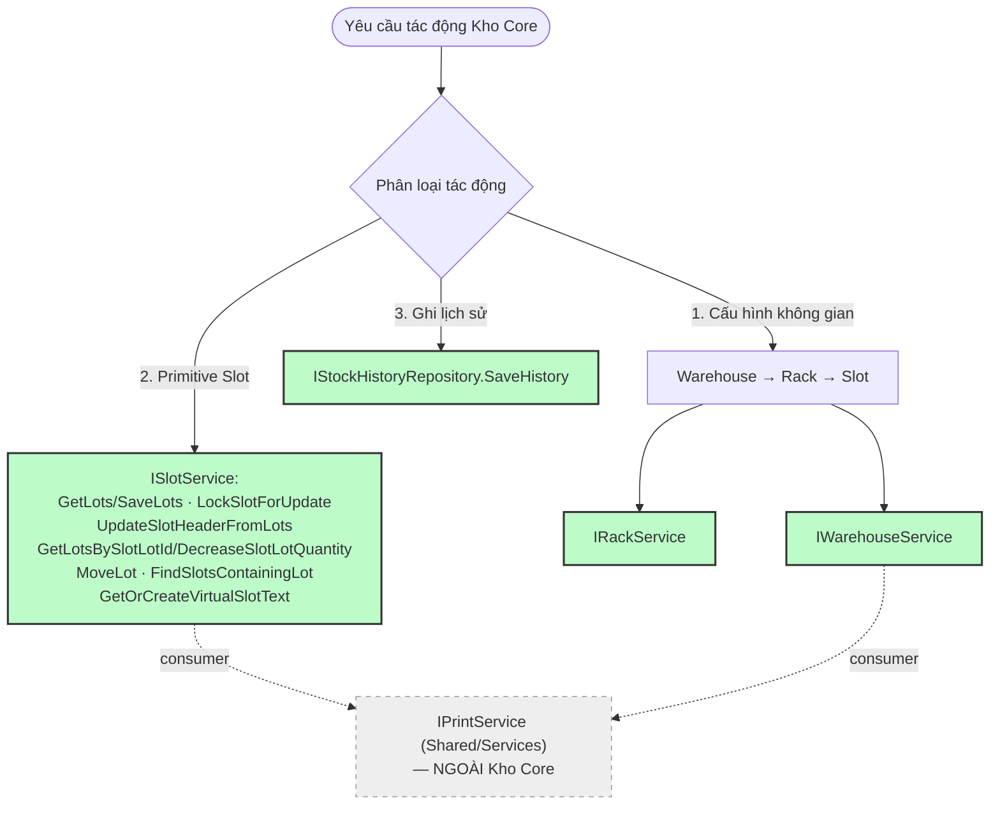

# Tài Liệu Kiến Trúc: Kho Core (Warehouse / Rack / Slot / SlotLot / StockHistory)

> **Vị trí trong bộ tài liệu:** Tài liệu CON, mô tả chi tiết duy nhất của phân khu Kho Core
> đã nêu tổng quan tại `WORKFLOW_WMS.md` § 2.2 và `WORKFLOW_DEPEND.md` § 1.1.

---

## 0. Trạng Thái Nợ Kiến Trúc

| # | Vấn đề | Trạng thái |
|---|---|---|
| 1 | `IRackService` vs `IWarehouseService` | ✅ Đã giải quyết — 2 service tách theo tầng thực thể (Warehouse, Rack). |
| 2 | Quyền sở hữu ghi lịch sử tồn kho | ✅ Đã giải quyết — `IStockHistoryRepository` là Primitive trung lập duy nhất. |
| 3 | Trùng lặp ghi `StockHistory` qua 2 code path | ✅ Đã giải quyết — mọi domain (Xuất kho, Nhập kho, Xử lý lỗi) inject thẳng `IStockHistoryRepository` qua constructor, không còn static wrapper. |
| 4 | Vai trò `StockService` chồng lấn `ISlotService`/`IStockExportService` | ✅ **Đã giải quyết — `IStockService`/`StockService` bị XOÁ HẲN.** Toàn bộ method đã map sang đúng domain (xem mục 7). |
| 5 | Domain In ấn nằm lẫn trong `StockService` | ✅ Đã giải quyết — tách thành `IPrintService`/`PrintService` tại `Shared/Services/`, dùng chung xuyên domain. |

📝 Ghi chú phụ (không khẩn cấp): `IWarehouseService` có `GetProductName`/`GetInspectionConfig` — ngữ nghĩa gần "item master data" hơn "warehouse". Chấp nhận được khi chưa có domain Item/Product riêng.

---

## 1. Vai Trò

Kho Core là tầng hạ tầng nền tảng — cung cấp các hàm nguyên thủy (Primitives) để:
1. Cấu hình không gian kho (Warehouse → Rack → Slot).
2. Thao tác Slot/SlotLot ở mức nguyên tử, có khoá dòng chống tranh chấp.
3. Ghi nhận lịch sử biến động tồn kho tập trung.

Kho Core **không chứa bất kỳ nghiệp vụ nào** (không biết "xuất kho", "chờ giao", "nhập từ sản xuất" là gì). Các module nghiệp vụ (`Modules/NhapKho`, `Modules/XuatKho`, `Modules/XuLyHangLoi`) **chỉ được phép** gọi vào Kho Core qua các interface dưới đây.

---

## 2. Nhánh 1 — Cấu Hình Không Gian
IWarehouseService ──▶ IWarehouseRepository ──▶ bảng Warehouse
IRackService ──▶ IRackRepository ──▶ bảng Rack

### 2.1. `IWarehouseService`

| Method | Mô tả |
|---|---|
| `GetAll()` | Lấy toàn bộ Warehouse |
| `Save(warehouse)` | Tạo/sửa 1 Warehouse (validate `Name` không rỗng) |
| `GetProductName(itemCode)` | Tra tên sản phẩm theo mã hàng |
| `GetInspectionConfig(itemCode)` | Lấy cấu hình kiểm tra theo mã hàng |

### 2.2. `IRackService`

| Method | Mô tả |
|---|---|
| `GetByWarehouse(warehouseId)` | Lấy toàn bộ Rack thuộc 1 Warehouse |
| `GetById(rackId)` | Lấy 1 Rack theo Id |
| `Create(warehouseId, rackName, rowCount, columnCount)` | Tạo Rack mới |
| `UpdateLayout(rackId, rowCount, columnCount)` | Cập nhật số hàng/cột |
| `Delete(rackId)` | Xoá Rack |
### 2.3. `IInspectionConfigService` (mới — tách từ IWarehouseService)

> Lý do tách: InspectionConfig là nghiệp vụ kiểm tra hàng hóa,
> không thuộc phạm vi quản lý không gian kho.

| Method | Mô tả |
|---|---|
| `GetAll()` | Lấy toàn bộ cấu hình kiểm tra |
| `GetByItemCode(itemCode)` | Lấy cấu hình theo mã hàng |
| `Save(config)` | Tạo mới hoặc cập nhật cấu hình |
| `Delete(configId)` | Xóa cấu hình theo Id |
| `NeedsInspection(itemCode)` | Kiểm tra mã hàng có cần KT không |

**Nghiệp vụ kiểm tra khi xuất kho:**
- Nếu `CheckItemCode = true` → scan tem thùng phải khớp mã hàng trong phiếu
- Nếu `CheckLotNo = true` → scan tem thùng phải khớp LotNo
- Nếu `CheckNSX = true` → scan tem hộp phải có ngày SX hợp lệ
- `DefaultQty` → số thùng/hộp tối thiểu phải scan
  ### 2.4. `IInspectionService` + `IInspectionLogRepository`
> Đặt tại `KhoCore/` — dùng chung cho Nhập kho, Xuất kho, Xử lý hàng lỗi.

**`IInspectionService`**
| Method | Mô tả |
|---|---|
| `Inspect(temTong, config, rawBoxScans)` | So sánh tem thùng với tem tổng theo config → trả `InspectionResult` |
| `SaveLog(inspectionCode, temTong, results, finalResult)` | Ghi log kiểm tra vào `InspectionLog` |

**`IInspectionLogRepository`**
| Method | Mô tả |
|---|---|
| `SaveLog(entry)` | Insert 1 dòng vào bảng `InspectionLog` |
| `GetByInspectionCode(code)` | Lấy toàn bộ log theo mã kiểm tra |

**Quy tắc đọc tem thống nhất (dùng chung QRCodeParser):**
- Mọi điểm scan (nhập kho / xuất kho / kiểm tra hàng lỗi) đều gọi
  `QRCodeParser.ParseQRCode(raw)` trước tiên
- Sau đó gọi `IInspectionService.Inspect(...)` nếu mã hàng có
  `IInspectionConfigService.NeedsInspection = true`
- Kết quả `InspectionResult.AllPassed` quyết định có cho phép
  tiếp tục giao dịch không
---

## 3. Nhánh 2 — Primitive Slot (`ISlotService`)

Đứng sau là `ISlotRepository` (SQL thuần) — module nghiệp vụ **không được** biết đến `ISlotRepository`.

### 3.1. Tra cứu

| Method | Mô tả |
|---|---|
| `GetSlotId(warehouseName, rackName, slotNumber)` | Tìm SlotId theo toạ độ |
| `GetSlotIdFromString(slotText)` | Tìm SlotId từ chuỗi hiển thị (qua `SlotParser`) |
| `GetSlotInfoFromString(slotText)` | Parse đầy đủ thông tin Slot (qua `SlotParser`) |
| `GetCapacity(slotId)` | Sức chứa tối đa |
| `GetQuantity(slotId)` | Số lượng hiện tại (đọc thường) |
| `GetQuantityWithLock(slotId)` | Số lượng hiện tại, có khoá dòng — chỉ dùng trong transaction đang mở |
| `FindSlotsContainingLot(lotNo)` | Tìm mọi Slot đang chứa 1 LOT — trả `List<SlotChuaLotInfo>` |
| `GetEmptySlots(itemCode, soLuongNhap)` | Tìm Slot trống phù hợp để nhập hàng |
| `GetAllActiveSlotLots()` | Liệt kê toàn bộ SlotLot đang có tồn (`Quantity > 0`) kèm toạ độ Warehouse/Rack/Slot — dùng cho các màn hình chọn nguồn Slot/LOT (VD: `FormChonSlotNoiBo`) |

### 3.2. Cập nhật Slot (toàn bộ / header)

| Method | Mô tả |
|---|---|
| `LockSlotForUpdate(slotId)` | Khoá dòng Slot — chỉ dùng trong transaction đang mở |
| `AddQuantity(slotId, quantity, itemCode, importDate)` | Cộng dồn tồn, có check capacity |
| `ClearSlot(slotId)` | Xoá sạch SlotLot của 1 Slot, reset header |
| `UpdateSlotInfo(slotId, itemCode, importDate, quantity)` | Ghi header trực tiếp, có check capacity |
| `UpdateSlotHeaderFromLots(slotId, lots)` | Tự tính SUM/ItemCode/ImportDate từ danh sách LOT rồi ghi header — dùng sau mọi thao tác sửa LOT |
| `GetLots(slotId)` / `SaveLots(slotId, lots)` | Đọc/ghi toàn bộ LOT của 1 Slot (xoá-ghi-lại) |
| `ExistsLot(slotId, lotNo)` | Kiểm tra 1 LOT có đang nằm trong Slot |

### 3.3. SlotLot theo dòng cụ thể (Rework — xuất 1 phần LOT)

| Method | Mô tả |
|---|---|
| `GetLotsBySlotLotId(slotLotId)` → `SlotLotInfo` | Đọc đúng 1 dòng SlotLot theo `SlotLotId` (PK IDENTITY thật) |
| `DecreaseSlotLotQuantity(slotLotId, qty)` | Trừ đúng 1 dòng; tự xoá nếu về 0; tự gọi `UpdateSlotHeaderFromLots` đồng bộ header |

### 3.4. Slot tạm trên UI/memory (không đụng DB)

| Method | Mô tả |
|---|---|
| `ClearSlotTemporarily(slot)` | Xoá tạm trên object C# — dùng khi preview UI |
| `BackupSlot(slot, out backup)` / `RestoreSlot(slot, backup)` | Backup/khôi phục trạng thái Slot trên UI |

### 3.5. Slot ảo (bulk-import / kho A0)

| Method | Mô tả |
|---|---|
| `GetOrCreateVirtualSlotText(warehouseName, rackName, capacity)` | Lấy hoặc tạo 1 Slot ảo theo tên cố định |

### 3.6. Sắp xếp lại kho (không qua Xuất kho)

| Method | Mô tả |
|---|---|
| `MoveLot(fromSlotId, toSlotId, lotNo)` | Dời 1 LOT giữa 2 Slot — **KHÔNG trừ STOCKTP, KHÔNG qua ChoGiao**. Dùng khi: (a) sắp xếp lại kho nội bộ, (b) dời phần dư sau khi `IStockExportService.PickToChoGiao` xuất 1 phần LOT (Presenter gọi tuần tự 2 lệnh, KHÔNG gộp lại thành 1 API) |

### 3.7. Kiểu dữ liệu liên quan

```csharp
public sealed class SlotInfo
{
    public int SlotId { get; set; }
    public string WarehouseName { get; set; }
    public string RackName { get; set; }
    public int SlotNumber { get; set; }
    public int Capacity { get; set; }
}

public sealed class SlotLotInfo
{
    public int SlotLotId { get; set; }   // PK IDENTITY thật — bảng SlotLot.SlotLotId
    public int SlotVatLyId { get; set; }
    public string LotNo { get; set; }
    public string ItemCode { get; set; }
    public int Quantity { get; set; }
    public string TemCode { get; set; }
    public DateTime? ImportDate { get; set; }
}
public sealed class SlotLotViewInfo
{
    public int SlotId { get; set; }
    public int SlotLotId { get; set; }
    public string WarehouseName { get; set; }
    public string RackName { get; set; }
    public int SlotNumber { get; set; }
    public string ItemCode { get; set; }
    public string LotNo { get; set; }
    public int Quantity { get; set; }
    public string TemCode { get; set; }
}
```

`LotInfo` — xem định nghĩa tại tài liệu Model chung.

---

## 4. Nhánh 3 — Ghi Lịch Sử (`IStockHistoryRepository`)

Primitive trung lập của Kho Core — mọi module gọi thẳng vào đây, không qua service trung gian nào khác.

```csharp
void SaveHistory(
    string actionType,      // Do module gọi tự đặt tên ("EXPORT", "MOVE", "REWORK_EXPORT"...)
    string itemCode,
    LotInfo lot,
    int? fromSlotId,
    int? toSlotId,
    string performedBy);    // Rỗng → tự điền Environment.UserName
```

Mọi service nghiệp vụ (`StockExportService`, `NhapTpReceivingService`, `ReworkStockService`...) inject `IStockHistoryRepository` qua constructor như mọi repo khác — không có static wrapper, không có transition phase.

---

## 5. Ranh Giới Với Domain In Ấn (`IPrintService`)

`IPrintService`/`PrintService` **không thuộc Kho Core** — đặt tại `Shared/Services/`. Lý do: đây là dựng dữ liệu hiển thị (preview phiếu), không ghi DB, không thuộc riêng 1 domain nghiệp vụ nào (Xuất kho, Nhập kho, Xử lý hàng lỗi đều cần in phiếu).

`IPrintService` phụ thuộc `ISlotService` (đọc LOT để tính preview) và `IWarehouseService` (lấy tên sản phẩm) — là **consumer** của Kho Core, không phải một phần của nó.

| Method | Mô tả |
|---|---|
| `CreatePrintData(lots)` | Gộp LOT thành dữ liệu in tem |
| `BuildExportPreview(slotId, slotNumber, exportQty, itemCode, nguoiThucHien)` | Preview phiếu xuất — không lưu DB |
| `GetProductNameByCode(itemCode)` | Tên sản phẩm để hiển thị trên phiếu |

---

## 6. Sơ Đồ Luồng (Mermaid)



Xanh lá = thuộc Kho Core, đã ổn định. Ô nét đứt = domain ngoài, chỉ là consumer.

---

## 7. Bảng Map Đầy Đủ — `StockService` Cũ Đã Đi Đâu (lịch sử tham chiếu)

| Method cũ trong `StockService` | Đích mới |
|---|---|
| `GetAvailableSlotsForImport` | Xoá — gọi thẳng `ISlotService.GetEmptySlots` |
| `GetInspectionConfig` | Xoá — gọi thẳng `IWarehouseService.GetInspectionConfig` |
| `ParseQr` | Xoá — gọi thẳng `QRCodeParser.ParseQRCode` |
| `GhiNhanChoGiao` | `IStockExportService`/`IHangChoGiaoRepository` |
| `ExportFromSlot` | `IStockExportService.ExportFromSlot` (Modules/XuatKho) |
| `ExportAndMoveRemaining` | **Xoá hẳn** — tách `PickToChoGiao` + `ISlotService.MoveLot`, Presenter gọi tuần tự |
| `SyncSlotFromSplitResult` | Xoá khỏi Service — logic đồng bộ UI chuyển xuống Form/Presenter |
| `LockSlotForUpdate` | Xoá — gọi thẳng `ISlotService.LockSlotForUpdate` |
| `GetSlotLots` | Xoá — gọi thẳng `ISlotService.GetLots` |
| `ClearSlotTemporarily` | Xoá — gọi thẳng `ISlotService.ClearSlotTemporarily` |
| `CreatePrintData`, `BuildExportPreview`, `GetProductNameByCode` | `IPrintService` (Shared/Services) |
| `GetOrCreateBulkImportSlotText`, `GetOrCreateVirtualSlotText` | Xoá — gọi thẳng `ISlotService.GetOrCreateVirtualSlotText` |
| `ImportSlotOnlyAfterStockTpAlreadyUpdated` | `INhapTpReceivingService` với `StockImportPurpose.KhachTraHang` |

`IStockService`/`StockService` đã xoá khỏi `KhoCore/Interfaces` và `KhoCore/Services`.

---

## 8. Việc Cần Làm

- [x] Chốt `IRackService`/`IWarehouseService` tách biệt
- [x] Xác nhận `IStockHistoryRepository` là Primitive trung lập
- [x] Loại bỏ trùng lặp ghi `StockHistory`
- [x] Xoá `StockService`, map toàn bộ method sang đúng domain (mục 7)
- [x] Tách `IPrintService` ra khỏi Kho Core, đặt tại `Shared/Services/`
- [ ] Xác nhận `StockExportResult` đã có `RemainingLotNo`/`RemainingQuantity` để hỗ trợ luồng `PickToChoGiao` + `MoveLot`
- [ ] Sửa `ExportFormSV`, `FormEnterItemSV` và mọi nơi từng `new StockService(...)` sang inject `ISlotService`/`IStockExportService`/`IPrintService`/`INhapTpReceivingService` trực tiếp
