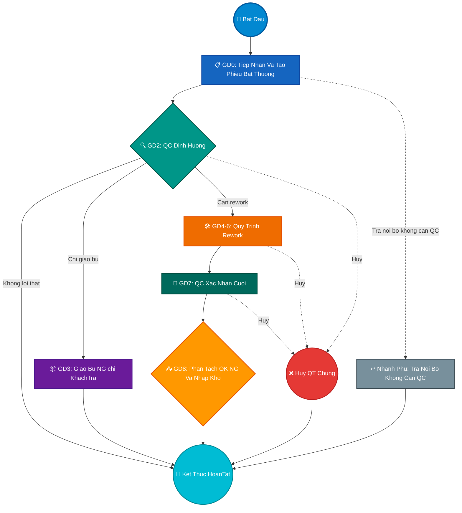

# WORKFLOW MAIN

## Quy trình QT Chung

```mermaid
graph TB
    Start(("🚀 Bat Dau"))
    GD0["📋 GD0: Tiep Nhan Va Tao Phieu Bat Thuong"]
    GD2{"🔍 GD2: QC Dinh Huong"}
    GD9["↩️ Nhanh Phu: Tra Noi Bo Khong Can QC"]
    GD3["📦 GD3: Giao Bu NG chi KhachTra"]
    GD4["🛠️ GD4-6: Quy Trinh Rework"]
    GD7["🧪 GD7: QC Xac Nhan Cuoi"]
    GD8{"📥 GD8: Phan Tach OK NG Va Nhap Kho"}
    Huy(("❌ Huy QT Chung"))
    KetThuc(("🏁 Ket Thuc HoanTat"))

    Start --> GD0
    GD0 --> GD2
    GD0 -.->|Tra noi bo khong can QC| GD9
    GD2 -->|Khong loi that| KetThuc
    GD2 -->|Chi giao bu| GD3
    GD2 -->|Can rework| GD4
    GD3 --> KetThuc
    GD4 --> GD7
    GD7 --> GD8
    GD8 --> KetThuc
    GD9 --> KetThuc
    GD2 -.->|Huy| Huy
    GD4 -.->|Huy| Huy
    GD7 -.->|Huy| Huy
    Huy --> KetThuc

    style Start fill:#0288d1,color:#ffffff,stroke:#01579b,stroke-width:3px
    style KetThuc fill:#00bcd4,color:#ffffff,stroke:#00838f,stroke-width:2px
    style GD0 fill:#1565c0,color:#ffffff,stroke:#0d47a1,stroke-width:2px
    style GD2 fill:#009688,color:#ffffff,stroke:#004d40,stroke-width:2px
    style GD3 fill:#6a1b9a,color:#ffffff,stroke:#4a148c,stroke-width:2px
    style GD4 fill:#ef6c00,color:#ffffff,stroke:#e65100,stroke-width:2px
    style GD7 fill:#00695c,color:#ffffff,stroke:#004d40,stroke-width:2px
    style GD8 fill:#ff9800,color:#ffffff,stroke:#e65100,stroke-width:2px
    style GD9 fill:#78909c,color:#ffffff,stroke:#37474f,stroke-width:2px
    style Huy fill:#e53935,color:#ffffff,stroke:#b71c1c,stroke-width:2px
```
